---
学习难点
---
# Qt

## Qt中show()和exec()

**窗口模式**

要理清两个函数的区别，还需要理解窗口模式：

**模式窗口**：<font color=red>窗口会原地阻塞 </font>，只能操作该窗口，其余窗口不能再操作；只有关闭该窗口后，代码处才会获得返回值，阻塞停止，就可以操作其它界面了；

**半模式窗口**：<font color=red>窗口会原地伪阻塞 </font>，虽然也是只能操作该窗口，其余窗口不能再操作，但是代码会继续往下运行，所以说是伪阻塞；

**非模式窗口**：<font color=red>窗口不会阻塞 </font>，可以随意操作；

**exec()和show()的区别**

| 函数1                                                               | 作用       |
| ------------------------------------------------------------------- | ---------- |
| QDialog* Dlg = new QDialog(this); Dlg->exec();                      | 模式窗口   |
| QDialog* Dlg = new QDialog(this); Dlg->setModal(true); Dlg->show(); | 半模式窗口 |
| QDialog* Dlg = new QDialog(this); Dlg->show();                      | 非模式窗口 |

**应用场景：**

1. new出来了一个新界面，需要用exec()，保证界面能一直显示
2. 没有新界面，但是有函数，需要用exec()，因为connect不一定会在注册之后就立刻连接，所以需要进入事件循环
3. 在重写子线程的run()方法时，也需要加入exec()进入事件循环，保证run能执行完毕

## QComboBox

想设置combobox的下拉列表必须这样设置：
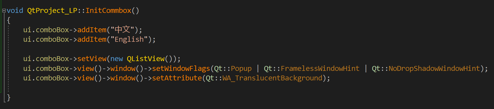
注意事项&代码解释：
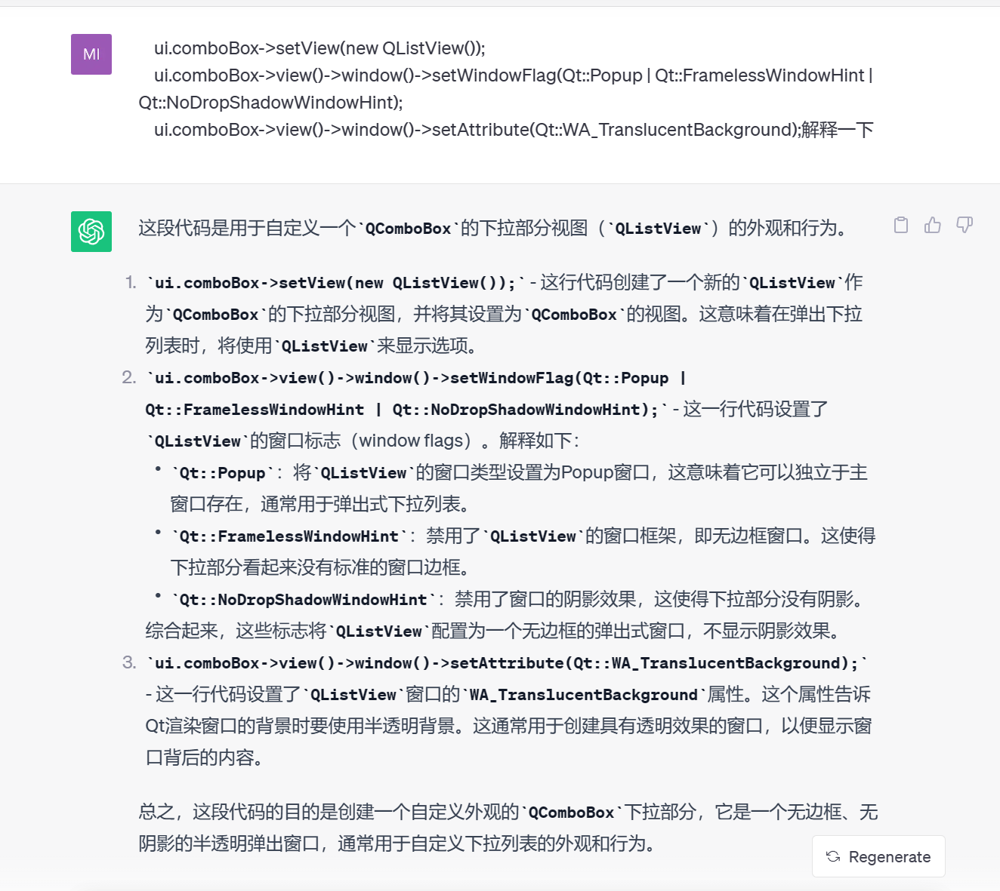
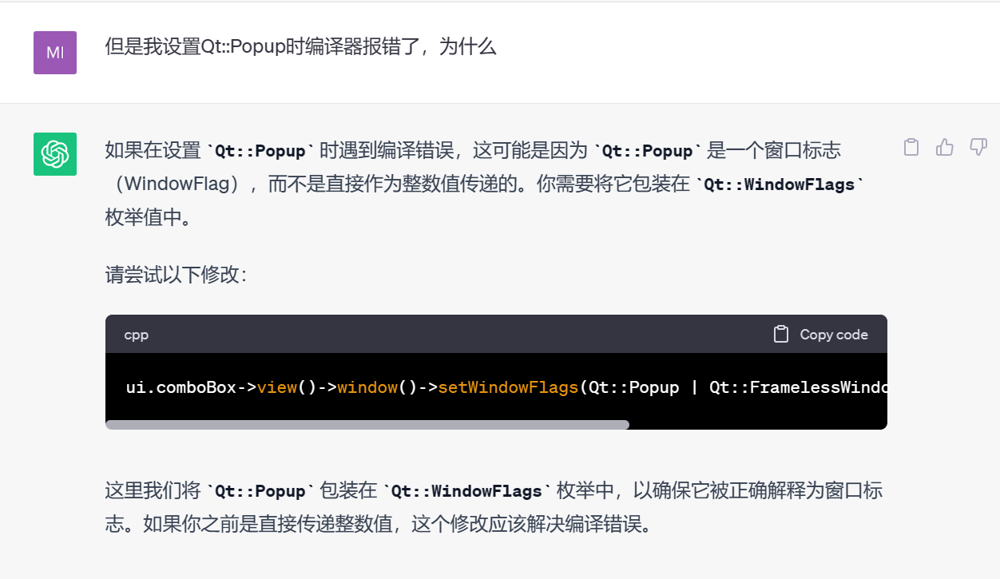
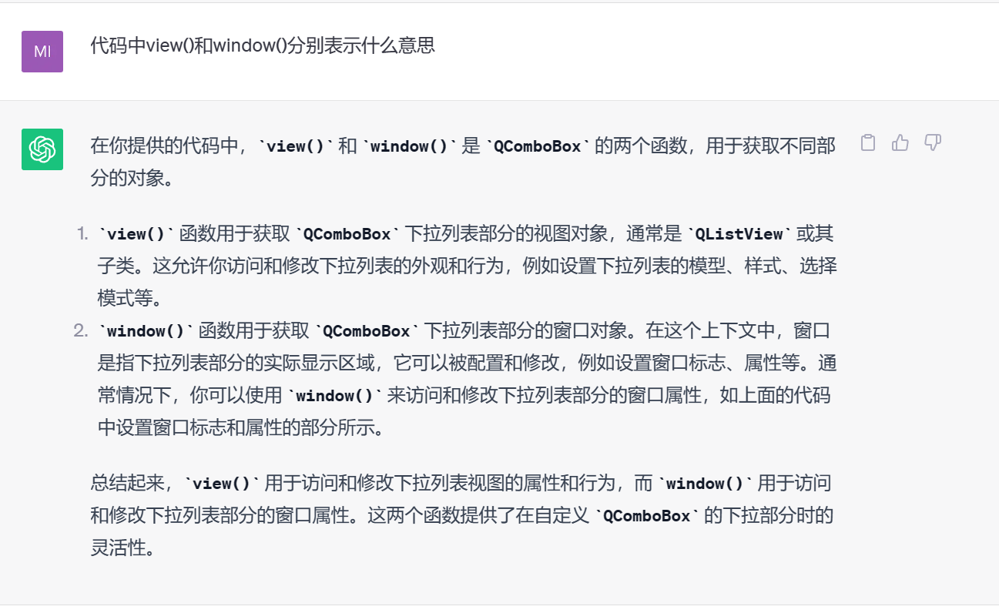

## QWaitCondition

[QWaitCondition 的正确使用方法-CSDN博客](https://blog.csdn.net/flyoxs/article/details/54617342)

```c++
// 主线程
mutex.lock();
Send(&packet);
condition.wait(&mutex); 
if (m_receivedPacket)
{
    HandlePacket(m_receivedPacket); // 另一线程传来回包
}
mutex.unlock();


// 通信线程
m_receivedPacket = ParsePacket(buffer);  // 将接收的数据解析成包
mutex.lock();
condition.wakeAll();
mutex.unlock();
```

主线程先把 mutex 锁占据，即从发送数据包开始，一直到 QWaitCondition::wait() 在操作系统层次真正执行阻塞等待指令，这一段主线程的时间段内，mutex 一直被上锁，即使通信线程很快就接收到数据包，也不会直接调用 wakeAll()，而是在调用 mutex.lock() 时阻塞住（因为主线程已经把mutex占据上锁了，再尝试上锁就会被阻塞），直到主线程 QWaitCondition::wait() 真正执行操作系统的阻塞等待指令并释放mutex，通信线程的 mutex.lock() 才即出阻塞，继续往下执行，调用 wakeAll()，此时一定能唤醒主线程成功。

# C++

## override关键字

https://zhuanlan.zhihu.com/p/260992059
https://zhuanlan.zhihu.com/p/624294602
eg:
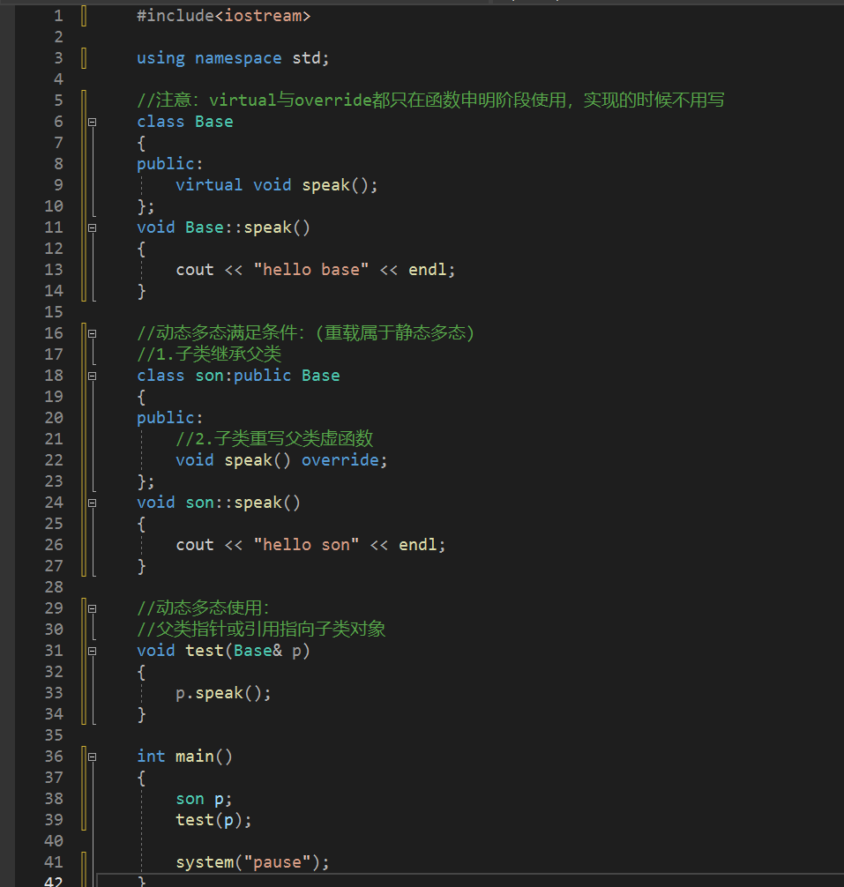

## using关键字

[C++中using的三种用法 - 知乎 (zhihu.com)](https://zhuanlan.zhihu.com/p/156155959)

### 导入命名空间

```c++
// 导入整个命名空间到当前作用域
using namespace std;
// 只导入某个变量到当前作用域 
using std::cout; 
```

**在.h头文件中，一般不应该使用using声明。**

因为头文件的内容会拷贝到所有引用它的文件中去，如果头文件里有某个using声明，那么每个使用了该头文件的文件就都会有这个声明，从而可能产生名字冲突。

### 指定别名

C++ 11 通过 using 指定别名，作用等同于 typedef，但相比 typedef，逻辑更直观，可读性更好。

```cpp
typedef int T; // 用 T 代替 int
using T = int; // 用 T 代替 int
```

### 在派生类中引用基类成员

尽管派生类 Derived 对 基类 Base 是私有继承，但通过 using 声明，派生类的对象就可以访问基类的 proteced 成员变量和 public 成员函数了。

## 野指针

[野指针（Wild Pointer）是指向非法的内存地址的指针，也叫悬挂指针（Dangling Pointer），意为无法正常使用的指针。野指针的出现可能会导致程序崩溃或者产生不可预知的结果。以下是一些常见的野指针情形](https://zhuanlan.zhihu.com/p/337060273)[1](https://zhuanlan.zhihu.com/p/337060273)[2](https://blog.csdn.net/sanqima/article/details/41807035)[3](https://www.bilibili.com/read/cv8832185/):

1. 使用未初始化的指针。
2. 指针所指的对象已经消亡。
3. 指针释放后之后未置空。

为了避免野指针带来的危害，开发人员应该注意以下几点：

1. C++引入了引用机制，如果使用引用可以达到编程目的，就可以不必使用指针。因为引用在定义的时候，必须初始化，所以可以避免野指针的出现。
2. 如果一定要使用指针，那么需要在定义指针变量的同时对它进行初始化操作。定义时将其置位NULL或者指向一个有名变量。
3. 对指针进行free或者delete操作后，将其设置为NULL。对于使用free的情况，常常定义一个宏或者函数xfree来代替free置空指针。

## vector的扩容机制

[面试题：C++vector的动态扩容，为何是1.5倍或者是2倍_vector扩容-CSDN博客](https://blog.csdn.net/qq_44918090/article/details/120583540)

## STL的底层实现

[STL介绍以及其底层实现？包括vector, map, list-CSDN博客](https://blog.csdn.net/sinat_36301420/article/details/104977572)

## 哈希表

[图文并茂详解数据结构之哈希表 - 知乎 (zhihu.com)](https://zhuanlan.zhihu.com/p/144296454)

哈希表首先通过哈希函数把非int的**「键」**或者**「关键字」**转化成int，可以用来做数组的下标。比如我们上面说的将学生的姓名作为**「键」**或者**「关键字」**，这是就需要哈希函数来完成，下图是哈希函数的转换示意图。

**注意：但是两个不一样的值通过哈希函数之后可能生成相同的值，因为我们把巨大的空间转出成较小的数组空间时，不能保证每个数字都映射到数组空白处。所以这里就会才生冲突，在哈希表中我们称之为哈希冲突，也就是说通过哈希函数计算出来的下标不一定是当前元素的真实下标**

解决哈希冲突的方法有两种**「开放地址法」**和**「链表法」**

1. **「开放地址法」**

在开放地址法中，若数据不能直接存放在哈希函数计算出来的数组下标时，就需要寻找其他位置来存放。在开放地址法中有三种方式来寻找其他的位置，分别是**「线性探测」**、**「二次探测」**、**「再哈希法」**

a.**「线性探测」**：

- **插入：**在线性探测哈希表中，数据的插入是线性的查找空白单元，例如我们将数88经过哈希函数后得到的数组下标是16，但是在数组下标为16的地方已经存在元素，那么就找17,17还存在元素就找18，一直往下找，直到找到空白地方存放元素。

- **查找：**线性探测哈希表的查找过程有点儿类似插入过程。我们通过散列函数求出要查找元素的键值对应的散列值，然后比较数组中下标为散列值的元素和要查找的元素。如果相等，则说明就是我们要找的元素；否则就顺序往后依次查找。如果遍历到数组中的空闲位置，还没有找到，就说明要查找的元素并没有在哈希表中。

- **删除：**线性探测哈希表的删除相对来说比较复杂一点，我们不能简单的把这一项数据删除，让它变成空，为什么呢？

线性探测哈希表在查找的时候，一旦我们通过线性探测方法，找到一个空闲位置，我们就可以认定哈希表中不存在这个数据。但是，如果这个空闲位置是我们后来删除的，就会导致原来的查找算法失	效。本来存在的数据，会被认定为不存在。

因此我们需要一个特殊的数据来顶替这个被删除的数据，因为我们的学生学号都是正数，所以我们用学号等于`-1`来代表被删除的数据。

这样会带来一个问题，如何在线性探测哈希表中做了多次操作，会导致哈希表中充满了学号为`-1`的数据项，使的哈希表的效率下降，所以很多哈希表中没有提供删除操作，即使提供了删除操作的，也尽量少使用删除函数。

b.**「二次探测」**：

在线性探测哈希表中，数据会发生聚集，一旦聚集形成，它就会变的越来越大，那些哈希函数后落在聚集范围内的数据项，都需要一步一步往后移动，并且插入到聚集的后面，因此聚集变的越大，聚集增长的越快。这个就像我们在逛超市一样，当某个地方人很多时，人只会越来越多，大家都只是想知道这里在干什么。

二次探测是防止聚集产生的一种尝试，思想是探测相隔较远的单元，而不是和原始位置相邻的单元。在线性探测中，如果哈希函数得到的原始下标是x,线性探测就是x+1,x+2,x+3......，以此类推，而在二次探测中，探测过程是x+1,x+4,x+9,x+16,x+25......,以此类推，到原始距离的步数平方。

**二次探测的问题**：二次探测消除了线性探测的聚集问题，这种聚集问题叫做原始聚集，然而，二次探测也产生了新的聚集问题，之所以会产生新的聚集问题，是因为所有映射到同一位置的关键字在寻找空位时，探测的位置都是一样的。

比如讲1、11、21、31、41依次插入到哈希表中，它们映射的位置都是1，那么11需要以一为步长探测，21需要以四为步长探测，31需要为九为步长探测，41需要以十六为步长探测，只要有一项映射到1的位置，就需要更长的步长来探测，这个现象叫做二次聚集。

二次聚集不是一个严重的问题，因为二次探测不怎么使用，这里我就不贴出二次探测的源码，因为
**「双哈希」**是一种更加好的解决办法。

c.**「双哈希法」**：

双哈希是为了消除原始聚集和二次聚集问题，不管是线性探测还是二次探测，每次的探测步长都是固定的。双哈希是除了第一个哈希函数外再增加一个哈希函数用来根据关键字生成探测步长，这样即使第一个哈希函数映射到了数组的同一下标，但是探测步长不一样，这样就能够解决聚集的问题。

第二个哈希函数必须具备如下特点

1. 和第一个哈希函数不一样

2. 不能输出为0，因为步长为0，每次探测都是指向同一个位置，将进入死循环，经过试验得出`stepSize = constant-(key%constant);`形式的哈希函数效果非常好，`constant`是一个质数并且小于数组容量

2. **「链表法」**

开放地址法中，通过在哈希表中再寻找一个空位解决冲突的问题，还有一种更加常用的办法是使用**「链表法」**来解决哈希冲突。**「链表法」**相对简单很多，**「链表法」**是每个数组对应一条链表。当某项关键字通过哈希后落到哈希表中的某个位置，把该条数据添加到链表中，其他同样映射到这个位置的数据项也只需要添加到链表中，并不需要在原始数组中寻找空位来存储。

## 红黑树

特点：

> 节点是红色或黑色。
> 根是黑色。
> 所有叶子都是黑色（叶子是NIL节点）。
> 每个红色节点必须有两个黑色的子节点。（从每个叶子到根的所有路径上不能有两个连续的红色节点。）
> 从任一节点到其每个叶子的所有简单路径都包含相同数目的黑色节点（简称黑高）。

根据以上性质：任意节点到其最长叶子节点路径不会超过最短路径的2倍。原因如下：

当某条路径最短时，这条路径必然都是由黑色节点构成。当某条路径长度最长时，这条路径必然是由红色和黑色节点相间构成（性质4限定了不能出现两个连续的红色节点）。而性质5又限定了从任一节点到其每个叶子节点的所有路径必须包含相同数量的黑色节点。

此时，在路径最长的情况下，路径上红色节点数量 = 黑色节点数量。该路径长度为两倍黑色节点数量，也就是最短路径长度的2倍。

**旋转操作**

在分析插入和删除操作前，这里需要插个队，先说明一下旋转操作，这个操作在后续操作中都会用得到。

旋转操作分为左旋和右旋，左旋是将某个节点旋转为其右孩子的左孩子，而右旋是节点旋转为其左孩子的右孩子。这话听起来有点绕，所以还是请看下图：

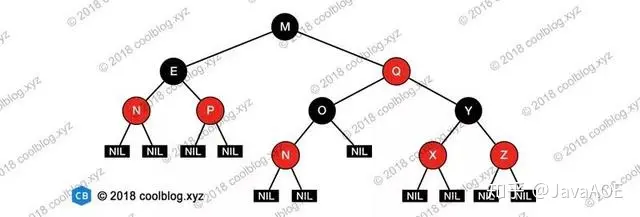

**插入：**插入新节点时，该节点为红色，然后根据父节点和叔叔节点的颜色变色，如果叔叔节点为红色，直接递归向上变色即可；如果叔叔节点为黑色，需要先旋转，再变色

[「六分钟速通」红黑树的插入调整，看叔叔脸色就好！_哔哩哔哩_bilibili](https://www.bilibili.com/video/BV1fw41117zt/?spm_id_from=333.337.search-card.all.click&vd_source=62fe42e71e56edada3fb7d905bdcf92b)

**删除：**删除操作首先要确定待删除节点有几个孩子，如果有两个孩子，不能直接删除该节点。而是要先找到该节点的前驱（该节点左子树中最大的节点）或者后继（该节点右子树中最小的节点），然后将前驱或者后继的值复制到要删除的节点中，最后再将前驱或后继删除。

红黑树删除操作的复杂度在于删除节点的颜色，当删除的节点是红色时，直接拿其孩子节点补空位即可。

当删除的节点是黑色时，那么所有经过该节点的路径上的黑节点数量少了一个，破坏了性质5。如果该节点的孩子为红色，直接拿孩子节点替换被删除的节点，并将孩子节点染成黑色；但如果孩子节点为黑色，根据其父节点，兄弟节点，兄弟节点左右孩子的颜色分为7种情况，通过变色，旋转来维持性质5

[番外-红黑树删除_哔哩哔哩_bilibili](https://www.bilibili.com/video/BV1KA41187v6/?spm_id_from=333.337.search-card.all.click&vd_source=62fe42e71e56edada3fb7d905bdcf92b)

## AVL树

[史上最详细的AVL树（含代码实现）-CSDN博客](https://blog.csdn.net/qq_56999918/article/details/122759059)

[红黑树和AVL树（平衡二叉树）区别_avl 红黑树区别-CSDN博客](https://blog.csdn.net/u010899985/article/details/80981053)

AVL树是带有平衡条件的二叉查找树，一般是用**平衡因子**差值判断是否平衡并通过旋转来实现平衡，左右子树树高不超过1，和红黑树相比，AVL树是**严格的平衡二叉树**，平衡条件必须满足（所有节点的左右子树高度差的绝对值不超过1）。不管我们是执行插入还是删除操作，只要不满足上面的条件，就要通过旋转来保持平衡，而旋转是非常耗时的，由此我们可以知道AVL树适合用于插入与删除次数比较少，但查找多的情况

## emplace_back() 与 push_back() 的区别

当调用push_back() 或insert() 成员函数时，是把元素类型的对象传递给它们，这些对象被拷贝到容器中。而当我们调用一个 emplace 系列函数时，则是将相应参数传递给元素类型的构造函数。这样emplace_back() 能就地通过参数构造对象，不需要拷贝操作，相比push_back() 能更好的避免内存的拷贝和移动，提升容器插入元素的性能。大多数情况都应该使用 emplace 系列函数：emplace; emplace_back; emplace_hit; emplace_fornt; emplace_after.

[【C++11】之 emplace_back() 与 push_back() 的区别_push_back和emplace_back-CSDN博客](https://blog.csdn.net/lemonxiaoxiao/article/details/108595548)

[C++中push_back和emplace_back的区别 - 知乎 (zhihu.com)](https://zhuanlan.zhihu.com/p/213853588)

[一文轻松搞懂emplace_back与push_back - 知乎 (zhihu.com)](https://zhuanlan.zhihu.com/p/610294692)

## 左值引用和右值引用

左值与右值这两个概念是从 C 中传承而来的，左值指既能够出现在等号左边，也能出现在等号右边的变量；右值则是只能出现在等号右边的变量。

- 常量左值引用既可以接收左值，也可以接收右值

```c++
	int& a = 7;//编译报错：非常量左值引用
	const int& a = 7;//编译正确，常量左值引用可以接收右值
	const int& b = a;//编译正确，常量左值引用可以接收左值
	//常量左值引用可以绑定右值是一条非常棒的特性，但是也存在一个缺点————常量性，一旦使用常量左值引用，表示我们无法在函数内修改该对象的内容（强制类型转换除外），所以需要另一个特性帮助我们完成工作，即右值引用。
```

- 显然，右值引用是一种引用右值且只能引用右值的方法，能够有效**延长右值的生命周期，减少对象复制，提升程序性能**；在语法方面，右值引用在类型后加&&

```c++
	int i = 0;
	int& j = i;		//左值引用
	int&& k = 11;	//右值引用
	//上述代码中，k是一个右值引用，如果用k引用i，会引起编译错误，右值引用的特点是可以延长右值的生命周期，对于11，理解可能不是很深，请看下面代码
```

```c++
class X{
public:
    X(){}
    X(const X& x){}
    ~X(){}
    show(){cout<<"show"<<endl;}
}
X make_x(){
    X x1;
    return x1;
}
int main(){
#ifdef 0
    //对于该段代码，一共发生了三次拷贝构造
    //第一次是函数中创建x1临时变量，第二次是返回临时变量，第三次是创建x2
    X x2(make_x());
    x2.show();
#endif
    //使用右值引用，只需2次拷贝构造即可实现同样功能
    //第一次是构造x1，第二次是构造x2
    //这里就很好体现出“延长生命周期，减少对象复制”的特点
    X&& x2 = make_x();
    x2.show();
}
```

## std::move

[一文读懂C++右值引用和std::move - 知乎 (zhihu.com)](https://zhuanlan.zhihu.com/p/335994370)

<font color=red>std::move就是将左值转为右值引用。</font>这样就可以重载到移动构造函数了，移动构造函数将指针赋值一下就好了，不用深拷贝了，提高性能

```cpp
class Array {
public:
    ......
 
    // 优雅
    Array(Array&& temp_array) {
        data_ = temp_array.data_;
        size_ = temp_array.size_;
        // 为防止temp_array析构时delete data，提前置空其data_      
        temp_array.data_ = nullptr;
    }
     
 
public:
    int *data_;
    int size_;
};
```

如何使用：

```cpp
// 例1：Array用法
int main(){
    Array a;
 
    // 做一些操作
    .....
     
    // 左值a，用std::move转化为右值
    Array b(std::move(a));
}
```

## 内联函数

https://www.bilibili.com/video/BV1wj411Z7kW/?spm_id_from=333.337.search-card.all.click&vd_source=62fe42e71e56edada3fb7d905bdcf92b

1. 内联不call函数，而是直接在调用函数的地方展开汇编，不用在压栈出栈了。是一种以空间换时间的做法。
2. 内联只是给编译器的一个建议，编译器是否把这个函数归为内联是取决于编译器的设计的，一般的话递归不能内联，代码量小的函数频、繁调用的函数会设置为内联
3. 内联比宏函数好，好在有类型检查，还有可以调试，宏不能调试。（宏的缺点：不能调试，计算容易出错，没有类型检查）
4. 一般类的成员函数都是内联的， 比如构造 析构 赋值运算符重载
5. 内联会导致代码膨胀，就是打包的exe文件会比不用内联的大

## lambda表达式

基本格式：
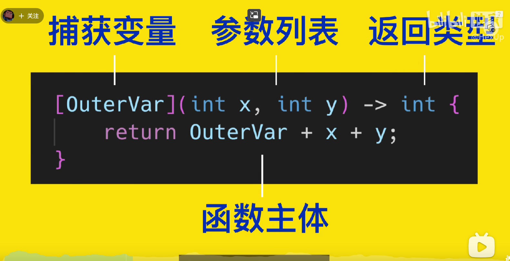

变量捕获

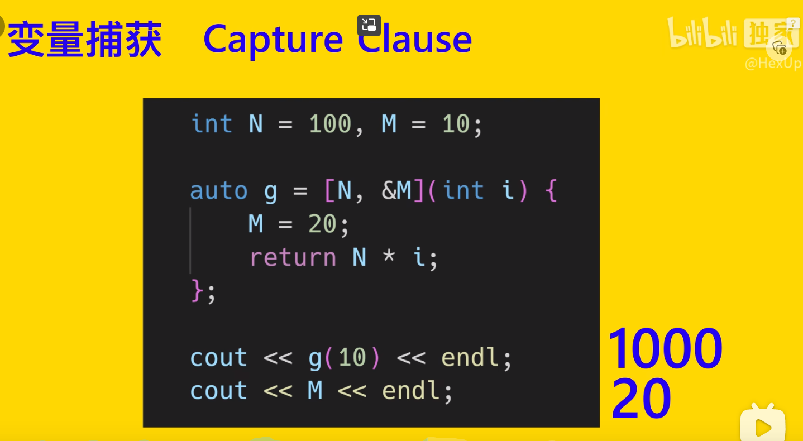
注意此时N为按值捕获，只可访问不可修改
[=]：表示封闭范围内所有变量都按值捕获
[&]：表示封闭范围内所有变量都按引用捕获
[&, =N]：按值捕获N，其他变量按引用捕获
[this]：在类中使用匿名函数时，可以用该方法捕获当前实例对象的指针

## 智能指针

**（用于在避免悬空指针，内存泄漏，属于模板类的应用）**

**下面四个都是指针，别搞混了**

eg:

```c++
fun()
{
    p=new type;
    return p;
}
p1=func();
delete p1//此处如果不释放，就会导致内存泄漏，可以用智能指针解决
```

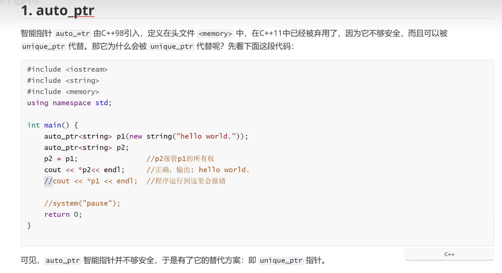
按理来说当p2=p1时，所有权已经转移到p2身上了，但我在cout<<*p1;时，程序不会报错，只有在运行时才会报错，所以auto_ptr被弃用
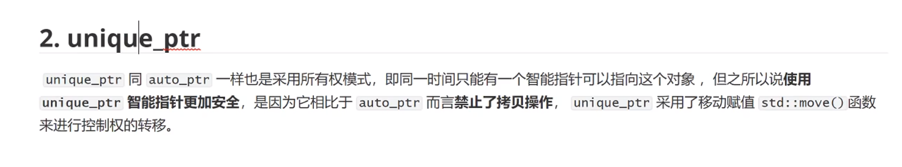
即用unique_ptr不允许两者之间的赋值操作，只允许通过move()转移所有权
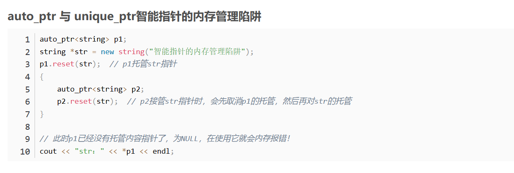


- 引用计数线程安全
- shared_ptr线程不安全，需要加线程锁
- share_ptr在最后一个指针离开作用域时，销毁已分配内存

[shared_ptr在多线程下的安全性问题](https://blog.csdn.net/www_dong/article/details/114418454)

[智能指针的原理及实现](https://blog.csdn.net/lizhentao0707/article/details/81156384)

[万字长文全面详解现代C++智能指针：原理、应用和陷阱 - 知乎 (zhihu.com)](https://zhuanlan.zhihu.com/p/672745555)

**引用计数变化的几种情况**

1. 新创建对象时 = 1
2. 拷贝赋值时 +
3. 拷贝构造时 +
4. 指针离开作用域时 -

```c++
/* ---------- shared point ---------- */
template<typename T>
class shared_ptr {
public:
// constructor
shared_ptr(T* ptr = nullptr) : m_ptr(ptr), m_refCount(new int(1)) {}

// overload copy constructor
shared_ptr(const shared_ptr& other) : m_ptr(other.m_ptr), m_refCount(other.m_refCount) {
    // increase the reference count
    (*m_refCount)++;
}

// destructor
~shared_ptr() {
    // decrease the reference count
    (*m_refCount)--;
    // if the reference count is zero, delete the pointer
    if (*m_refCount == 0) {
        delete m_ptr;
        delete m_refCount;
    }
}

// overload operator=()
shared_ptr& operator=(const shared_ptr& other) {
    // check self-assignment
    if (this != &other) {
        // decrease the reference count for the old pointer
        (*m_refCount)--;
        // if the reference count is zero, delete the pointer
        if (*m_refCount == 0) {
            delete m_ptr;
            delete m_refCount;
        }
        // copy the data and reference pointer and increase the reference count
        m_ptr = other.m_ptr;
        m_refCount = other.m_refCount;
        // increase the reference count
        (*m_refCount)++;
    }
    return *this;
}

private:
    T* m_ptr;            // points to the actual data
    int* m_refCount;     // reference count
};

```

```c++
/* ---------- weak point ---------- */
template<typename T>
class WeakPtr
{
public:
    WeakPtr() {};

    WeakPtr(const SharedPtr<T> &p) : ptr(p.get())
    {}

    ~WeakPtr()
    {}

    WeakPtr<T>& operator=(const WeakPtr &p)
    {
        ptr = p.ptr;
        return *this;
    }

    T& operator*()
    {
        return *ptr;
    }

    T* operator->()
    {
        return ptr;
    }

    operator bool()
    {
        return ptr != nullptr;
    }

private:
    // weak point 只引用，不计数
    T *ptr;

};
```


**shared_ptr与内存泄漏**

[C++智能指针循环引用问题分析](https://blog.csdn.net/zhwenx3/article/details/82789537)

```c++
class B; // 前置声明
class A {
public:
    shared_ptr<B> ptr;
};

class B {
public:
    shared_ptr<A> ptr;
};

int main()
{
	shared_ptr<A> pa(new A());
	shared_ptr<B> pb(new B());
	pa -> ptr = pb;
	pb -> ptr = pa;
    return 0;
}

```

class A和class B的对象各自被两个智能指针管理，也就是A object和B object引用计数都为2

在这种情况下，在main函数结束的时候，pa和pb的析构函数被调用，但是class A对象和class B对象仍然被一个智能指针管理，A object和B object引用计数变成1，于是这两个对象的内存无法被释放，造成内存泄漏

解决方法很简单，把class A或者class B中的shared_ptr改成weak_ptr即可，由于weak_ptr不会增加shared_ptr的引用计数，所以A object和B object中有一个的引用计数为1，在pa和pb析构时，会正确地释放掉内存

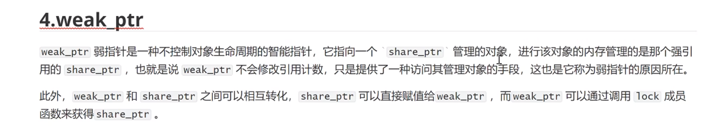
weak_ptr属于弱指针，相对的，shared_ptr属于强指针

## 回调函数

https://www.bilibili.com/video/BV1vk4y1G7Hf/?spm_id_from=333.337.search-card.all.click&vd_source=62fe42e71e56edada3fb7d905bdcf92b

## 多线程与多进程

多线程适用于高并发，数据规模小且独立。多进程使用于稳定，数据规模大对并发没有那么高要求。io复用适用于大量客户端连接，需要大量的io监听文件描述符

## 设计模式

https://zhuanlan.zhihu.com/p/431714886
[C++设计模式_毕加索来喽的博客-CSDN博客](https://blog.csdn.net/weixin_42636062/category_11313224.html?spm=1001.2014.3001.5482)

### 工厂模式

对于工厂模式来说，都用到了动态多态，这样我们在使用的时候可以让代码有更高的复用性，不需要指定我想用的具体是哪个子类，只需要同一写成其父类，用的时候再传入具体子类即可

[3.C++设计模式-创建型模型_设计模式-构建模式c++_毕加索来喽的博客-CSDN博客](https://blog.csdn.net/weixin_42636062/article/details/119938514)

#### 简单工厂模式

我要创建具体对象的时候，往工厂里传入对应字符串，然后在工厂的Create函数中通过ifelse返回对应创建的对应对象，main.cpp中代码如下：

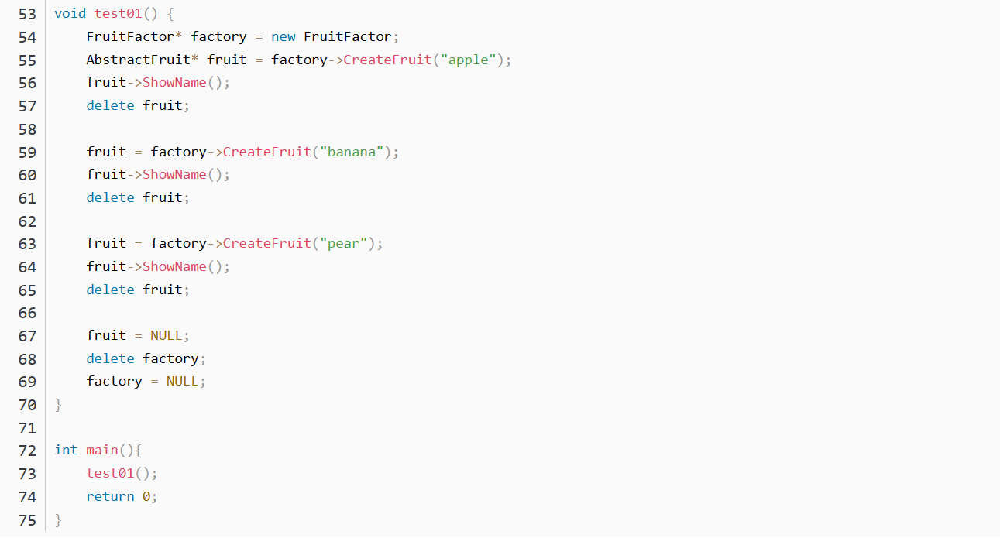

显然，我要添加新的水果时，首先要创建一个继承于AbstractFruit的具体水果类，然后在FruitFactory的CreateFruit中添加新建具体水果类的ifelse语句。
特点：

1. 在Fruit类中包含很多“if…else…”代码块
2. Fruit类的职责过重
3. 当需要增加新类型的水果时，必须修改Fruit类的源代码

#### 工厂方法模式

其实和简单工厂模式相似，只不过在工厂方法模式中的核心工厂类不再创建具体水果对象，而是把这项工作推迟到了其子类中。main.cpp中具体代码如下：

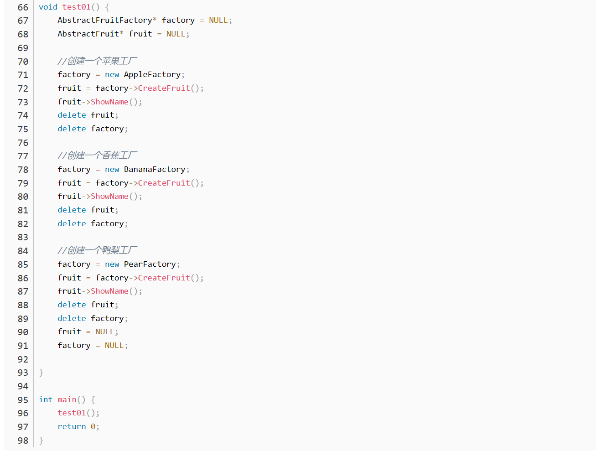

显然，我需要添加新的水果时，首先要创建一个继承于AbstractFruit的具体水果类，然后创建一个继承于AbstractFruitFactory的具体水果工厂类。
特点：

1. 在添加新水果时不用修改源代码
2. 添加新水果时需要单独创建一个类，代码量大

#### 抽象工厂模式

与工厂方法模式类似，但抽象工厂抽象的是整个产品族而非具体的产品。比如在工厂方法模式中我只要创建苹果，香蕉，鸭梨，但在抽象工厂模式中，这些水果还分不同的产地，比如中国苹果，美国苹果，日本苹果。main.cpp 中具体代码如下：

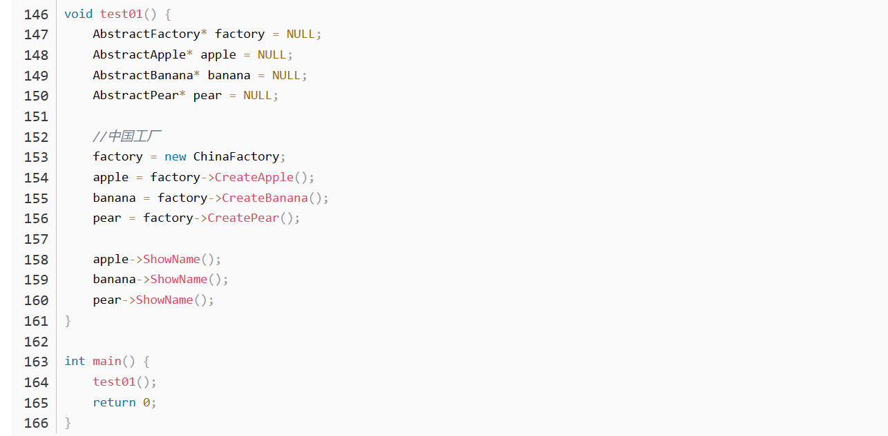

显然：	

1. 我只需要添加产品族时，只需要创建一个继承于抽象工厂的具体工厂类，然后创建继承于抽象工厂具体产品类 的 具体工厂具体产品类。
2. 当我需要为产品族添加具体产品时，需要先创建一个新的抽象工厂具体产品类 然后再创建继承于 抽象工厂具体产品类 的具体工厂具体产品类 ，最后在抽象工厂中创建 创建抽象工厂具体产品方法（纯虚函数） ，在具体工厂中创建 创建具体工厂具体产品方法

特点：

1. 新增产品族时很方便，不用修改已有的代码
2. 新增具体产品时很复杂，需要修改抽象工厂和具体工厂的源码

### 单例模式

[C++设计模式——单例模式_单例模式c++_静思心远的博客-CSDN博客](https://blog.csdn.net/zhiyuan2021/article/details/108032795)

**单例模式理论：**

单例模式是一种常用的软件设计模式。在它的核心结构中只包含一个被称为单例的特殊类。通过单例模式可以保证系统中一个类只有一个实例而且该实例易于外界访问，从而方便对实例个数的控制并节约系统资源。如果希望在系统中某个类的对象只能存在一个，单例模式是最好的解决方案。

**实现单例步骤：**

1. 构造函数私有化
2. 增加静态私有的当前类的指针变量
3. 提供静态对外接口，可以让用户获得单例对象(GetInstance)

#### 单例模式（懒汉式）

**需要时才会创建**

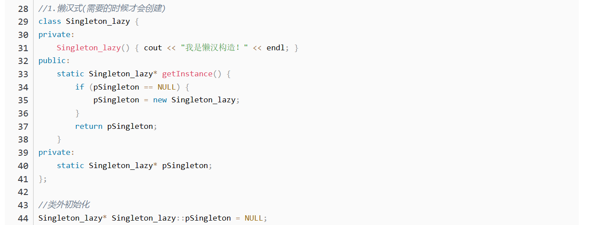

#### 单例模式（饿汉式）

**直接创建，即在main执行前就创建好了**


#### 单例模式的线程安全问题

对于饿汉式而言，因为创建对象在main函数执行之前，所以不会出现线程安全问题

对于懒汉式而言，由于会在需要时才创建对象，所以会出现线程安全问题
解决办法：加入双检锁-DCL机制
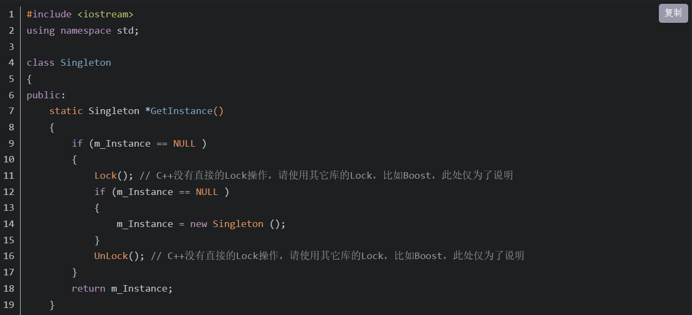
对于此机制的理解：
假设此处有两线程A，B，没有加入双检锁。A在执行完第一个判空语句进入Lock()时正好时间片结束，轮到B进入相应的时间片；显然，此时对于该进程而言，单例对象还没创建，所以B顺理成章地创建单例对象；问题出在当B的时间片结束，进入A的时间片时，如果没有加入双检锁机制，进入Lock()后不会再次判断进程中是否已经存在单例对象，所以顺理成章地再次创建单例对象，那么此时该进程中存在了两个单例对象，线程不安全；如果加入了双检锁机制，则A在创建对象前会再次检测单例对象是否存在，延迟了单例对象创建时间，保证线程安全。但此操作由于加入了两个判断语句，所以消耗时间稍长，所以如果对性能要求比较高的话，应该使用饿汉式。

#### 单例模式的对象释放问题

1. 单例对象从头到尾就一份内存，没必要释放
2. 如果非要提供释放，可以如下，运行完自动释放：

```c++
#include <iostream>
using namespace std;

//实现单例步骤
//1.构造函数私有化
//2.增加静态私有的当前类的指针变量
//3.提供静态对外接口，可以让用户获得单例对象

//单例 分为懒汉式 饿汉式

//1.懒汉式(需要的时候才会创建)
class Singleton_lazy {
private:
	Singleton_lazy() { cout << "我是懒汉构造！" << endl; }
public:
	static Singleton_lazy* getInstance() {
		if (pSingleton == NULL) {
			pSingleton = new Singleton_lazy;
		}
		return pSingleton;
	}
#if 0 
	//这样释放不行，万一谁手贱释放，就直接没了，这个权限不能给
	static void freeSpace() {
		if (pSingleton != NULL) {
			delete pSingleton;
		}
	}
#endif
	//如果非要写，可以加个类中类，运行完自动释放
	class Garbo {
		~Garbo() {
			if (pSingleton != NULL) {
				delete pSingleton;
			}
		}
	};

private:
	static Singleton_lazy* pSingleton;
	//创建的静态变量位于全局区，等程序结束之后由系统自动释放，
    //释放时调用garbo的析构函数，正好释放该单例对象
	static Garbo garbo;
};

//类外初始化
Singleton_lazy* Singleton_lazy::pSingleton = NULL;

```

## 架构模式

### C/S模式

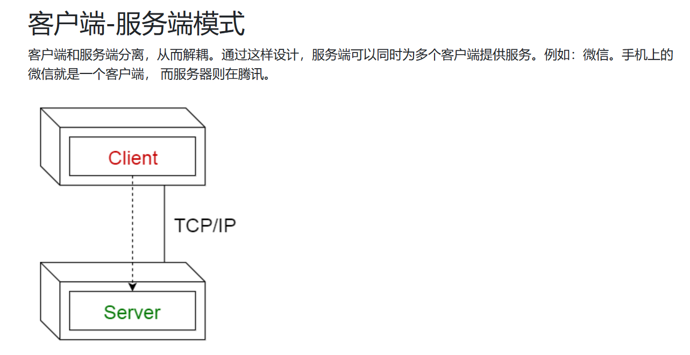

只要是个联网软件，就叫C/S模式

### MVC模式

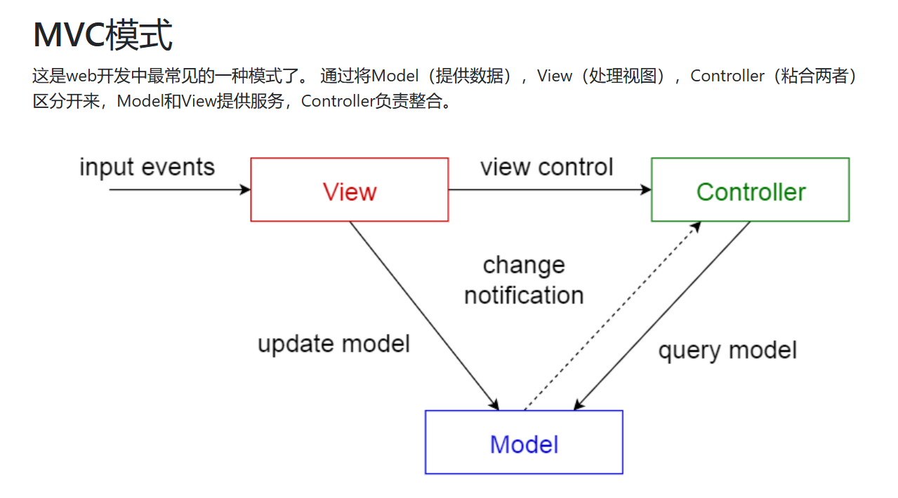

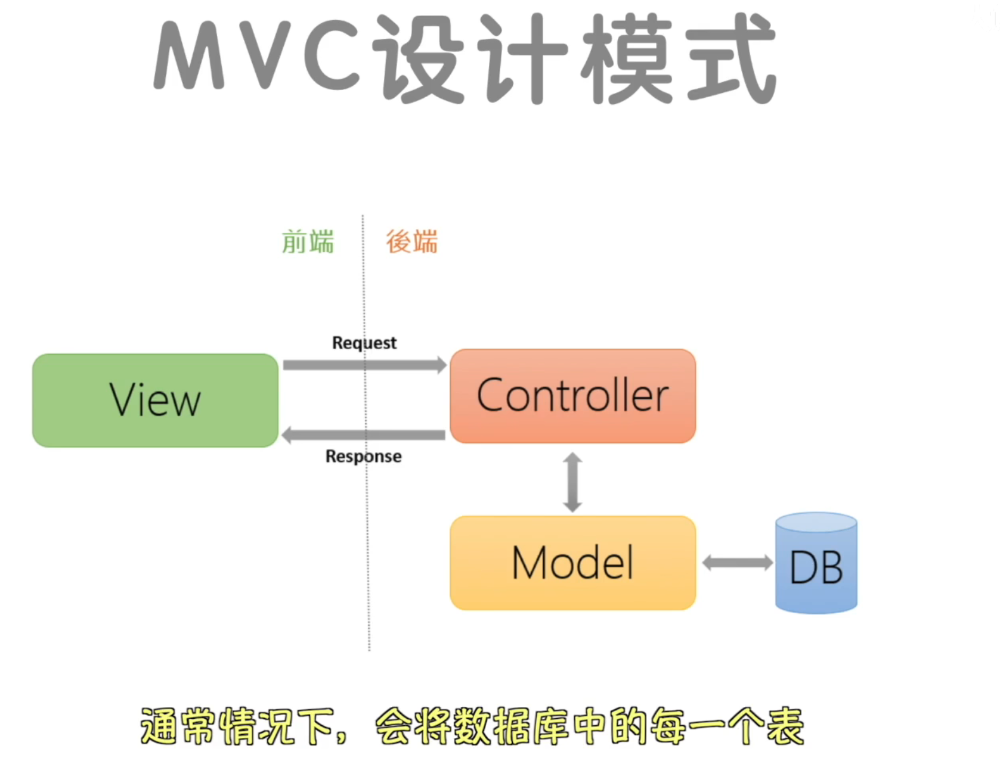

### 观察者模式

实现：[观察者模式（c++学习笔记） - 知乎 (zhihu.com)](https://zhuanlan.zhihu.com/p/119308881)

举个例子，当我回家的时候，妈妈去做饭，爸爸去看电视；此时我是被观察者，爸爸和妈妈是观察者，那观察者和被观察者如何联系起来呢，通过在我的具体对象中加入妈妈去做饭和爸爸去看电视的函数指针，当我回来时调用我.notify()去逐个通知观察者

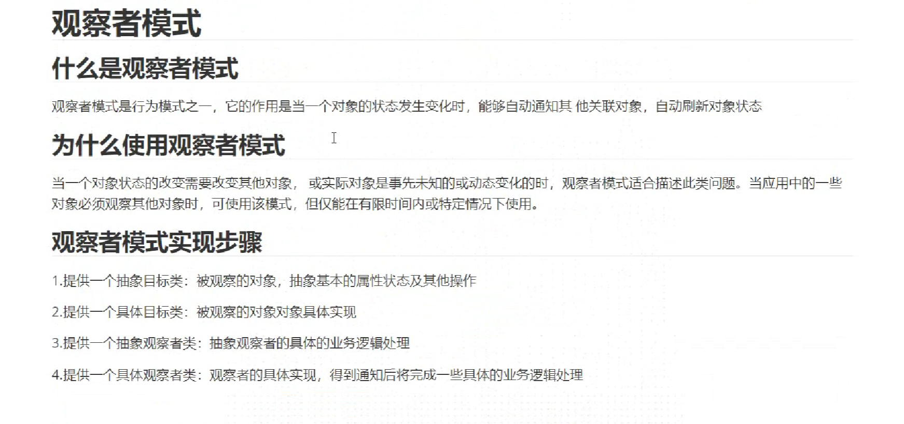

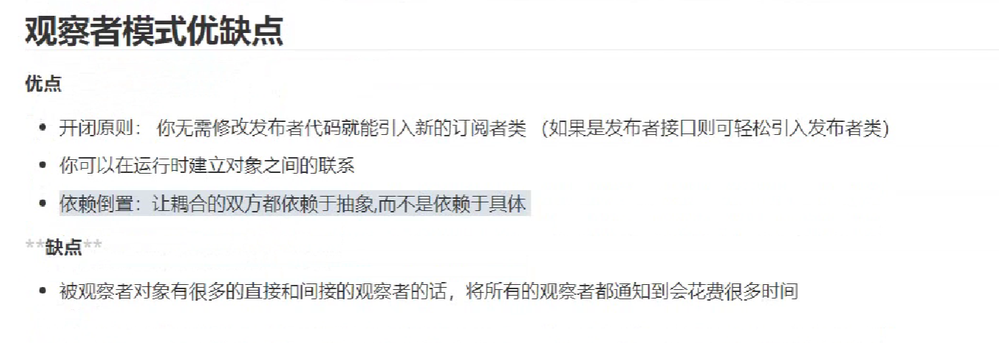

## 函数指针和回调函数

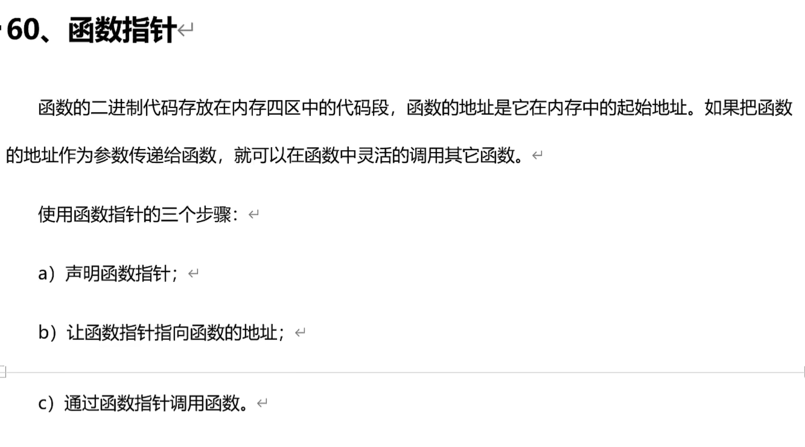

### 申明函数指针

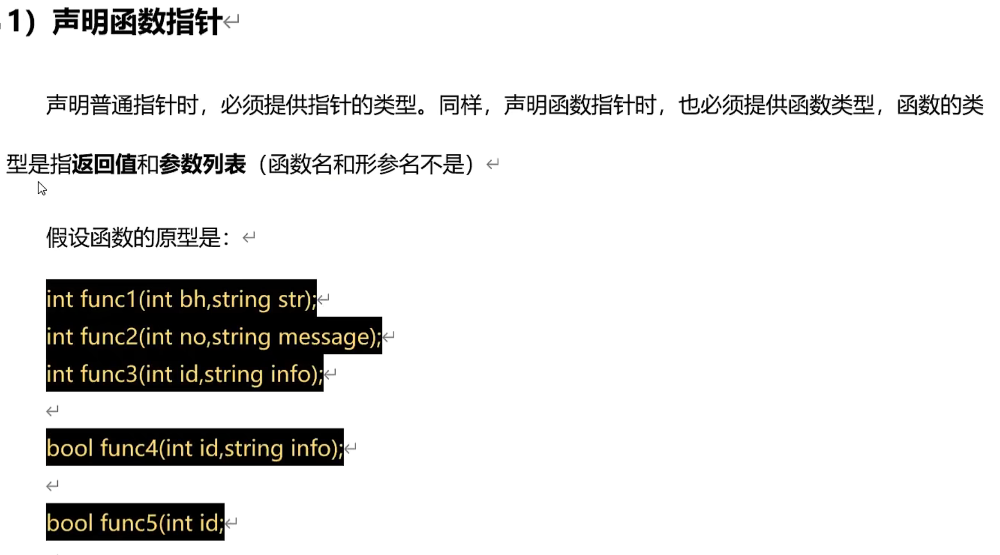

- 其中fun1，fun2，fun3虽然函数名和形参名不一样，但都是相同类型的函数；由此可得fun4, 5和fun1，2，3都不是同一类型函数
- 如果要申明以上三种函数的函数指针，则语法如下：

  int (*pFuncA)(int, string);

  bool (*pFuncB)(int, string);

  bool (*pFuncC)(int);

  **注意：**

  1. 函数指针的返回值要与原函数相同。
  2. 第一个括号内为函数指针名，必须用括号括起来，并且指针名前面要加*。
  3. 参数列表中的参数类型必须与原函数一样，但参数名可写可不写。
- 函数指针的实践：

  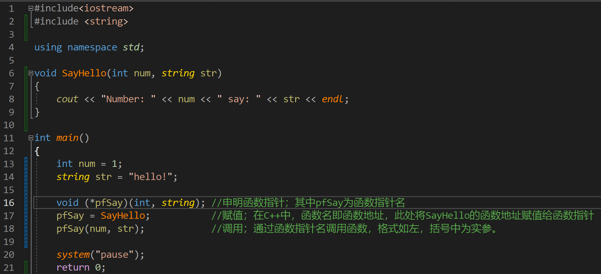

### 函数回调

#### 普通函数的函数回调

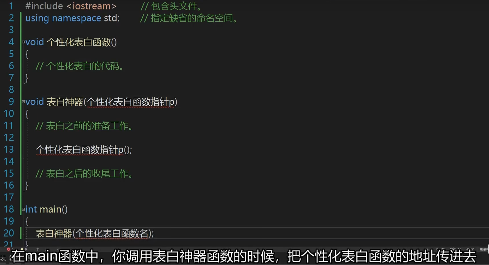

  理解：

  现在我要开发一个方便大伙表白的函数，这个函数名叫做表白神器，在这个函数里干三件事。1. 表白之前的场地布置等准备活动。2. 表白时的动作以及我对女生说的话。3. 表白之后的场地打扫等收尾活动。在这三件事情中，第1，3条都是可以确定的事情，只有第2件事情不确定，因为每个人的做法都不一样，这个时候就可以用到函数指针，那么用户在调用表白函数时只需要传入自己准备好的个性化表白函数指针，即可有一个完整的表白流程。这种函数调用的方法就叫函数的回调，其中个性化表白函数就叫回调函数。

  **对于回调函数需要注意两点：**（在和普通函数调用对比之后，我注意到两点不同的地方）

1. 在表白神器中不能直接调用个性化表白函数，因为不同的用户有不同的个性化表白函数，我根本不知道这个表白神器具体被谁调用。
2. 采用函数指针传参的形式，使不同用户在调用同一个表白神器时，可以根据自己的情况调用不同的个性化表白函数，使函数整体的灵活性更强。
3. 很明显，通过以上2点，对于我的需求而言，我只能使用回调函数来实现

  **回调函数的传参方式：**

1. 由调用者函数提供实参

   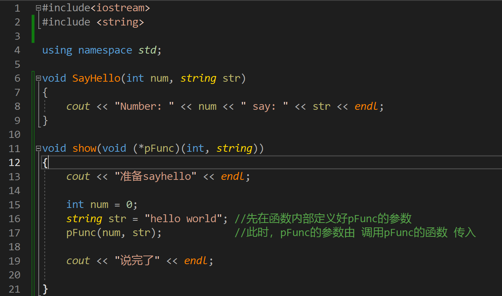
2. 由外界提供实参

   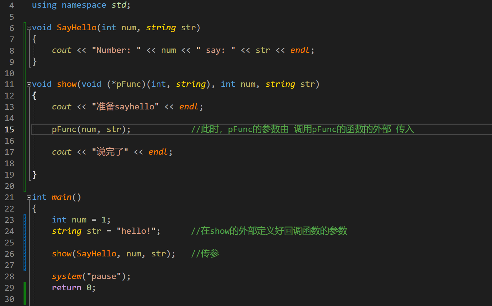

#### 类成员函数的函数回调

[关于C++ 回调函数(callback) 精简且实用_c++回调函数_zhoupian的博客-CSDN博客](https://blog.csdn.net/zhoupian/article/details/119495949)

##### 静态函数

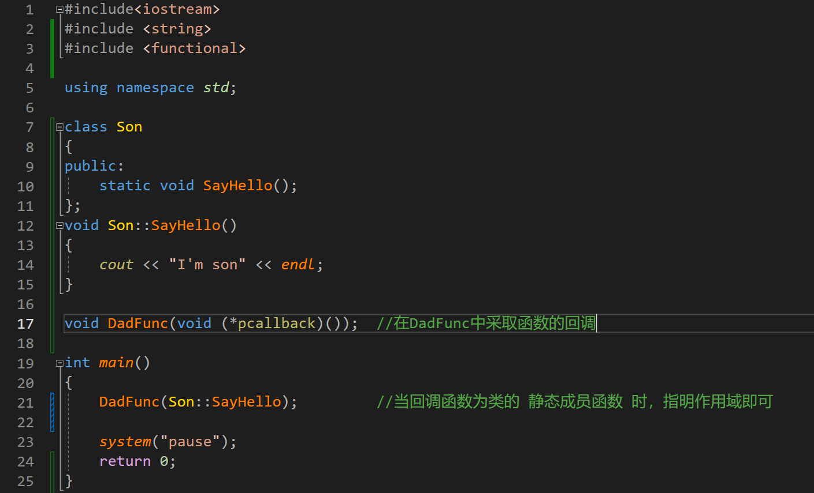

##### 非静态函数

**std::function：**

function<>的实例对象封装各种可调用的实体，包括函数指针，lambda表达式，类的成员函数，普通函数

[C++11中的std::function_std::function 大小__大猪的博客-CSDN博客](https://blog.csdn.net/u013654125/article/details/100140547)

封装类的非静态成员函数：


封装函数指针：

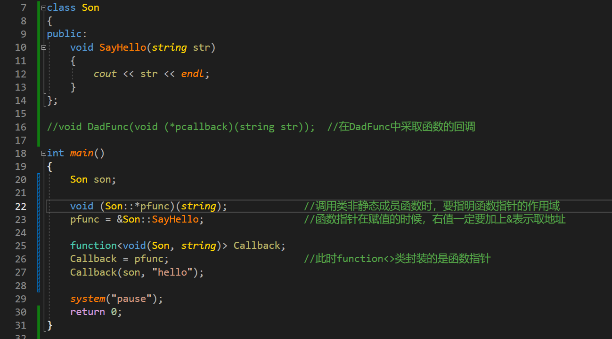

**std::bind**

bind用来绑定函数的某些参数的，在函数的回调之中，可以用来将 类的非静态成员函数 中的第一个参数与具体对象绑定，但注意对于参数列表中的剩余参数，必须显示指明或者用placeholders::_1 / _2 / _3……指定。他的返回值是一个可调用的实体，可以选择用function<>接受

[C++11中的std::bind__大猪的博客-CSDN博客](https://blog.csdn.net/u013654125/article/details/100140328)

使用bind配合function实现函数的回调（耦合度低）

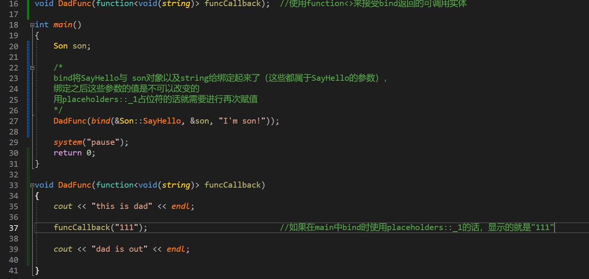

使用function<>实现函数的回调（耦合度高）

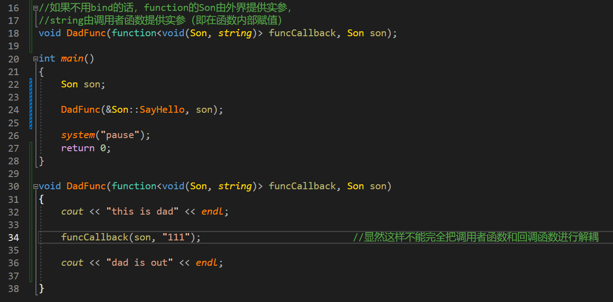

## connect的原理

[Qt中的信号槽 | 爱编程的大丙 (subingwen.cn)](https://subingwen.cn/qt/qt-signal-slot/?highlight=信号槽)
https://www.bilibili.com/video/BV1Jp4y167R9?p=29&vd_source=62fe42e71e56edada3fb7d905bdcf92b

- 信号槽机制（信号对应的是事件，信号槽对应的是事件的处理动作）类似于设计模式中的观察者模式（就是我一直在观察有没有事件产生，如果有则对其进行处理，基于这种机制，其核心思想就是回调，不过对于我们而言，事件的捕捉和信号的回调都由Qt框架内部实现），架构模式中的消息传递模式。
- 信号：事件在产生之后，显然会被我们的Qt框架捕捉到，但是捕捉到之后不会直接把事件交给我们，而是发送一个信号，这个信号就是对产生的事件的描述，本质就是一个函数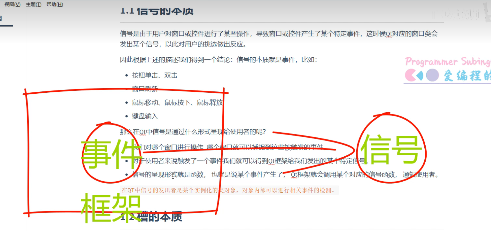

  其中信号的sender必须为实例化对象，因为事件以及信号是属于某个对象的，
- 槽：显然，处理信号的动作（即槽函数）也属于某个对象，所以也receiver也必须为实例化对象
- connect：如果要使用connect或者对象树，该类都必须直接或间接的继承自QObject，connect只负责在Qt框架中注册，注册成功后Qt框架会在事件循环中不断检测sender发出的signal。具体的调用由Qt框架负责
- connect的优缺点：[Qt经典面试题:Qt信号槽机制与优势与不足_qt信号槽机制的优缺点-CSDN博客](https://liucjy.blog.csdn.net/article/details/125409056?spm=1001.2101.3001.6650.1&utm_medium=distribute.pc_relevant.none-task-blog-2~default~CTRLIST~Rate-1-125409056-blog-86155060.235^v38^pc_relevant_anti_t3&depth_1-utm_source=distribute.pc_relevant.none-task-blog-2~default~CTRLIST~Rate-1-125409056-blog-86155060.235^v38^pc_relevant_anti_t3&utm_relevant_index=2)

  https://chat.openai.com/share/3396fb8c-ba99-4216-82bb-54a18556d11d
- 多线程情况下, Qt中的信号槽分别在什么线程中执行, 如何控制?

  信号槽机制的执行线程是由receiver决定的。因为本质上是个观察者模式

  通过connect函数的第五个参数connectType来控制。
  connect用于连接qt的信号和槽，在qt编程过程中不可或缺。它其实有第五个参数，只是一般使用默认值，在满足某些特殊需求的时候可能需要手动设置。

  Qt::AutoConnection： 默认值，使用这个值则连接类型会在信号发送时决定。如果接收者和发送者在同一个线程，则自动使用Qt::DirectConnection类型。如果接收者和发送者不在一个线程，则自动使用Qt::QueuedConnection类型。

  Qt::DirectConnection：槽函数会在信号发送的时候直接被调用，<font color=red>槽函数运行于信号发送者所在线程</font>。效果看上去就像是直接在信号发送位置调用了槽函数。这个在多线程环境下比较危险，可能会造成奔溃。

  Qt::QueuedConnection：槽函数在控制回到接收者所在线程的事件循环时被调用，<font color=red>槽函数运行于信号接收者所在线程</font>。发送信号之后，槽函数不会立刻被调用，等到接收者的当前函数执行完，进入事件循环之后，槽函数才会被调用。多线程环境下一般用这个。

  Qt::BlockingQueuedConnection：槽函数的调用时机与Qt::QueuedConnection一致，不过发送完信号后发送者所在线程会阻塞，直到槽函数运行完。接收者和发送者绝对不能在一个线程，否则程序会死锁。在多线程间需要同步的场合可能需要这个。

  Qt::UniqueConnection：这个flag可以通过按位或（|）与以上四个结合在一起使用。当这个flag设置时，当某个信号和槽已经连接时，再进行重复的连接就会失败。也就是避免了重复连接。
- 自定义通信类解决connect的缺点：https://chat.openai.com/share/3396fb8c-ba99-4216-82bb-54a18556d11d
- **connect**:

  1. concect的三种类型，Qt4和Qt5在参数上的差别，qt4的应用场景
  2. Qt5的sender和receiver，第5个参数
  3. 底层原理：先要使用元对象系统，提供对象之间通信的信号与槽机制、运行时类型信息和动态属性系统。底层原理是观察者模式，结合回调函数
  4. 具体实现：先注册，检测到后再回调
  5. 缺点：
  6. 解决办法：有一块共享内存，往里写，往外读。注意：1. 互斥锁 2. 阻塞：while，非阻塞：exec();

事件派发 ->事件过滤->事件分发->事件处理几个阶段。

## 堆排序

**介绍堆**

大顶堆：

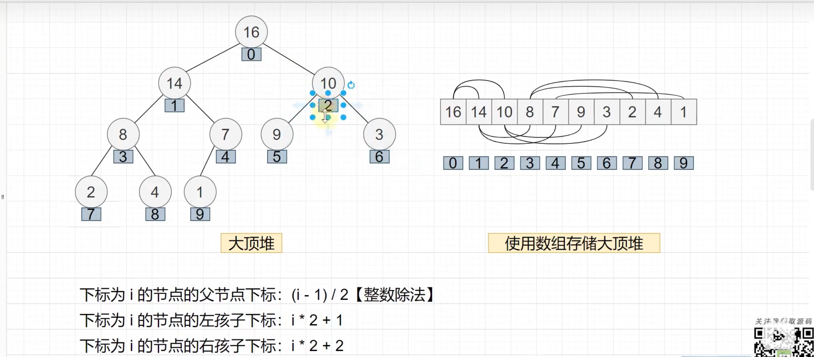

小顶堆：

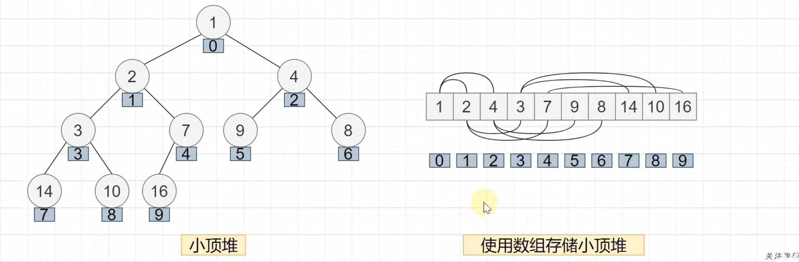

**维护堆的性质（O(logN))**

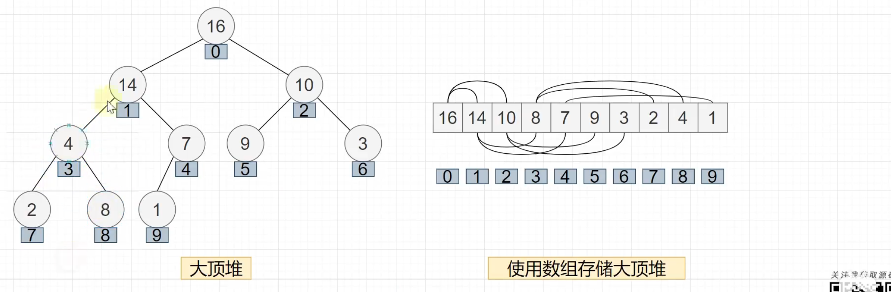

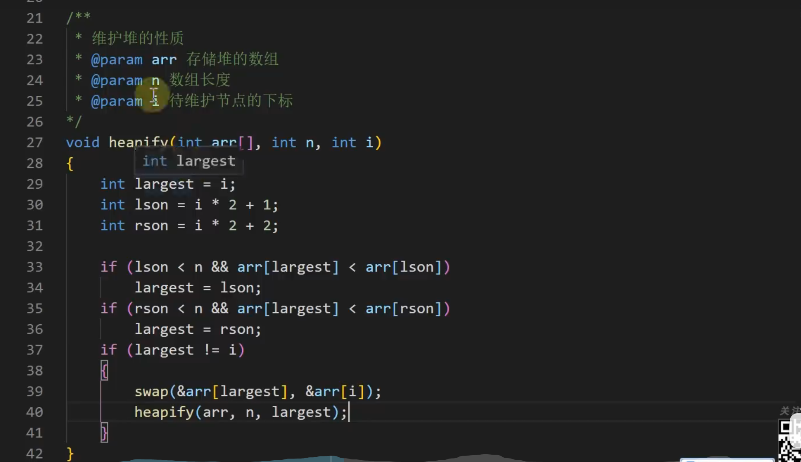

此处为递归，33-36行表示：if (父节点<左孩子||右孩子)，then 最大节点=max(左孩子，右孩子)，swap(最大节点val，父节点val)，最后对最大节点index进行递归（因为此时最大节点val和父节点val发生了swap，最大节点index的val此时为swap之前的父节点val）

**建堆（O(N))，堆排序(O(NlogN))**

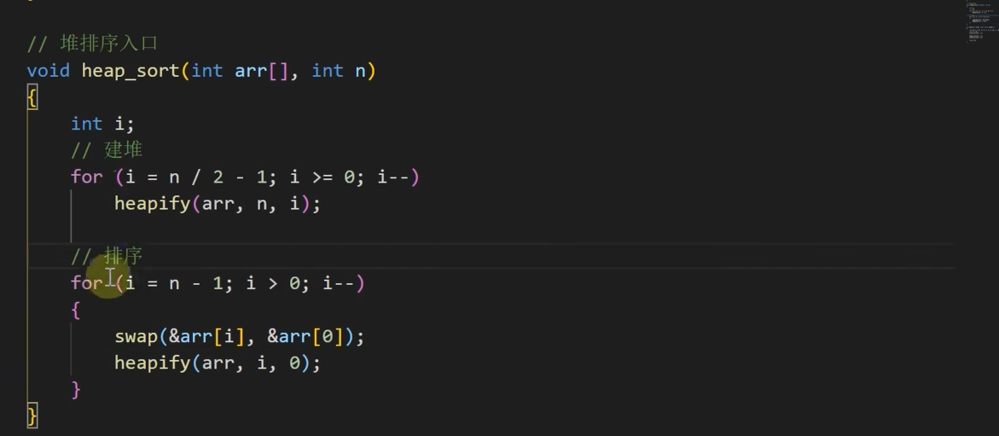

**建堆：**

从最后一个子节点的父节点开始，即i=n/2-1((n-1)/2也可以，都一样)一直往前遍历，对每一个节点都调用heapify函数，完成建堆。

**堆排序（首先要建堆）：**

每次swap(最后一个节点val，堆顶val)，并将最后一个元素移出堆（即原先的堆顶元素），直至堆中个数为1，此时数组（不是堆）中的元素为由小->大排序

## 快速排序（O(NlogN))

主要采用的分治思想，把比pivot小的元素放在前面，比pivot大的元素放在后面，然后递归处理pivot前面和后面的元素即可

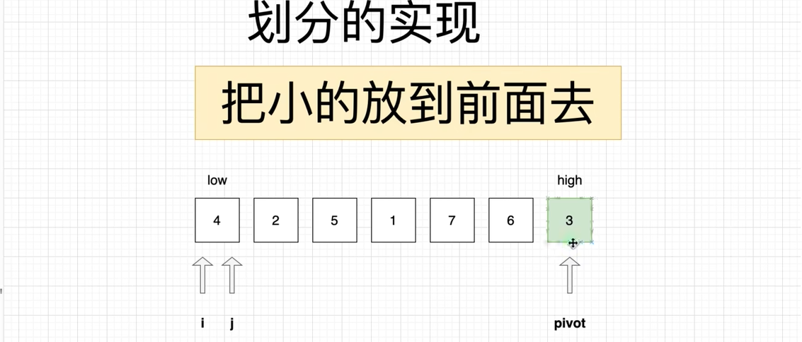

代码：

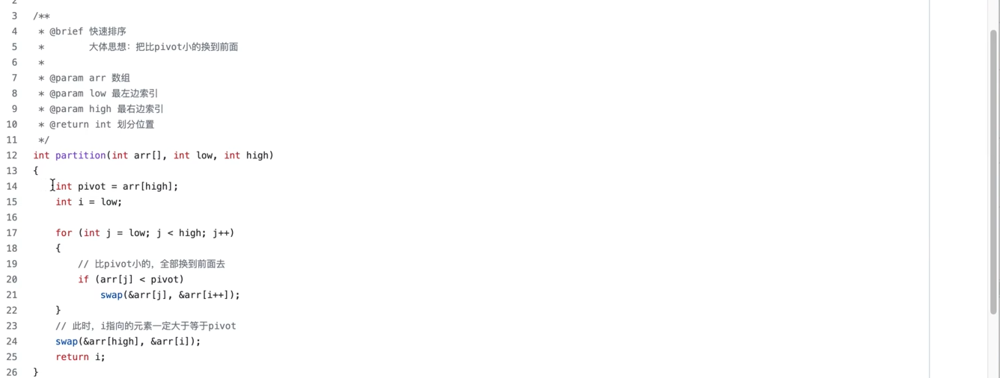

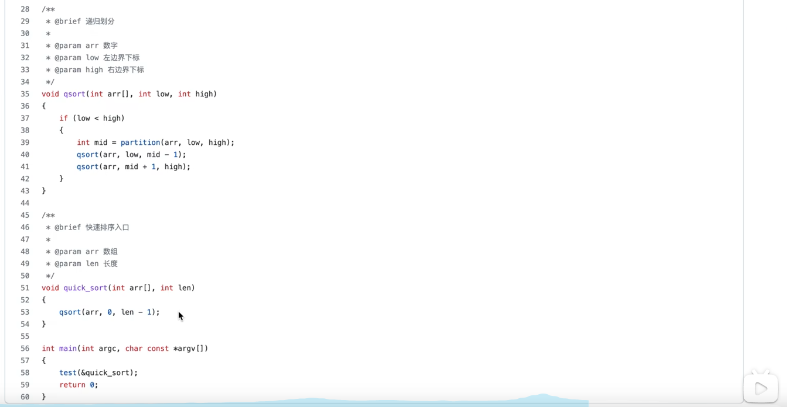

**快速排序改进**

- 三值取中
- 小数组采用插入排序
- 多线程

[快速排序优化：一步一步优化，将快速排序的性能提升5倍 - 知乎 (zhihu.com)](https://zhuanlan.zhihu.com/p/139056506)

[快速排序的5种优化方法_快速排序优化-CSDN博客](https://blog.csdn.net/qq_19525389/article/details/81436838)

## new/delete，malloc/free

- new的实现过程是：首先调用名为**operator new**的标准库函数，分配足够大的原始为类型化的内存，以保存指定类型的一个对象；接下来运行该类型的一个**构造函数**，用指定初始化构造对象；最 后返回指向新分配并构造后的的对象的指针
- delete的实现过程：对指针指向的对象运行适当的**析构函数**；然后通过调用名为**operator delete** 的标准库函数释放该对象所用内存

**相同点**

- 都可用于内存的动态申请和释放

**不同点**

- 前者是C++运算符，后者是C/C++语言标准库函数
- new自动计算要分配的空间大小，malloc需要手工计算
- new是类型安全的，malloc不是。例如：

  ```c++
  int* p = new float[2]; //编译错误
  int* p = (int*)malloc(2 * sizeof(double));//编译无错误
  ```

**free()如何知道释放内存块的大小**

[free()如何知道释放内存块的大小 - 知乎 (zhihu.com)](https://zhuanlan.zhihu.com/p/98859924)

举个例子：假设你用malloc需要申请100字节，实际是申请了104个字节。把前4字节存成该块内存的实际大小，并把前4字节后的地址返回给你。 free释放的时候会根据传入的地址向前偏移4个字节 从这4字节获取具体的内存块大小并释放。

## sizeof/strlen

编译器在**编译时**就计算出了 sizeof 的结果。而 strlen 函数必须在运行时才能计算出来。

并且 sizeof 计算的是数据类型占的**内存大小**，而 strlen 计算的是字符串的**实际长度**。

sizeof 的参数可以是数据的类型，也可以是变量，而 strlen 只能以结尾为‘\0‘的**字符串**作参数。

## 野指针/悬空指针/内存泄漏

**野指针：**未被初始化的指针

**悬空指针：**指针最初指向的内存已经被释放了的一种指针。

产生原因及解决办法：
野指针：指针变量未及时初始化 =>  定义指针变量及时初始化，要么置空。
悬空指针：指针free或delete之后没有及时置空 =>  释放操作后立即置空。（智能指针也可以）

**内存泄漏：**内存泄漏可以通过智能指针进行解决；检测工具：windows下可以使用CRT库

## define/const

define是在编译的**预处理阶段**起作用；而const是在**编译、运行**的时候起作用

宏不检查类型，一般来说加上一个大括号；const会检查数据类型

## const/static

**static**

- 不考虑类的情况
  隐藏。所有不加static的全局变量和函数具有全局可见性，可以在其他文件中使用，加了之后只能在该文件所在的编译模块中使用
- 考虑类的情况
  static成员变量：只与类关联，不与类的对象关联。定义时要分配空间，可以被非static成员函数任意访问。
  static成员函数：不具有this指针，无法访问类对象的普通成员变量和普通成员函数； 不能被声明为const、虚函数和volatile；可以被非static成员函数任意访问

**const**

- 不考虑类的情况
  const常量在定义时必须初始化，之后无法更改 const形参可以接收const和非const类型的实参
- 考虑类的情况
  const成员变量：只能通过构造函数初始化列表进行初始化，并且 必须有构造函数；

  const成员函数：const对象只能调用const成员函数；且只有mutable修饰的数据的值可以改变

## 编程实现strcpy

[编写程序实现strcpy函数_编写strcpy函数-CSDN博客](https://blog.csdn.net/m0_62179366/article/details/123098864)

```c++
#include<stdio.h>
#include<assert.h>
char* my_strcpy(char* dest,const char* sou)
{
    //防止传入空指针
	assert(dest && sou);
    //形成链式访问
	char* ret = dest;
	while (*dest++=*sou++)
	{
		;
	}
	return ret;
}
int main()
{
	char arr1[] = "Hello World!";
	char arr2[] = "***************";
 
	printf("%s", my_strcpy(arr2, arr1));
 
	return 0;
}
```

## 类型安全

一般来说，由于C++拥有new/delete，const，inline，模板函数，是类型安全的，比较容易引起类型安全隐患的是在进行向下类型转换的时候，比如父类指针/引用转换为子类指针/引用的时候，这个时候会用到dynamic_cast关键字

[C++强制类型转换操作符 dynamic_cast - 狂奔~ - 博客园 (cnblogs.com)](https://www.cnblogs.com/xiangtingshen/p/10851851.html)

注意：`static_cast`和 `dynamic_cast`使用场景差不多，但 `static_cast` 不执行**运行时类型检查**。如果对转换不确定，考虑使用其他类型的转换，如 `dynamic_cast`。

## C++的内存分区

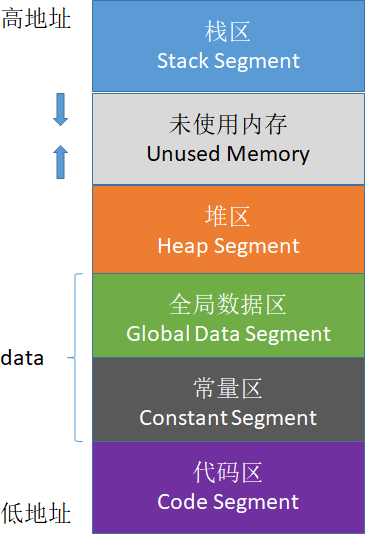

**栈：**在执行函数时，函数内局部变量的存储单元都可以在栈上创建，函数执行结束时这些存储单元自动 被释放。栈内存分配运算内置于处理器的指令集中，效率很高，但是分配的内存容量有限

**堆：**就是那些由 new分配的内存块，他们的释放编译器不去管，由我们的应用程序去控制，一般一个 new就要对应一个 delete。如果程序员没有释放掉，那么在程序结束后，操作系统会自动回收

**自由存储区：**就是那些由 malloc 等分配的内存块，它和堆是十分相似的，不过它是用 free 来结束自 己的生命的

**全局/静态 存 储 区：**全局变量和静态变量被分配到同一块内存中，在以前的C语言中，全局变量和静态变 量又分为初始化的和未初始化的，在C++里面没有这个区分了，它们共同占用同一块内存区，在该区定 义的变量若没有初始化，则会被自动初始化，例如int型变量自动初始为0

**常量存储区：**这是一块比较特殊的存储区，这里面存放的是常量，不允许修改

**代码区：**存放函数体的二进制代码

## 堆和栈的区别

|              | 堆                                                           | 栈                                                           |
| ------------ | :----------------------------------------------------------- | :----------------------------------------------------------- |
| 管理方式     | 堆中资源由程序员控制（容易产生memory leak）                  | 栈资源由编译器自动管理，无需手工控制                         |
| 内存管理机制 | 系统有一个记录空闲内存地址的链表，当系统收到程序 申请时，遍历该链表，寻找第一个空间大于申请空间的 堆结点，删 除空闲结点链表中的该结点，并将该结点空 间分配给程序（大多数系统会在这块内存空间首地址记录本 次分配的大小，这样delete才能正确释放本内存空间， 另外系统会将多余的部分重新放入空闲链表中） | 只要栈的剩余空间大于所申请 空间，系统为程序提供内存， 否则报异常提示栈溢出。（这 一块理解一下链表和队列的区 别，不连续空间和连续空间的 区别，应该就比较好理解这两 种机制的区别了） |
| 空间大小     | 堆是不连续的内存区域（因为系统是用链表来存储空闲内 存地址，自然不是连续的），堆大小受限于计算机系统中 有效的虚拟内存（32bit 系统理论上是4G），所以堆的 空间比较灵活，比较大 | 栈是一块连续的内存区域，大 小是操作系统预定好的， windows下栈大小是2M（也有 是1M，在 编译时确定，VC中 可设置） |
| 碎片问题     | 对于堆，频繁的new/delete会造成大量碎片，使程序 效率降低，linux中的伙伴系统，windows下的堆管理系统用于解决这种问题 | 对于栈，它是有点类似于数据 结构上的一个先进后出的栈， 进出一一对应，不会产生碎 片。（看到这里我突然明白了 为什么面试官在问我堆和栈的 区别之前先问了我栈和队列的区别） |
| 生长方向     | 堆向上，向高地址方向增长。                                   | 栈向下，向低地址方向增长。                                   |
| 分配方式     | 堆都是动态分配（没有静态分配的堆）                           | 栈有静态分配和动态分配，静态分配由编译器完成（如局部 变量分配），动态分配由alloca 函数分配，但栈的动态分配的 资源由编译器进行释放，无需程序员实现。 |
| 分配效率     | 堆由C/C++函数库提供，机制很复杂。所以堆的效率比 栈低很多。   | 栈是其系统提供的数据结构， 计算机在底层对栈提供支持， 分配专门 寄存器存放栈地址， 栈操作有专门指令。 |

## 虚函数表，虚函数，虚函数表指针

虚表指针vptr跟虚函数密不可分，对于有虚函数或者继承于拥有虚函数的基类，对该类进行实例化时，在**构造函数执行时会对虚表指针进行初始化，并且存在对象内存布局的最前面。**
虚函数表位于C++内存模型中的**常量区**；而虚函数则位于C++内存模型中的**代码区**。

## 异常处理

在程序执行过程中，由于程序员的疏忽或是系统资源紧张等因素都有可能导致异常，任何程序都无法保 证绝对的稳定，常见的异常有：
数组下标越界除法计算时除数为0
动态分配空间时空间不足
如果不及时对这些异常进行处理，程序多数情况下都会崩溃。
（1）  try、throw和catch关键字
C++中的异常处理机制主要使用try、throw和catch三个关键字，其在程序中的用法如下：

```c++
#include <iostream>
using namespace std;
int main()
{
	double m = 1, n = 0;
	try {
		cout << "before dividing." << endl; 
        if (n == 0)
			throw - 1; //抛出int型异常
		else if (m == 0)
    		throw - 1.0; //拋出double 型异常 
        else
			cout << m / n << endl;
		cout << "after dividing." << endl;
	}
	catch (double d) {
		cout << "catch (double)" << d << endl; 
    }
	catch (...) {
		cout << "catch (...)" << endl;
    }
	cout << "finished" << endl; return 0;
}
//运行结果
//before dividing.
//catch (...)
//finished
```

代码中，对两个数进行除法计算，其中除数为0。可以看到以上三个关键字，程序的执行流程是先执行 try包裹的语句块，如果执行过程中没有异常发生，则不会进入任何catch包裹的语句块，如果发生异常，则使用throw进行异常抛出，再由catch进行捕获，throw可以抛出各种数据类型的信息，代码中使 用的是数字，也可以自定义异常class。**catch根据throw抛出的数据类型进行精确捕获（不会出现类型 转换），如果匹配不到就直接报错，可以使用catch(...)的方式捕获任何异常（不推荐）。**当然，如果catch 了异常，当前函数如果不进行处理，或者已经处理了想通知上一层的调用者，可以在catch里面再throw 异常。

有多个异常，catch捕获时先后顺序有什么需要注意的吗（越靠后捕获范围应该越大）

## this指针

**A. this指针是什么时候创建的？**

this在成员函数的开始执行前构造，在成员的执行结束后清除。

一个对象的this指针并不是对象本身的一部分，不会影响sizeof(对象)的结果。this作用域是在类内部，当在类的非静态成员函数中访问类的非静态成员的时候，编译器会自动将对象本身的地址作为一个隐含参数传递给函数。也就是说，即使你没有写上this指针，编译器在编译的时候也是加上this的，它作为非静态成员函数的隐含形参，对各成员的访问均通过this进行。 　　例如，调用date.SetMonth(9) <===> SetMonth(&date, 9)，this帮助完成了这一转换 .

**B. this指针存放在何处？堆、栈、全局变量，还是其他？**

其实编译器在生成程序时加入了获取对象首地址的相关代码。并把获取的首地址存放在了寄存器ECX中(VC++编译器是放在ECX中，其它编译器有可能不同)。也就是成员函数的其它参数正常都是存放在栈中。而this指针参数则是存放在寄存器中。
类的静态成员函数因为没有this指针这个参数，所以类的静态成员函数也就无法调用类的非静态成员变量。

**C. C++中类成员函数是如何知道哪个对象调用了它？并正确显示调用它的对象的数据呢？**

当一个对象调用某成员函数时会隐式传入一个参数， 这个参数就是this指针，是普通成员函数的首参。this指针中存放的就是这个对象的首地址。
这和C中通过向函数传递结构体变量的地址是不是很像？只是传参形式不一样罢了！ 在C中我们是手工把结构体变量和函数关联起来的，而C++则是编译器帮我们把类数据和成员函数关联起来的并通过名称粉碎和编译时检查等形式防止外部的任意访问。

**D. this指针是如何访问类中的变量的？**

如果不是类，而是结构体的话，那么，如何通过结构指针来访问结构中的变量呢？如果你明白这一点的 话，就很容易理解这个问题了。
在C++中，类和结构是只有一个区别的：类的成员默认是private，而结构是public。
this是类的指针，如果换成结构体，那this就是结构的指针了。

**E.我们只有获得一个对象后，才能通过对象使用this指针。如果我们知道一个对象this指针的位置，可 以直接使用吗？**

this指针只有在成员函数中才有定义。因此，你获得一个对象后，也不能通过对象使用this指针。所 以，我们无法知道一个对象的this指针的位置（只有在成员函数里才有this指针的位置）。当然，在成员函数里，你是可以知道this指针的位置的（可以通过&this获得），也可以直接使用它。

**F.  每个类编译后，是否创建一个类中函数表保存函数指针，以便用来调用函数？**

普通的类函数（不论是成员函数，还是静态函数）都不会创建一个函数表来保存函数指针。只有虚函数 才 会被放到函数表中。但是，即使是虚函数，如果编译期就能明确知道调用的是哪个函数，编译器就不 会 通过函数表中的指针来间接调用，而是会直接调用该函数。正是由于this指针的存在，用来指向不同 的 对象，从而确保不同对象之间调用相同的函数可以互不干扰

## 原子操作

[什么是原子操作 - 知乎 (zhihu.com)](https://zhuanlan.zhihu.com/p/575896055)

[原子操作-CSDN博客](https://blog.csdn.net/just_kong/article/details/99289539)

原子操作就是: 不可中断的一个或者一系列操作, 也就是不会被线程调度机制打断的操作, 运行期间不会有任何的上下文切换(context switch).更广泛的意义下原子操作是指一系列必须整体完成的操作步骤，如果任何一步操作没有完成，那么所有完成的步骤都必须回滚，这样就可以保证要么所有操作步骤都未完成，要么所有操作步骤都被完成。

对于非long和double基本数据类型的"简单操作"都可以看作是原子的. 例如: 赋值和返回. 大多数体系中long和double都占据8个字节, 操作系统很可能会将写入和读取操作分离为两个单独的32位的操作来执行, 这就产生了在一个读取和写入过程中一个上下文切换(context switch), 从而导致了不同任务线程看到不正确结果的的可能性.

递增, 递减不是原子操作: i++反汇编的汇编指令: (需要三条指令操作, 和两个内存访问, 一次寄存器修改)

Win32 API中常用的原子操作主要有三类，一种是加1减1操作，一种是比较交换操作，另外一种是赋值（写）操作。

## 内存对齐

[什么是内存对齐？为什么要内存对齐？_内存对齐是什么意思-CSDN博客](https://blog.csdn.net/weixin_40853073/article/details/81451792#:~:text=对结构体A来说，a占4个字节，占从0~3的字节，b是double类型占8个字节，占从8~15的字节，c占两个字节，从16~17的字节。,对结构体B来说，a占4个字节，从0~3，b占两个字节从4~6；c占8个字节从8~15。 这就是内存对齐，对齐规则是按照成员的声明顺序，依次安排内存，其偏移量为成员大小的整数倍，0看做任何成员的整数倍，最后结构体的大小为最大成员的整数倍（所以这里的A的大小是24，而不是18）。)

C语言和C++中空类和空结构体的大小
在C++中规定了空结构体和空类的内存所占大小为1字节，因为c++中规定，任何不同的对象不能拥有相同的内存地址。否则无法区分this指针。
而在C语言中，空的结构体在内存中所占大小为0。(gcc中测试为0，其他编译器不一定)

为什么要内存对齐？

1. **平台原因**(移植原因)：不是所有的硬件平台都能访问任意地址上的任意数据的；某些硬件平台只能在某些地址处取某些特定类型的数据，否则抛出硬件异常。
2. **性能原因**：数据结构(尤其是栈)应该尽可能地在自然边界上对齐。原因在于，为了访问未对齐的内存，处理器需要作两次内存访问；而对齐的内存访问仅需要一次访问。
   - 假如没有内存对齐机制，数据可以任意存放，现在一个int变量存放在从地址1开始的联系四个字节地址中，该处理器去取数据时，要先从0地址开始读取第一个4字节块,剔除不想要的字节（0地址）,然后从地址4开始读取下一个4字节块,同样剔除不要的数据（5，6，7地址）,最后留下的两块数据合并放入寄存器。这需要做很多工作。
   - 现在有了内存对齐的，int类型数据只能存放在按照对齐规则的内存中，比如说0地址开始的内存。那么现在该处理器在取数据时一次性就能将数据读出来了，而且不需要做额外的操作，提高了效率。

## 函数调用时的压栈过程

[函数调用时的压栈过程](https://www.bilibili.com/video/BV1wh41117uB/?buvid=Y449ED4A69C3DE3B4446A587E397D24EA532&from_spmid=search.search-result.0.0&is_story_h5=false&mid=S1oTrFEKVgS%2FhTGAJJeDIw%3D%3D&p=1&plat_id=116&share_from=ugc&share_medium=iphone&share_plat=ios&share_session_id=DDCC9712-2BE0-4AA4-A463-A7E98A0036C4&share_source=QQ&share_tag=s_i&spmid=united.player-video-detail.0.0&timestamp=1709438878&unique_k=B4zVbOn&up_id=435139336)

首先明确一点：栈的push操作由高地址指向低地址

当函数从入口函数main函数开始执行时，编译器会将我们操作系统的运行状态，main函数的返回地址、main的参数（由右向左压栈）、mian函数中的变量、进行依次压栈；
当main函数开始调用func()函数时，编译器此时会将main函数中func()的下一条语句压栈作为func()返回时的起始位置，此时栈顶以下的部分被称为main的栈帧（在执行func()时，main的栈帧处于挂起状态）再将func()函数的参数从右到左、func()定义变量依次压栈；

# 计算机网络

## OSI七层模型

物理层：底层数据传输，如网线；网卡标准。
数据链路层：定义数据的基本格式，如何传输，如何标识；如网卡MAC地址。
网络层：定义IP编址，定义路由功能；如不同设备的数据转发。
传输层：端到端传输数据的基本功能；如 TCP、UDP。
会话层：控制应用程序之间会话能力；如不同软件数据分发给不同软件。
表示层：数据格式标识，基本压缩加密功能。
应用层：各种应用软件，包括 Web 应用

## TCP长连接和短链接的区别

在HTTP/1.0中默认使用短连接。也就是说，客户端和服务器每进行一次HTTP操作，就建立一次连接， 任务结束就中断连接。
而从HTTP/1.1起，默认使用长连接，用以保持连接特性。

## TCP粘包/拆包

由于TCP是流式传输的协议，所以对一段数据无法准确判断该段数据的开头和结尾，所以会造成TCP粘包，拆包也是同样的原因

在我的那个开源项目中，我是通过给消息设定开头和结尾来解决TCP粘包和拆包问题的

## URL到显示界面的过程

1. 浏览器接收到⽤户请求，先检查浏览器缓存⾥是否有缓存该资源，如果有直接返回；如果没有进⼊下⼀ 步⽹络请求。
2. ⽹络请求前，进⾏ **DNS解析** ，以获取请求域名的 IP地址 。如果请求协议是 HTTPS ，那么还需要 建⽴TLS连接 。DNS解析时会按本地浏览器缓存->本地 Host ⽂件->路由器缓存-> DNS 服务器-> 根 DNS 服务器的顺序查询域名对应 IP ，直到找到为⽌。
3. **浏览器与服务器IP建⽴TCP连接**。连接建⽴后，浏览器端会构建请求⾏、请求头等信息，并把和该域名 相关的    Cookie 等数据附加到请求头中，向服务器构建请求信息。
4. 服务器接收到请求信息，根据请求⽣成响应数据。
5. 浏览器解析响应头。若响应头状态码为    301、302 ，会重定向到新地址；若响应数据类型是字节流类 型，⼀般会将请求提交给下载管理器；若是HTML类型，会进⼊下⼀部渲染流程。
6. 浏览器解析HTML ⽂件，创建DOM 树，解析    CSS 进⾏样式计算，然后将CSS和DOM合并，构建渲 染树；最后布局和绘制渲染树，完成⻚⾯展示。

## 端口有效范围

0-1023为知名端口号，比如其中HTTP是80，FTP是20（数据端口）、21（控制端口）
UDP和TCP报头使用两个字节存放端口号，所以端口号的有效范围是从0到65535。动态端口的范围是从 1024到65535

## TCP头部信息

源端口号，目的端口号：比较简单，不在赘述

序列号：用于 TCP   通信过程中某一传输方向上字节流的每个字节的编号，为了确保数据 通信的有序性，避免网络中乱序的问题。接收端根据这个编号进行确认，保证分割的数据段在原始数据包的位置。初始序列号由自己定，而后绪的序列号由对端的 ACK 决定：SN_x = ACK_y (x 的序列号 = y 发给 x 的 ACK)。

确认序列号：确认序列号是接收确认端所期望收到的下一序列号。确认序号应当是上次 已 成功收到数据字节序号加1， 只有当标志位中的  ACK   标 志 为  1   时该确认序列号的字段才有效。 主要用来解决不丢包的问题。

TCPflags：SYN，ACK，FIN，这个会在tcp三次握手/四次挥手时涉及到

滑动窗口大小：用于流量控制

## 三次握手/四次挥手

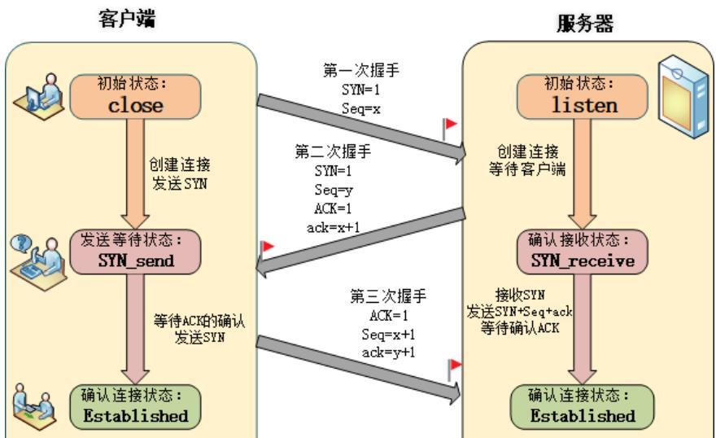

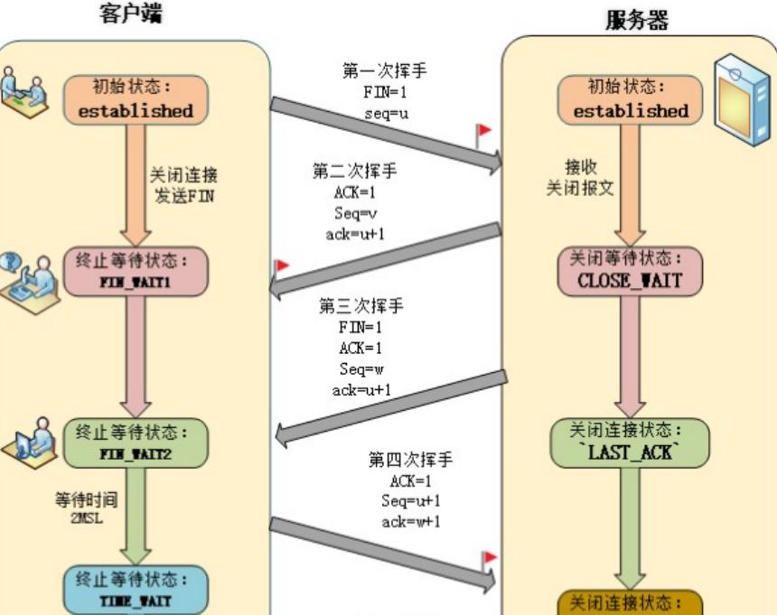

## 四次挥手释放连接时，等待2MSL的意义

> MSL是Maximum Segment Lifetime的英文缩写，可译为“最长报文段寿命”，它是任何报文在网络 上存在的最长时间，超过这个时间报文将被丢弃。

**为了保证客户端发送的最后一个ACK报文段能够到达服务器。**因为这个ACK有可能丢失，从而导致处在 LAST-ACK状态的服务器收不到对FIN-ACK的确认报文。服务器会超时重传这个FIN-ACK，接着客户端再 重传一次确认，重新启动时间等待计时器。最后客户端和服务器都能正常的关闭。假设客户端不等待 2MSL，而是在发送完ACK之后直接释放关闭，一但这个ACK丢失的话，服务器就无法正常的进入关闭连 接状态。

## TCP可靠传输实现

序列号，确认序列号，校验和，停止等待，滑动窗口，超时重传，拥塞控制（慢开始，拥塞避免，快重传，快恢复）

## 拥塞控制

> 在某段时间内，如果<font color=red>对网络中某一资源的需求超过了该资源所能提供的可用部分，网络性能就要变坏。</font>这种情况叫拥塞(congestion)
>
> 资源指的是计算机网络中的链路容量（带宽），交换节点中的缓存和处理机等。

cwnd，swnd，ssthresh定义：

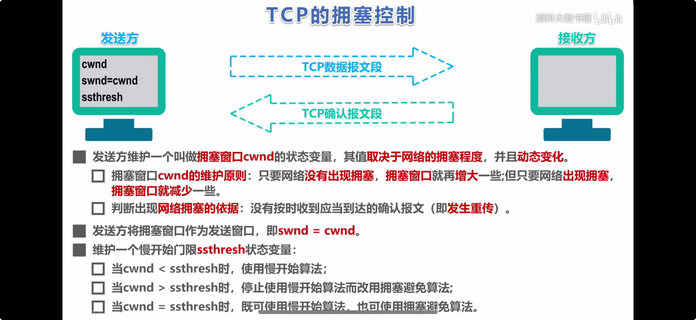

- 慢开始(slow-start)：cwnd初始值为1，在未发生超时重传，未达到ssthresh时执行的时慢开始算法，此时发送方每接收一轮接收方的ACK报文时（即一个RTT)，cwnd翻倍。注意慢开始指的是一开始向网络注入的报文段少，不是拥塞窗口cwnd增长速度慢
- 拥塞避免(congestion avoidance)：当cwnd=ssthresh时，采用拥塞避免算法，此时每接收一轮接收方的ACK报文，cwnd+1。注意该算法并非指完全能够避免拥塞，而是指在拥塞避免阶段将拥塞窗口控制为按线性规律增长，使网络不容易出现拥塞。
- 快重传(fast retransmit)：

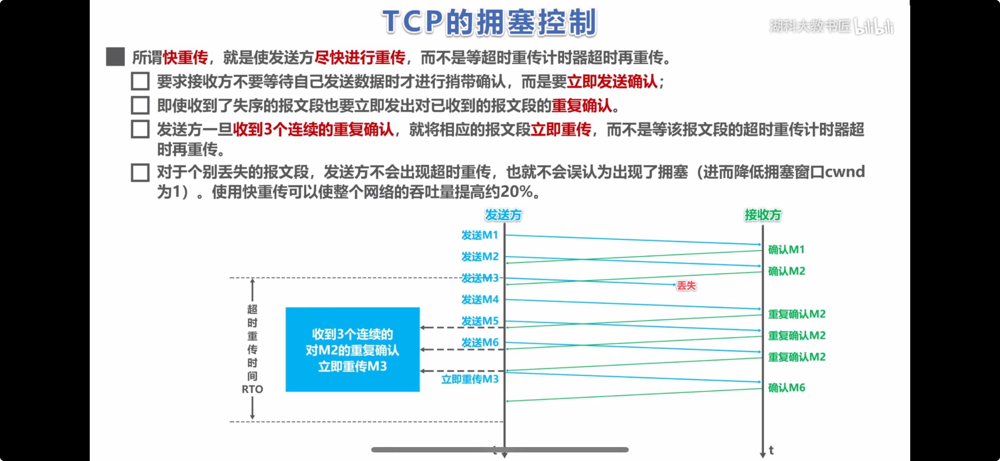

- 快恢复(fast recovery)：

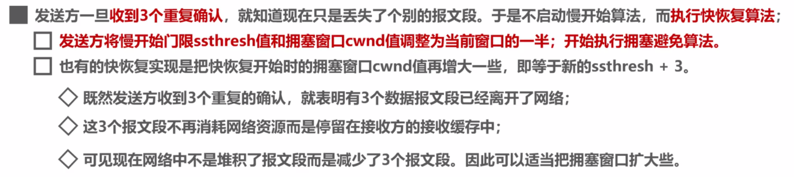

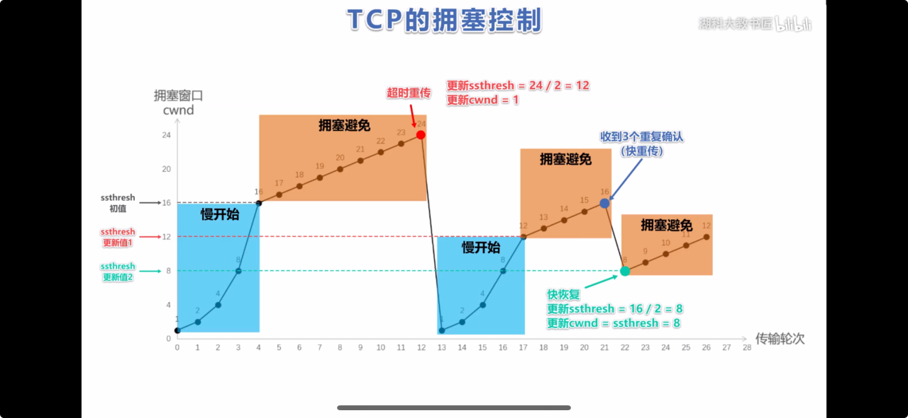

## TCP对应的应用层协议

FTP：定义了文件传输协议，使用21端口.
Telnet：它是一种用于远程登陆的端口,23端口
SMTP：定义了简单邮件传送协议，服务器开放的是25号端口。
POP3：它是和SMTP对应，POP3用于接收邮件。
HTTPS：443，还需要ssl证书
HTTP：80。

## UDP对应的应用层协议

DNS：用于域名解析服务，用的是53号端口
SNMP：简单网络管理协议，使用161号端口
TFTP(Trival File Transfer Protocal)：简单文件传输协议，69

# 操作系统

## IO多路复用

**IO多路复用是指使用一个线程来检查多个文件描述符（Socket）的就绪状态**，比如调用select和poll函数，传入多个文件描述符，**如果有一个文件描述符就绪，则返回，否则阻塞直到超时**。

[什么是IO多路复用？为什么需要IO多路复用？_串口io复用的作用-CSDN博客](https://blog.csdn.net/Sansipi/article/details/121890431)

## 进程，线程，协程

|          | 进程                                                                            | 线程                                                 | 协程                                                                       |
| -------- | ------------------------------------------------------------------------------- | ---------------------------------------------------- | -------------------------------------------------------------------------- |
| 定义     | 资源调度的基本单位                                                              | 程序执行的基本单位。                                 | 用户态的轻量级线程，线程内部调度的基本单位                                 |
| 切换情况 | 进程CPU环境(栈、寄存器、页表和文件句柄等)的保存以及新 调度的进程CPU环境的设置   | 保存和设置程序计数器、少量寄 存器和栈的内容          | 先将寄存器上下文和栈保存，等 切换回来的时候再进行恢复                      |
| 切换者   | 操作系统                                                                        | 操作系统                                             | 用户                                                                       |
| 切换过程 | 用户态->内核态-> 用户态                                                         | 用户态->内核态-> 用户态                              | 用户态(没有陷入内核)                                                       |
| 调用栈   | 内核栈                                                                          | 内核栈                                               | 用户栈                                                                     |
| 拥有资源 | CPU资源、内存资源、文件资 源和句柄等                                            | 程序计数器、寄存器、栈和状态字                       | 拥有自己的寄存器上下文和栈                                                 |
| 并发性   | 不同进程之间切换实现并发， 各自占有CPU实现并行                                  | 一个进程内部的多个线程并发执行                       | 同一时间只能执行一个协程，而 其他协程处于休眠状态，适合对 任务进行分时处理 |
| 系统开销 | 切换虚拟地址空间，切换内核 栈和硬件上下文，CPU高速缓 存失效、页表切换，开销很大 | 切换时只需保存和设置少量寄存 器内容，因此开 销很小   | 同一时间只能执行一个协程，而 其他协程处于休眠状态，适合对 任务进行分时处理 |
| 通信方面 | 进程间通信需要借助操作系统                                                      | 线程间可以直接读写进程数据段 (如全局变量)来进 行通信 | 共享内存、消息队列                                                         |

## 一个进程可以创建多少线程

一个进程可用虚拟空间是2G，默认情况下，线程的栈的大小是1MB，所以理论上最多只能创建2048个线程。一个进程可以创建的线程数由可用虚拟空间和线程的栈的大小共同决定。

## 线程之间共享的资源

[线程间到底共享了哪些进程资源 - 知乎 (zhihu.com)](https://zhuanlan.zhihu.com/p/352707156#)

由于线程运行的本质就是函数运行，函数运行时信息是保存在栈帧中的，因此每个线程都有自己独立的、私有的栈区。除了栈帧以及线程上下文（程序计数器、栈指针以及函数运行使用的寄存器）以外，其他的都是线程之间共享的

## Linux下进程间通信方式

- 管道：

  - 无名管道（内存文件）：管道是一种半双工的通信方式，数据只能单向流动，而且只能在具 有 亲缘关系的进程之间使用。进程的亲缘关系通常是指父子进程关系。
  - 有名管道（FIFO文件，借助文件系统）：有名管道也是半双工的通信方式，但是允许在没有 亲 缘关系的进程之间使用，管道是先进先出的通信方式。
- 共享内存
- 消息队列
- 套接字：适用于不同机器间进程通信，在本地也可作为两个进程通信的方式。
- 信号：用于通知接收进程某个事件已经发生，比如按下ctrl + C就是信号。
- 信号量：信号量是一个计数器，可以用来控制多个进程对共享资源的访问。它常作为一种锁机制， 实现进程、线程的对临界区的同步及互斥访问。

## 进程的状态切换

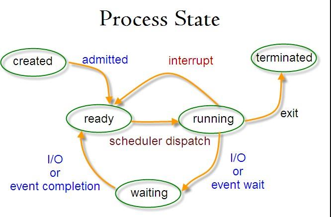

- 就绪状态（ready）：等待被调度
- 运行状态（running）
- 阻塞状态（waiting）：等待资源

应该注意以下内容：

- 只有就绪态和运行态可以相互转换，其它的都是单向转换。就绪状态的进程通过调度算法从而获得 CPU 时间，转为运行状态；而运行状态的进程，在分配给它的 CPU  时间片用完之后就会转为就绪 状态，等待下一次调度。
- 阻塞状态是缺少需要的资源从而由运行状态转换而来，但是该资源不包括 CPU 时间，缺少 CPU 时 间会从运行态转换为就绪态。

## 一个程序编译过程

**预处理**：主要处理源代码文件中的以“#”开头的预编译指令

**编译**：把预编译之后生成的文件，进行语法分析，生成相应的汇编文件。

**汇编**：将汇编代码转变成机器指令(机器码文件)。

**链接**：将不同的源文件产生的目标文件进行链接，从而形成一个可以执行的程序。链接分为静态链接和动态链接。

## 死锁

**死锁必要条件**
互斥条件：进程对所需求的资源具有排他性，若有其他进程请求该资源，请求进程只能等待。 
不剥夺条件：进程在所获得的资源未释放前，不能被其他进程强行夺走，只能自己释放 
请求和保持条件：进程当前所拥有的资源在进程请求其他新资源时，由该进程继续占有。 
循环等待条件：存在一种进程资源循环等待链，链中每个进程已获得的资源同时被链中下一个进程 所请求。

**处理方法**

**破坏互斥条件**
这个条件我们没有办法破坏，因为我们用锁本来就是想让他们互斥的（临界资源需要互斥访问）。

**破坏请求与保持条件**
一次性申请所有的资源。

**破坏不剥夺条件**
占用部分资源的线程进一步申请其他资源时，如果申请不到，可以主动释放它占有的资源。

**破坏循环等待条件**
靠按序申请资源来预防。按某一顺序申请资源，释放资源则反序释放。破坏循环等待条件。
我们对线程 2 的代码修改成下面这样就不会产生死锁了。

银行家算法

## 进程通信方法

无名管道，有名管道，消息队列，共享内存，套接字

## 锁类型

读写锁，互斥锁，条件变量
