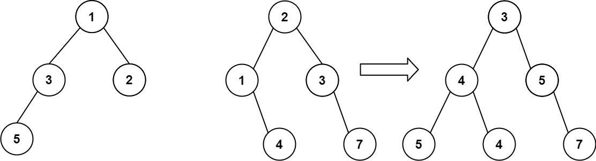

## Day1（数组）

### 704.二分查找（数组）

[704. 二分查找](https://leetcode.cn/problems/binary-search/)

(附加题：35，34)

给定一个 `n` 个元素有序的（升序）整型数组 `nums` 和一个目标值 `target` ，写一个函数搜索 `nums` 中的 `target`，如果目标值存在返回下标，否则返回 `-1`。

**示例 1:**

```
输入: nums = [-1,0,3,5,9,12], target = 9
输出: 4
解释: 9 出现在 nums 中并且下标为 4
```

**示例 2:**

```
输入: nums = [-1,0,3,5,9,12], target = 2
输出: -1
解释: 2 不存在 nums 中因此返回 -1
```

题解：

```c++
class Solution {
public:
	//此处方法为二分法，使用的是 左闭右闭，
    //当数组为有序数组的时候，首先考虑此方法
    //整体思想是在while中不断更新 left 或 right，缩小查找范围
    //时间复杂度为 O(logn)
	int search(vector<int>& nums, int target) {
		int ileft = 0;
		int iright = nums.size()-1;	//右闭
		while (ileft <= iright)		//注意这里while循环的条件
		{
			int mid = ileft + (iright - ileft) / 2;		 //防止数组越界
			if (target < nums.at(mid))					//目标小于中间值，说明目标在mid左边
			{
				iright = mid - 1;					    //中间值已经大于target了，所以mid要-1
			}
			else if (target > nums.at(mid))
			{
				ileft = mid + 1;						//同理
			}
			else
			{
				return mid;
			}
		}
		return -1;
	}
};
```


### 27.移除元素（数组）

[27. 移除元素](https://leetcode.cn/problems/remove-element/)

给你一个数组 `nums` 和一个值 `val`，你需要 **[原地](https://baike.baidu.com/item/原地算法)** 移除所有数值等于 `val` 的元素，并返回移除后数组的新长度。不要使用额外的数组空间，你必须仅使用 `O(1)` 额外空间并 **[原地 ](https://baike.baidu.com/item/原地算法)修改输入数组**。元素的顺序可以改变。你不需要考虑数组中超出新长度后面的元素。

**示例 1：**

```
输入：nums = [3,2,2,3], val = 3
输出：2, nums = [2,2]
解释：函数应该返回新的长度 2, 并且 nums 中的前两个元素均为 2。你不需要考虑数组中超出新长度后面的元素。例如，函数返回的新长度为 2 ，而 nums = [2,2,3,3] 或 nums = [2,2,0,0]，也会被视作正确答案。
```

**示例 2：**

```
输入：nums = [0,1,2,2,3,0,4,2], val = 2
输出：5, nums = [0,1,3,0,4]
解释：函数应该返回新的长度 5, 并且 nums 中的前五个元素为 0, 1, 3, 0, 4。注意这五个元素可为任意顺序。你不需要考虑数组中超出新长度后面的元素。
```

```c++
class Solution {
public:
	//快慢指针
	int removeElement(vector<int>& nums, int val) {
        //i是快指针，j是慢指针
        //快指针指向原数组，根据条件筛选原数组，得出新数组
        //慢指针指向新数组，接收快指针的赋值
		int i = 0, j = 0;
		for (i = 0; i < nums.size(); i++)
		{
			if (nums.at(i) != val)
			{
				nums.at(j) = nums.at(i);
				++j;
			}
		}
		return j;
	}
};
```

## Day2（数组）

### 209.长度最小的子数组

[209. 长度最小的子数组](https://leetcode.cn/problems/minimum-size-subarray-sum/)

给定一个含有 `n` 个正整数的数组和一个正整数 `target` **。**

找出该数组中满足其总和大于等于 `target` 的长度最小的 **连续子数组** `[numsl, numsl+1, ..., numsr-1, numsr]` ，并返回其长度**。**如果不存在符合条件的子数组，返回 `0` 。

**示例 1：**

```
输入：target = 7, nums = [2,3,1,2,4,3]
输出：2
解释：子数组 [4,3] 是该条件下的长度最小的子数组。
```

**示例 2：**

```
输入：target = 4, nums = [1,4,4]
输出：1
```

**示例 3：**

```
输入：target = 11, nums = [1,1,1,1,1,1,1,1]
输出：0
```

题解：

```c++
class Solution {
public:
//滑动窗口
int minSubArrayLen(int target, vector<int>& nums) {
	int ileft = 0, iright = 0;
	int sum = 0, mincount = 111111;

	//如果这里的循环使用ileft，那么每次在定位iright时依然要从ileft开始往右遍历，浪费时间比较大
	//所以此处应该使用iright，而ileft使用动态调整，耗时更少
	for (iright; iright < nums.size(); iright++)
	{
		//此处应该先记录iright 移动后/初始状态下 当前窗口的sum，再去记录ileft移动后新窗口的结果
		sum += nums[iright];
		while(sum >= target)
		{
			//当sum>=target时，表示当前已经得到了一个字串，我们应该先记录当前字串的信息，再动态调整ileft的位置
			mincount = mincount > (iright - ileft + 1) ? (iright - ileft + 1) : mincount;
			sum = sum - nums[ileft];
			ileft++;						//ileft始终向后移动，不能回退，因为iright也是向后移动的，如果ileft往回退，会导致最短字串变长
		}
	}
	if (mincount == 111111)
	{
		return 0;			//如果mincount=111111，表示sum恒小于target，此时应该返回0
	}
	return mincount;
}
};
```
### 977.有序数组的平方

[977. 有序数组的平方](https://leetcode.cn/problems/squares-of-a-sorted-array/)

给你一个按 **非递减顺序** 排序的整数数组 `nums`，返回 **每个数字的平方** 组成的新数组，要求也按 **非递减顺序** 排序。

**示例 1：**

```
输入：nums = [-4,-1,0,3,10]
输出：[0,1,9,16,100]
解释：平方后，数组变为 [16,1,0,9,100]
排序后，数组变为 [0,1,9,16,100]
```

**示例 2：**

```
输入：nums = [-7,-3,2,3,11]
输出：[4,9,9,49,121]
```

题解：

```c++
class Solution {
public:
	//双指针，由两边向中间遍历，当前的最大值即整个数组的最大值
    //注意前提：非递减顺序数组
	vector<int> sortedSquares(vector<int>& nums) {
		int vcount = nums.size();
		vector<int> newnums(vcount);
		int ileft = 0, iright = vcount - 1;
		int k = vcount - 1;
		for (ileft,iright; ileft <= iright;)
		{
			if ((nums[ileft]*nums[ileft]) > (nums[iright]*nums[iright]))
			{
				newnums[k--] = nums[ileft] * nums[ileft];
				ileft++;
			}
			else
			{
				newnums[k--] = nums[iright] * nums[iright];
				iright--;
			}
		}
		return newnums;

	}
};
```

### 59.螺旋矩阵Ⅱ

[59. 螺旋矩阵 II](https://leetcode.cn/problems/spiral-matrix-ii/)

给你一个正整数 `n` ，生成一个包含 `1` 到 `n2` 所有元素，且元素按顺时针顺序螺旋排列的 `n x n` 正方形矩阵 `matrix` 。

**示例 1：**


```
输入：n = 3
输出：[[1,2,3],[8,9,4],[7,6,5]]
```

**示例 2：**

```
输入：n = 1
输出：[[1]]
```

题解：

```c++
class Solution {
public:
	vector<vector<int>> generateMatrix(int n) {
		int startx = 0, starty = 0;
		int offest = 1;
		int num = 1;
		int i, j;
		vector<vector<int>> vvnum(n, vector<int>(n));
        //注意是左闭右开区间
        //注意可以把该问题拆解成每次循环一圈，一共循环n/2次，每循环一圈就缩小一圈
		for (int k = 0; k < n / 2; k++)
		{
			for (j = startx; j < n - offest; j++)
			{
				vvnum[startx][j] = num++;
			}
			for (i = starty; i < n - offest; i++)
			{
				vvnum[i][j] = num++;
			}
			for (j; j > starty; j--)
			{
				vvnum[i][j] = num++;
			}
			for (i; i > startx; i--)
			{
				vvnum[i][j] = num++;
			}
			startx++;
			starty++;
			offest++;
		}
		if (n % 2 != 0)
		{
			vvnum[n / 2][n / 2] = n * n;
		}
		return vvnum;
	}
};
```

## 数组总结

[76. 最小覆盖子串 - 力扣（LeetCode）](https://leetcode.cn/problems/minimum-window-substring/description/)，[904. 水果成篮 - 力扣（LeetCode）](https://leetcode.cn/problems/fruit-into-baskets/description/)

1. 使用双指针的时候，注意 ①每次只能移动一个指针，不能贪心。②基本思路是会有一个指针一直变化（通常是快指针）然后慢指针会根据快指针变化后，该数组和题目相关的值的改变而动态变化。
2. 注意遇到涉及区间的问题时，一定要坚持不变量（左闭右开）

## Day3（链表）

### 203. 移除链表元素

[203. 移除链表元素](https://leetcode.cn/problems/remove-linked-list-elements/)

给你一个链表的头节点 `head` 和一个整数 `val` ，请你删除链表中所有满足 `Node.val == val` 的节点，并返回 **新的头节点** 。

**示例 1**


```
输入：head = [1,2,6,3,4,5,6], val = 6
输出：[1,2,3,4,5]
```

**示例 2：**

```
输入：head = [], val = 1
输出：[]
```

**示例 3：**

```
输入：head = [7,7,7,7], val = 7
输出：[]
```

**提示：**

- 列表中的节点数目在范围 `[0, 104]` 内
- `1 <= Node.val <= 50`
- `0 <= val <= 50`

```c++
class Solution {
public:
	//虚拟头节点的使用
	ListNode* removeElements(ListNode* head, int val) {
		//创建虚拟头节点，和创建类指针一样的步骤
		ListNode* m_VirtulHead = new ListNode;
		m_VirtulHead->next = head;
		//在链表中头节点是不能移动的，所以需要创建一个临时指针进行移动
		ListNode* m_pindex = m_VirtulHead;

		//注意使用虚拟头节点时，我要查看/删除的永远是当前临时指针的下一个节点的值
		while (m_pindex->next != NULL)
		{
			if (m_pindex->next->val == val)
			{
				//注意当元素被删除时
				//和迭代器注意事项一样，会把后面的元素往前填空，相当于m_pindex->next的节点往后移动了一位
				//所以删除元素后不用再移动指针，否则会有漏检查的元素
				m_pindex->next = m_pindex->next->next;
			}
			else
			{
				m_pindex = m_pindex->next;
			}
			
		}
		return m_VirtulHead->next;
	}
};
```

### 206. 反转链表

[206. 反转链表](https://leetcode.cn/problems/reverse-linked-list/)

给你单链表的头节点 `head` ，请你反转链表，并返回反转后的链表。

**示例 1：**


```
输入：head = [1,2,3,4,5]
输出：[5,4,3,2,1]
```

**示例 2：**


```
输入：head = [1,2]
输出：[2,1]
```

**示例 3：**

```
输入：head = []
输出：[] 
```

**提示：**

- 链表中节点的数目范围是 `[0, 5000]`
- `-5000 <= Node.val <= 5000`

```c++
class Solution {
public:
	//还是用的双指针+temp思想
	ListNode* reverseList(ListNode* head) {
		//还是先拆解目标，由反转多个节点的链表转换成只反转两个节点的链表
		ListNode* curr = head;
		ListNode* pre = nullptr;
		while (curr)
		{
			//然后组合起来，发现如果要将n个 两个节点链表串联起来，需要加一个临时变量存储curr->next的值
             //注意链表中给temp赋值时一定要考虑curr是否为空，所以我每次只能在更新完curr后不能直接赋值
             //必须要经过while进行判断后才能给temp赋值
			ListNode* temp = curr->next;
			//注意此处修改的时curr->next的值，要关注哪些要改，哪些不要改
			curr->next = pre;
			pre = curr;
			curr = temp;
		}
		head = pre;

		return head;
	}
	
};
```

### 707.设计链表

[707. 设计链表](https://leetcode.cn/problems/design-linked-list/)

你可以选择使用单链表或者双链表，设计并实现自己的链表。
单链表中的节点应该具备两个属性：`val` 和 `next` 。`val` 是当前节点的值，`next` 是指向下一个节点的指针/引用。
如果是双向链表，则还需要属性 `prev` 以指示链表中的上一个节点。假设链表中的所有节点下标从 **0** 开始。

实现 `MyLinkedList` 类：

- `MyLinkedList()` 初始化 `MyLinkedList` 对象。
- `int get(int index)` 获取链表中下标为 `index` 的节点的值。如果下标无效，则返回 `-1` 。
- `void addAtHead(int val)` 将一个值为 `val` 的节点插入到链表中第一个元素之前。在插入完成后，新节点会成为链表的第一个节点。
- `void addAtTail(int val)` 将一个值为 `val` 的节点追加到链表中作为链表的最后一个元素。
- `void addAtIndex(int index, int val)` 将一个值为 `val` 的节点插入到链表中下标为 `index` 的节点之前。如果 `index` 等于链表的长度，那么该节点会被追加到链表的末尾。如果 `index` 比长度更大，该节点将 **不会插入** 到链表中。
- `void deleteAtIndex(int index)` 如果下标有效，则删除链表中下标为 `index` 的节点。

**示例：**

```
输入
["MyLinkedList", "addAtHead", "addAtTail", "addAtIndex", "get", "deleteAtIndex", "get"]
[[], [1], [3], [1, 2], [1], [1], [1]]
输出
[null, null, null, null, 2, null, 3]

解释
MyLinkedList myLinkedList = new MyLinkedList();
myLinkedList.addAtHead(1);
myLinkedList.addAtTail(3);
myLinkedList.addAtIndex(1, 2);    // 链表变为 1->2->3
myLinkedList.get(1);              // 返回 2
myLinkedList.deleteAtIndex(1);    // 现在，链表变为 1->3
myLinkedList.get(1);              // 返回 3
```

**提示：**

- `0 <= index, val <= 1000`
- 请不要使用内置的 LinkedList 库。
- 调用 `get`、`addAtHead`、`addAtTail`、`addAtIndex` 和 `deleteAtIndex` 的次数不超过 `2000` 。

```c++
class MyLinkedList {

public:
	struct ListNode
	{
		int val;
		//注意注意：自定义变量一定要初始化！！！！！
		ListNode* next = nullptr;
		ListNode() {};
		ListNode(int x) : val(x) {};
	};

public:
	MyLinkedList() {
		head = nullptr;
		count = 0;
	}

	int get(int index) {
		//注意退出条件是 index>=count  
		if (index < 0 || index >= count)
		{
			return -1;
		}
		ListNode* curr = head;
		for (int i = 0; i < index; i++)
		{
			curr = curr->next;
		}
		return curr->val;
	}

	void addAtHead(int val) {
		ListNode* newhead = new ListNode(val);
		newhead->next = head;
		head = newhead;
		count++;
	}

	void addAtTail(int val) {
		//在链表中修改节点一定要使用虚拟头节点
         //因为要考虑到头节点为空的情况下，访问 head->next 非法
		ListNode* tail = new ListNode(val);
		ListNode* virtulhead = new ListNode;
		virtulhead->next = head;
		ListNode* curr = virtulhead;
		while (curr->next != nullptr)
		{
			curr = curr->next;
		}
		curr->next = tail;

		count++;
		head = virtulhead->next;
	}

	void addAtIndex(int index, int val) {
		if (index < 0 || index > count)
		{
			return;
		}
		if (index == count)
		{
			addAtTail(val);
			return;
		}

		ListNode* virtulhead = new ListNode();
		virtulhead->next = head;
		ListNode* curr = virtulhead;
		for (int i = 0; i < index; i++)
		{
			curr = curr->next;
		}
		ListNode* node = new ListNode(val);
		node->next = curr->next;
		curr->next = node;

		count++;
		head = virtulhead->next;
	}

	void deleteAtIndex(int index) {
		if (index < 0 || index >= count)
		{
			return;
		}
		ListNode* virtulhead = new ListNode();
		virtulhead->next = head;
		ListNode* curr = virtulhead;
		for (int i = 0; i < index; i++)
		{
			curr = curr->next;
		}
		curr->next = curr->next->next;

		count--;
		head = virtulhead->next;
	}

	ListNode* head;
	int count;

};
```

## Day4（链表）

### [24. 两两交换链表中的节点](https://leetcode.cn/problems/swap-nodes-in-pairs/)

给你一个链表，两两交换其中相邻的节点，并返回交换后链表的头节点。你必须在不修改节点内部的值的情况下完成本题（即，只能进行节点交换）。

**示例 1：**


```
输入：head = [1,2,3,4]
输出：[2,1,4,3]
```

**示例 2：**

```
输入：head = []
输出：[]
```

**示例 3：**

```
输入：head = [1]
输出：[1]
```

**提示：**

- 链表中节点的数目在范围 `[0, 100]` 内
- `0 <= Node.val <= 100`

```c++
class Solution {
public:
	//本题体现的还是双指针思想
	//即①：终止条件是什么 ②要改变的是什么 ③要更新的是什么，什么时候更新
	//当然为了方便操作，很多情况下我们需要三指针甚至四指针
	ListNode* swapPairs(ListNode* head) {
		ListNode* virtulhead = new ListNode();
		
		//所有涉及到更改节点的链表题都必须设置虚拟指针！！！！
		//本题的拆解模型：以pre为标兵，反转pre后面的两个节点，再更新pre的位置
		virtulhead->next = head;
		ListNode* pre = virtulhead;

		//第一步：想清楚终止条件
		while (pre->next && pre->next->next)
		{
			//根据pre的值更新操作节点
			ListNode* nleft = pre->next;
			ListNode* nright = nleft->next;
			ListNode* newleft = nright->next;

			//反转
			pre->next = nright;
			nright->next = nleft;
			nleft->next = newleft;

			//更新pre，pre在本题中像一个标兵，所有的更改，更新都是以pre的位置为准
			pre = nleft;
		}
		
		return virtulhead->next;
	}
};
```

### [19. 删除链表的倒数第 N 个结点](https://leetcode.cn/problems/remove-nth-node-from-end-of-list/)

给你一个链表，删除链表的倒数第 `n` 个结点，并且返回链表的头结点。

**示例 1：**


```
输入：head = [1,2,3,4,5], n = 2
输出：[1,2,3,5]
```

**示例 2：**

```
输入：head = [1], n = 1
输出：[]
```

**示例 3：**

```
输入：head = [1,2], n = 1
输出：[1]
```

**提示：**

- 链表中结点的数目为 `sz`
- `1 <= sz <= 30`
- `0 <= Node.val <= 100`
- `1 <= n <= sz`

```c++
class Solution {
public:
	//使用的是快慢指针
	ListNode* removeNthFromEnd(ListNode* head, int n) {
		ListNode* virtulhead = new ListNode;
		virtulhead->next = head;

		ListNode* slow = virtulhead;
		ListNode* fast = virtulhead;

		for (int i = 0; i < n; i++)
		{
			fast = fast->next;
		}
		//注意删除的时候我们要操控目标的前一个指针
		while (fast->next)
		{
			slow = slow->next;
			fast = fast->next;
		}
		slow->next = slow->next->next;
		return virtulhead->next;
	}
};
```

### [面试题 02.07. 链表相交](https://leetcode.cn/problems/intersection-of-two-linked-lists-lcci/)

给你两个单链表的头节点 `headA` 和 `headB` ，请你找出并返回两个单链表相交的起始节点。如果两个链表没有交点，返回 `null` 。

图示两个链表在节点 `c1` 开始相交**：**

[](https://assets.leetcode-cn.com/aliyun-lc-upload/uploads/2018/12/14/160_statement.png)

题目数据 **保证** 整个链式结构中不存在环。

**注意**，函数返回结果后，链表必须 **保持其原始结构** 。

 

**示例 1：**

[](https://assets.leetcode.com/uploads/2018/12/13/160_example_1.png)

```
输入：intersectVal = 8, listA = [4,1,8,4,5], listB = [5,0,1,8,4,5], skipA = 2, skipB = 3
输出：Intersected at '8'
解释：相交节点的值为 8 （注意，如果两个链表相交则不能为 0）。
从各自的表头开始算起，链表 A 为 [4,1,8,4,5]，链表 B 为 [5,0,1,8,4,5]。
在 A 中，相交节点前有 2 个节点；在 B 中，相交节点前有 3 个节点。
```

**示例 2：**

[](https://assets.leetcode.com/uploads/2018/12/13/160_example_2.png)

```
输入：intersectVal = 2, listA = [0,9,1,2,4], listB = [3,2,4], skipA = 3, skipB = 1
输出：Intersected at '2'
解释：相交节点的值为 2 （注意，如果两个链表相交则不能为 0）。
从各自的表头开始算起，链表 A 为 [0,9,1,2,4]，链表 B 为 [3,2,4]。
在 A 中，相交节点前有 3 个节点；在 B 中，相交节点前有 1 个节点。
```

**示例 3：**

[](https://assets.leetcode.com/uploads/2018/12/13/160_example_3.png)

```
输入：intersectVal = 0, listA = [2,6,4], listB = [1,5], skipA = 3, skipB = 2
输出：null
解释：从各自的表头开始算起，链表 A 为 [2,6,4]，链表 B 为 [1,5]。
由于这两个链表不相交，所以 intersectVal 必须为 0，而 skipA 和 skipB 可以是任意值。
这两个链表不相交，因此返回 null 。
```

**提示：**

- `listA` 中节点数目为 `m`
- `listB` 中节点数目为 `n`
- `0 <= m, n <= 3 * 104`
- `1 <= Node.val <= 105`
- `0 <= skipA <= m`
- `0 <= skipB <= n`
- 如果 `listA` 和 `listB` 没有交点，`intersectVal` 为 `0`
- 如果 `listA` 和 `listB` 有交点，`intersectVal == listA[skipA + 1] == listB[skipB + 1]`

```c++
class Solution {//面试题 02.07. 链表相交
public:
	//和快慢指针相似
	//快慢指针用来解决和差值相关问题挺好的感觉
	ListNode* getIntersectionNode(ListNode* headA, ListNode* headB) {
		int counta = 0, countb = 0;
		ListNode* curra = headA;
		ListNode* currb = headB;

		//分别计算a,b的链表长度
		while (curra)
		{
			curra = curra->next;
			counta++;
		}
		while (currb)
		{
			currb = currb->next;
			countb++;
		}

		//让a始终为最长链，保证代码统一性
		if (countb > counta)
		{
			swap(headA, headB);
			swap(counta, countb);
		}
		curra = headA;
		currb = headB;

		//移动最长链，是的链a的剩余节点数和b一致
		int gap = counta - countb;
		while (gap--)
		{
			curra = curra->next;
		}

		//两链条同时向后移动，直curra和currb相等或者循环结束
		while (curra)
		{
			if (curra == currb)
			{
				return curra;
			}
			else
			{
				curra = curra->next;
				currb = currb->next;
			}
		}
		return NULL;
	}
};

```

### [142. 环形链表 II](https://leetcode.cn/problems/linked-list-cycle-ii/)

给定一个链表的头节点  `head` ，返回链表开始入环的第一个节点。 *如果链表无环，则返回 `null`。*

如果链表中有某个节点，可以通过连续跟踪 `next` 指针再次到达，则链表中存在环。 为了表示给定链表中的环，评测系统内部使用整数 `pos` 来表示链表尾连接到链表中的位置（**索引从 0 开始**）。如果 `pos` 是 `-1`，则在该链表中没有环。**注意：`pos` 不作为参数进行传递**，仅仅是为了标识链表的实际情况。

**不允许修改** 链表。

 

**示例 1：**


```
输入：head = [3,2,0,-4], pos = 1
输出：返回索引为 1 的链表节点
解释：链表中有一个环，其尾部连接到第二个节点。
```

**示例 2：**


```
输入：head = [1,2], pos = 0
输出：返回索引为 0 的链表节点
解释：链表中有一个环，其尾部连接到第一个节点。
```

**示例 3：**


```
输入：head = [1], pos = -1
输出：返回 null
解释：链表中没有环。
```

 

**提示：**

- 链表中节点的数目范围在范围 `[0, 104]` 内
- `-105 <= Node.val <= 105`
- `pos` 的值为 `-1` 或者链表中的一个有效索引

```c++
class Solution {
public:
    //这题很特殊，主要考的是数学推算，所以直接记结论吧
    ListNode *detectCycle(ListNode *head) {
        ListNode* slow = head;
        ListNode* fast = head;
		
        //快慢指针
        //目前遇到的快慢指针有三种用法
        //①快指针先走，然后快慢指针一起移动（v相同，t不同）
        //②快指针先走，然后满指针在快指针后面动态移动（v相同，t不同）
        //③快慢指针一起走，但是每次快指针比慢指针多走一格（v不同，t相同）也就是本题
        while(fast && fast->next)
        {
            fast = fast->next->next;
            slow = slow->next;

            if(slow == fast)
            {
                ListNode* meetnode = slow;
                ListNode* startnode = head;

                while(meetnode != startnode)
                {
                    meetnode = meetnode->next;
                    startnode = startnode->next;
                }
                return startnode;
            }
        }
        return NULL;

    }
};
```

## 休息日

## Day6（哈希表）

**注意：①哈希表增删改查的时间复杂度均为O(1)，**
	**②如果需要查询重复元素/查询元素是否在数组中出现过时，首先考虑用哈希表空间换时间**
	**③需要注意对于map和set系列容器的find方法的使用**
	**④重点关注我想查找的是什么, 什么就当作哈希表中的key**
	**⑤不考虑答案输出顺序的时候肯定会用到哈希表**

### [242. 有效的字母异位词](https://leetcode.cn/problems/valid-anagram/)

给定两个字符串 `*s*` 和 `*t*` ，编写一个函数来判断 `*t*` 是否是 `*s*` 的字母异位词。

**注意：**若 `*s*` 和 `*t*` 中每个字符出现的次数都相同，则称 `*s*` 和 `*t*` 互为字母异位词。

**示例 1:**

```
输入: s = "anagram", t = "nagaram"
输出: true
```

**示例 2:**

```
输入: s = "rat", t = "car"
输出: false
```

**提示:**

- `1 <= s.length, t.length <= 5 * 104`
- `s` 和 `t` 仅包含小写字母

```c++
class Solution {
public:
    bool isAnagram(string s, string t) {
        unordered_map<char, int> tmap;
        for(int j = 0; j < t.size(); j++)
        {
            tmap[t[j]]++;
        }

        for(int i = 0; i < s.size(); i++)
        {
            tmap[s[i]]--;
        }
        
        for(auto& e : tmap)
        {
            if(e.second != 0)
            {
                return false;
            }
        }
        return true;
    }
};
```

### [49. 字母异位词分组](https://leetcode.cn/problems/group-anagrams/)（附加题）

给你一个字符串数组，请你将 **字母异位词** 组合在一起。可以按任意顺序返回结果列表。

**字母异位词** 是由重新排列源单词的所有字母得到的一个新单词。

 

**示例 1:**

```
输入: strs = ["eat", "tea", "tan", "ate", "nat", "bat"]
输出: [["bat"],["nat","tan"],["ate","eat","tea"]]
```

**示例 2:**

```
输入: strs = [""]
输出: [[""]]
```

**示例 3:**

```
输入: strs = ["a"]
输出: [["a"]]
```

```c++
class Solution {
public:
	//用哈希表的时候，我要注意我想查找的是什么
	//在本题中，我想查找的是字母异位词，所以应该将字母异位词作为key
	//但是每个字母异位词都不一样，所以可以通过sort排序将异位词变成一样的就好了
	vector<vector<string>> groupAnagrams(vector<string>& strs) {
		unordered_map<string, vector<string>> matchingumap;
		for (string& str : strs)
		{
			string key = str;
			sort(key.begin(), key.end());
			matchingumap[key].push_back(str);
		}
		
		vector<vector<string>> vvec;
		for (auto& it : matchingumap)
		{
			vvec.push_back(it.second);
		}
		return vvec;
	}
};
```

### [438. 找到字符串中所有字母异位词](https://leetcode.cn/problems/find-all-anagrams-in-a-string/)（重做）

### [349. 两个数组的交集](https://leetcode.cn/problems/intersection-of-two-arrays/)

给定两个数组 `nums1` 和 `nums2` ，返回 *它们的交集* 。输出结果中的每个元素一定是 **唯一** 的。我们可以 **不考虑输出结果的顺序** 。

**示例 1：**

```
输入：nums1 = [1,2,2,1], nums2 = [2,2]
输出：[2]
```

**示例 2：**

```
输入：nums1 = [4,9,5], nums2 = [9,4,9,8,4]
输出：[9,4]
解释：[4,9] 也是可通过的
```

```c++
class Solution {
public:
    //这题可以理解成在数组1中查找和数组2重复的元素
    //所以我们把数组2放在哈希表中，再遍历数组1，查找表中是否存在该元素
	void inserttomap(vector<int>& nums)
	{
		for (auto& e : nums)
		{
			uset.insert(e);
		}
	}

	void skim(vector<int>& nums)
	{
		for (auto& e : nums)
		{
			if (uset.find(e) != uset.end())
			{
				nums12.push_back(e);
			}
		}
	}

	vector<int> intersection(vector<int>& nums1, vector<int>& nums2) {
		if (nums1.size() > nums2.size())
		{
			inserttomap(nums2);
			skim(nums1);
		}
		else
		{
			inserttomap(nums1);
			skim(nums2);
		}
		return nums12;
	}

	unordered_set<int> uset;
	vector<int> nums12;
};
```

### [350. 两个数组的交集 II](https://leetcode.cn/problems/intersection-of-two-arrays-ii/)（附加题）

### [202. 快乐数](https://leetcode.cn/problems/happy-number/)

编写一个算法来判断一个数 `n` 是不是快乐数。

**「快乐数」** 定义为：

- 对于一个正整数，每一次将该数替换为它每个位置上的数字的平方和。
- 然后重复这个过程直到这个数变为 1，也可能是 **无限循环** 但始终变不到 1。
- 如果这个过程 **结果为** 1，那么这个数就是快乐数。

如果 `n` 是 *快乐数* 就返回 `true` ；不是，则返回 `false` 。 

**示例 1：**

```
输入：n = 19
输出：true
解释：
12 + 92 = 82
82 + 22 = 68
62 + 82 = 100
12 + 02 + 02 = 1
```

**示例 2：**

```
输入：n = 2
输出：false
```

```c++
class Solution {
public:
    //先理解题意，我们在对n不断求和的过程中，如果和为1，则为快乐数
    //如果重复，则不是。对于“重复”二字，表示当前的sum和之前的sum重复，所以这题可以用哈希表解决
    //判断元素是否重复/是否在某一数组中出现过，用哈希表
    int getsum(int& n )
    {
        int sum = 0;
        while(n != 0)
        {
            sum += (n%10) * (n%10);
            n = n / 10;
        }
        return sum;
    }

    bool isHappy(int n) {
        while(1)
        {
            int sum = getsum(n);

            if(sum == 1)
            {
                return true;
            }
            
            if(sumset.find(sum) != sumset.end())
            {
                return false;
            }
            else
            {
                sumset.insert(sum);
            }

            n = sum;
        }
    }
    unordered_set<int> sumset;
};
```

### [1. 两数之和hot100](https://leetcode.cn/problems/two-sum/)

给定一个整数数组 `nums` 和一个整数目标值 `target`，请你在该数组中找出 **和为目标值** *`target`* 的那 **两个** 整数，并返回它们的数组下标。

你可以假设每种输入只会对应一个答案。但是，数组中同一个元素在答案里不能重复出现。

你可以按任意顺序返回答案。

**示例 1：**

```
输入：nums = [2,7,11,15], target = 9
输出：[0,1]
解释：因为 nums[0] + nums[1] == 9 ，返回 [0, 1] 。
```

**示例 2：**

```
输入：nums = [3,2,4], target = 6
输出：[1,2]
```

**示例 3：**

```
输入：nums = [3,3], target = 6
输出：[0,1]
```

```c++
class Solution {
public:
    //其实看到这个题，首先应该想到用双指针，快指针用来遍历数组，慢指针用来寻找是否存在一个数使得快+慢=target
    //但仔细想想就会发现这道题可以使用哈希表来解决
    //注意我们当前遍历到的值是 nums[快] ，需要find的是 target-nums[快] ！！！
	vector<int> twoSum(vector<int>& nums, int target) {
		unordered_map<int, int> umap;
		vector<int> vec;
		for (int i = 0; i < nums.size(); i++)
		{
			if (umap.find(target - nums[i]) != umap.end())
			{
				auto pair = umap.find(target - nums[i]);
				vec.clear();
				vec.push_back(i);
				vec.push_back(pair->second);
				return vec;
			}
			umap[nums[i]] = i;
		}
		return vec;
	}
};
```

```c++
// 往前找
class Solution {
public:
    vector<int> twoSum(vector<int>& nums, int target) {
        unordered_map<int, int> umap{};
        vector<int> res{};
        for (int i = 0; i < nums.size(); i++) {
            int expect = target - nums[i];
            const auto& e = umap.find(expect);
            if (e == umap.end()) {  // 没找到
                umap.insert(make_pair(nums[i], i));
            }else {                 // 找到
                res.push_back(i);
                res.push_back(e->second);
                return res;
            }
        }
        return res;
    }
};
```

## Day7（哈希表）

### [454. 四数相加 II](https://leetcode.cn/problems/4sum-ii/)

给你四个整数数组 `nums1`、`nums2`、`nums3` 和 `nums4` ，数组长度都是 `n` ，请你计算有多少个元组 `(i, j, k, l)` 能满足：

- `0 <= i, j, k, l < n`
- `nums1[i] + nums2[j] + nums3[k] + nums4[l] == 0`

**示例 1：**

```
输入：nums1 = [1,2], nums2 = [-2,-1], nums3 = [-1,2], nums4 = [0,2]
输出：2
解释：
两个元组如下：
1. (0, 0, 0, 1) -> nums1[0] + nums2[0] + nums3[0] + nums4[1] = 1 + (-2) + (-1) + 2 = 0
2. (1, 1, 0, 0) -> nums1[1] + nums2[1] + nums3[0] + nums4[0] = 2 + (-1) + (-1) + 0 = 0
```

**示例 2：**

```
输入：nums1 = [0], nums2 = [0], nums3 = [0], nums4 = [0]
输出：1
```

```c++
class Solution {
public:
    //分类思想，用以简化问题，这个好像之前也用到过类似的思想
    //首先我们可以得出num1[i] + num2[j] = -(num3[k] + num4[l])
    //然后会发现左值和右值都是暂时没法确定的
    //这里的处理和双指针类似，我们固定一个，然后移动另一个
    //也就是我把左值所有的情况都写在umap里，然后再一个个算右值，通过右值寻找左值是否存在
    //注意此处不是通过左值寻找右值，因为我把左值写在了umap里，所以我们要寻找的是左值而非右值（当然你要是把左右值都写在两个umap里也可以）
    int fourSumCount(vector<int>& nums1, vector<int>& nums2, vector<int>& nums3, vector<int>& nums4) {
        unordered_map<int, int> umap12;
        int count = 0;
        for(int i = 0; i < nums1.size(); i++)
        {
            for(int j = 0; j < nums2.size(); j++)
            {
                umap12[nums1[i] + nums2[j]]++;
            }
        }
        for(int i = 0; i < nums3.size(); i++)
        {
            for(int j = 0; j < nums4.size(); j++)
            {
                int sum = nums3[i] + nums4[j];
                sum = 0 - sum;
                if(umap12.find(sum) != umap12.end())
                {
                    count += umap12.find(sum)->second;
                }
            }
        }
        return count;
    }
};
```

### [383. 赎金信](https://leetcode.cn/problems/ransom-note/)

给你两个字符串：`ransomNote` 和 `magazine` ，判断 `ransomNote` 能不能由 `magazine` 里面的字符构成。

如果可以，返回 `true` ；否则返回 `false` 。

`magazine` 中的每个字符只能在 `ransomNote` 中使用一次。

**示例 1：**

```
输入：ransomNote = "a", magazine = "b"
输出：false
```

**示例 2：**

```
输入：ransomNote = "aa", magazine = "ab"
输出：false
```

**示例 3：**

```
输入：ransomNote = "aa", magazine = "aab"
输出：true
```

```c++
class Solution {
public:
    //由于本题要查询的数量最多只有26个，所以直接使用数组反而是最快的
    bool canConstruct(string ransomNote, string magazine) {
        unordered_map<char, int> umap;
        for(int i = 0; i < ransomNote.size(); i++)
        {
            umap[ransomNote[i]]++;
        }
        for(int i = 0; i < magazine.size(); i++)
        {
            umap[magazine[i]]--;
        }
        for(int i = 0; i < umap.size(); i++)
        {
            if(umap[i] > 0)
            {
                return false;
            }
        }
        return true;
    }
};
```

### [15. 三数之和hot100](https://leetcode.cn/problems/3sum/)

给你一个整数数组 `nums` ，判断是否存在三元组 `[nums[i], nums[j], nums[k]]` 满足 `i != j`、`i != k` 且 `j != k` ，同时还满足 `nums[i] + nums[j] + nums[k] == 0` 。请

你返回所有和为 `0` 且不重复的三元组。

**注意：**答案中不可以包含重复的三元组。

**示例 1：**

```
输入：nums = [-1,0,1,2,-1,-4]
输出：[[-1,-1,2],[-1,0,1]]
解释：
nums[0] + nums[1] + nums[2] = (-1) + 0 + 1 = 0 。
nums[1] + nums[2] + nums[4] = 0 + 1 + (-1) = 0 。
nums[0] + nums[3] + nums[4] = (-1) + 2 + (-1) = 0 。
不同的三元组是 [-1,0,1] 和 [-1,-1,2] 。
注意，输出的顺序和三元组的顺序并不重要。
```

**示例 2：**

```
输入：nums = [0,1,1]
输出：[]
解释：唯一可能的三元组和不为 0 。
```

**示例 3：**

```
输入：nums = [0,0,0]
输出：[[0,0,0]]
解释：唯一可能的三元组和为 0 。
```

```c++
class Solution {//重做
public:
    //这个可以用哈希表，但是时间消耗很大，但是我们先看需要找的值：不重复的三元组
    //这个返回值有两个限制条件，我们先看其中一个：三元组，明显可以想到之前在处理数组/链表的做法：固定一个，移动两个，也可以说是双指针吧。不知你有没有发现，使用双指针会将原本O(n2)时间复杂度的数组变成O(n)，这个对于处理数组有很大的帮助
    //但是你会发现如果使用双指针的话，还是需要固定左指针，然后右指针去遍历接下来的数组，这样的话时间复杂度依然很高
    //考虑到本题不需要返回数组下标，所以我们可以直接对这个数组进行排序，排序之后时间复杂度有效下降。同时去重的时候更方便
	vector<vector<int>> threeSum(vector<int>& nums) {
		sort(nums.begin(), nums.end());
		int left = 0, right = 0;
		vector<vector<int>> vvans;
		vector<int> vans;
		for (int i = 0; i < nums.size() - 2; i++)
		{
			left = i + 1;
			right = nums.size() - 1;
			if (nums[i] <= 0)
			{
				while (left < right)
				{
                    //i的去重，要和前一个比，因为和后一个比的话会漏掉nums[left] = nums[i]的情况
					if (i > 0 && nums[i] == nums[i - 1])
					{
						break;
					}
					if (nums[i] + nums[left] + nums[right] == 0)
					{
						vans.clear();
						vans.push_back(nums[i]);
						vans.push_back(nums[left]);
						vans.push_back(nums[right]);
						vvans.push_back(vans);
                        //j,k的去重，要在已经得到三元组的情况下去重
                        //可以在push前去重，也可在push后去重，此处用的是后者
                        //去重的时候和后一个比
                        while(right > left && nums[right] == nums[right - 1])
                        {
                            right--;
                        }
                        while(right > left && nums[left] == nums[left + 1])
                        {
                            left++;
                        }

						left++;
						right--;
					}
					else if (nums[i] + nums[left] + nums[right] > 0)
					{
						right--;
					}
					else if (nums[i] + nums[left] + nums[right] < 0)
					{
						left++;
					}

				}
			}
		}
		return vvans;
	}
};

```

```c++
// 如果想使用双指针，一定要找到一个条件，该条件能够清晰的告诉我们什么时候移动左指针，什么时候移动右指针
// num1,num2,num3都要要分别去重
// 因为如果存在两个数nums[x] == nums[x-1]，那么最终nums[x]对应的解一定和nums[x-1]对应的解有交集
class Solution {
public:
    vector<vector<int>> threeSum(vector<int>& nums) {
        vector<vector<int>> res{};
        if (nums.size() < 3)
            return res;

        sort(nums.begin(), nums.end());
        // 整体去重
        // 防止类似于[-1,0,1],[1,0,-1]之类的解
        for (int i = 0; i < nums.size(); i++) {
            int num1 = nums[i];
            if (num1 > 0)
                return res;
            // 去重num1
            if (i > 0 && num1 == nums[i - 1])
                continue;
            int left = i + 1, right = nums.size() - 1;
            while (left < right) {
                int num2 = nums[left], num3 = nums[right];
                int tmp = num1 + num2 + num3;
                if (tmp == 0) {
                    res.push_back({num1, num2, num3});
                    // 去重num2
                    while (left < right && nums[left] == nums[left + 1])
                        ++left;
                    // 去重num3
                    while (left < right && nums[right] == nums[right - 1])
                        --right;
                    ++left;
                    --right;
                }else if (tmp > 0) {
                    --right;
                }
                else {              // tmp < 0
                    ++left;
                }
            }
        }
        return res;
    }
};
```


### [18. 四数之和](https://leetcode.cn/problems/4sum/)（重做）

给你一个由 `n` 个整数组成的数组 `nums` ，和一个目标值 `target` 。请你找出并返回满足下述全部条件且**不重复**的四元组 `[nums[a], nums[b], nums[c], nums[d]]` （若两个四元组元素一一对应，则认为两个四元组重复）：

- `0 <= a, b, c, d < n`
- `a`、`b`、`c` 和 `d` **互不相同**
- `nums[a] + nums[b] + nums[c] + nums[d] == target`

你可以按 **任意顺序** 返回答案 。

**示例 1：**

```
输入：nums = [1,0,-1,0,-2,2], target = 0
输出：[[-2,-1,1,2],[-2,0,0,2],[-1,0,0,1]]
```

**示例 2：**

```
输入：nums = [2,2,2,2,2], target = 8
输出：[[2,2,2,2]]
```

```c++
class Solution {//重做
public:
    //对于时间复杂度比较高O(n3)的题来说，额外需要注意减枝操作
    vector<vector<int>> fourSum(vector<int>& nums, int target) {
        vector<vector<int>> result;
        sort(nums.begin(), nums.end());
        for (int k = 0; k < nums.size(); k++) {
            // 剪枝处理
            if (nums[k] > target && nums[k] >= 0) {
            	break; // 这里使用break，统一通过最后的return返回
            }
            // 对nums[k]去重
            if (k > 0 && nums[k] == nums[k - 1]) {
                continue;
            }
            for (int i = k + 1; i < nums.size(); i++) {
                // 2级剪枝处理
                if (nums[k] + nums[i] > target && nums[k] + nums[i] >= 0) {
                    break;
                }

                // 对nums[i]去重
                if (i > k + 1 && nums[i] == nums[i - 1]) {
                    continue;
                }
                int left = i + 1;
                int right = nums.size() - 1;
                while (right > left) {
                    // nums[k] + nums[i] + nums[left] + nums[right] > target 会溢出
                    if ((long) nums[k] + nums[i] + nums[left] + nums[right] > target) {
                        right--;
                    // nums[k] + nums[i] + nums[left] + nums[right] < target 会溢出
                    } else if ((long) nums[k] + nums[i] + nums[left] + nums[right]  < target) {
                        left++;
                    } else {
                        result.push_back(vector<int>{nums[k], nums[i], nums[left], nums[right]});
                        // 对nums[left]和nums[right]去重
                        while (right > left && nums[right] == nums[right - 1]) right--;
                        while (right > left && nums[left] == nums[left + 1]) left++;

                        // 找到答案时，双指针同时收缩
                        right--;
                        left++;
                    }
                }

            }
        }
        return result;
    }
};

```

```c++
// 需要特别注意与三数之和的区别，尤其是15，18行的if语句
// 需要注意的是判断是否需要跳过的条件，一个是去重，还有一个是将该循环的最大值和最小值与target（不是0）进行比较
class Solution {
public:
    vector<vector<int>> fourSum(vector<int>& nums, int target) {
        vector<vector<int>> res{};
        if (nums.size() < 4)
            return res;
        sort(nums.begin(), nums.end());
        for (int i = 0; i < nums.size(); i++) {
            if (i > 0 && nums[i] == nums[i - 1])
                continue;

            for (int j = i + 1; j < nums.size(); j++) {
                if ((j < nums.size() - 2) &&
                    ((long long)nums[i] + nums[j] + nums[j + 1] + nums[j + 2] > target)
                   )
                    continue;
                if ((j < nums.size() - 2) && 
                    ((long long)nums[i] + nums[j] + 
                     nums[nums.size() - 2] + nums[nums.size() - 1] < target)
                   )
                    continue;
                //return res;
                if (j > i + 1 && nums[j] == nums[j - 1])
                    continue;

                int num1 = nums[i], num2 = nums[j];
                int left = j + 1, right = nums.size() - 1;
                while (left < right) {
                    int num3 = nums[left], num4 = nums[right];
                    int tmp = (long long)num1 + num2 + num3 + num4;
                    if (tmp == target) {
                        res.push_back({num1, num2, num3, num4});
                        while (left < right && nums[left] == nums[left + 1])
                            ++left;
                        while (left < right && nums[right] == nums[right - 1])
                            --right;
                        ++left;
                        --right;
                    }
                    else if (tmp > target) {
                        --right;
                    }
                    else if (tmp < target) {
                        ++left;
                    }
                }
            }
        }
        return res;
    }
};
```

### [128. 最长连续序列hot100](https://leetcode.cn/problems/longest-consecutive-sequence/)

给定一个未排序的整数数组 `nums` ，找出数字连续的最长序列（不要求序列元素在原数组中连续）的长度。

请你设计并实现时间复杂度为 `O(n)` 的算法解决此问题。

**示例 1：**

```
输入：nums = [100,4,200,1,3,2]
输出：4
解释：最长数字连续序列是 [1, 2, 3, 4]。它的长度为 4。
```

**示例 2：**

```
输入：nums = [0,3,7,2,5,8,4,6,0,1]
输出：9
```

**示例 3：**

```
输入：nums = [1,0,1,2]
输出：3
```

```c++
// 往后找
class Solution {
public:
    int longestConsecutive(vector<int>& nums) {
        int res = 0;
        int tmpres = 0;
        unordered_set<int> uset{nums.begin(), nums.end()};
        auto&& ele = uset.begin();
        for (ele; ele != uset.end(); ele++) {
            auto&& pre = uset.find(*ele - 1);
            if (pre == uset.end()) {      // 没找到，说明*ele是开头
                tmpres = 0;
                pre = ele;
                while (pre != uset.end()) {         // 计算以*ele为开头的连续序列长度
                    ++tmpres;
                    pre = uset.find(*pre + 1);
                }
                res = max(res, tmpres);
            }else {                     // 找到了，说明nums[i]不是是开头
                // do nothing;
            }
        }
        return res;
    }
};
```

## Day8（字符串）

### [541. 反转字符串 II](https://leetcode.cn/problems/reverse-string-ii/)

给定一个字符串 `s` 和一个整数 `k`，从字符串开头算起，每计数至 `2k` 个字符，就反转这 `2k` 字符中的前 `k` 个字符。

- 如果剩余字符少于 `k` 个，则将剩余字符全部反转。
- 如果剩余字符小于 `2k` 但大于或等于 `k` 个，则反转前 `k` 个字符，其余字符保持原样。

**示例 1：**

```
输入：s = "abcdefg", k = 2
输出："bacdfeg"
```

**示例 2：**

```
输入：s = "abcd", k = 2
输出："bacd"
```

```c++
class Solution {
public:
    string reverseStr(string s, int k) {
        for (int i = 0; i < s.size(); i += (2 * k)) {
            //所以当需要固定规律一段一段去处理字符串的时候，要想想在在for循环的表达式上做做文章。
            // 1. 每隔 2k 个字符的前 k 个字符进行反转
            // 2. 剩余字符小于 2k 但大于或等于 k 个，则反转前 k 个字符
            if (i + k <= s.size()) {
                reverse(s.begin() + i, s.begin() + i + k );
            } else {
                // 3. 剩余字符少于 k 个，则将剩余字符全部反转。
                reverse(s.begin() + i, s.end());
            }
        }
        return s;
    }
};
```

### 替换数字（第八期模拟笔试）（重做）

给定一个字符串 s，它包含小写字母和数字字符，请编写一个函数，将字符串中的字母字符保持不变，而将每个数字字符替换为number。 例如，对于输入字符串 "a1b2c3"，函数应该将其转换为 "anumberbnumbercnumber"。

输入描述

输入一个字符串 s,s 仅包含小写字母和数字字符。

输出描述

打印一个新的字符串，其中每个数字字符都被替换为了number

输入示例

```
a1b2c3
```

输出示例

```
anumberbnumbercnumber
```

提示信息

```c++
数据范围：
1 <= s.length < 10000。
```

```c++
#include<iostream>
using namespace std;
//其实很多数组填充类的问题，如果会导致数组长度变长
//其做法都是先预先给数组扩容带填充后的大小，然后在从后向前进行操作。
//如果最终导致数组长度变短，则从前往后操作
int main() {//重做
    string s;
    while (cin >> s) {
        int count = 0; // 统计数字的个数
        int sOldSize = s.size();
        for (int i = 0; i < s.size(); i++) {
            if (s[i] >= '0' && s[i] <= '9') {
                count++;
            }
        }
        // 扩充字符串s的大小，也就是每个空格替换成"number"之后的大小
        s.resize(s.size() + count * 5);
        int sNewSize = s.size();
        // 从后先前将空格替换为"number"
        for (int i = sNewSize - 1, j = sOldSize - 1; j < i; i--, j--) {
            if (s[j] > '9' || s[j] < '0') {
                s[i] = s[j];
            } else {
                s[i] = 'r';
                s[i - 1] = 'e';
                s[i - 2] = 'b';
                s[i - 3] = 'm';
                s[i - 4] = 'u';
                s[i - 5] = 'n';
                i -= 5;
            }
        }
        cout << s << endl;
    }
}
```

### [151. 反转字符串中的单词](https://leetcode.cn/problems/reverse-words-in-a-string/)

给你一个字符串 `s` ，请你反转字符串中 **单词** 的顺序。

**单词** 是由非空格字符组成的字符串。`s` 中使用至少一个空格将字符串中的 **单词** 分隔开。

返回 **单词** 顺序颠倒且 **单词** 之间用单个空格连接的结果字符串。

**注意：**输入字符串 `s`中可能会存在前导空格、尾随空格或者单词间的多个空格。返回的结果字符串中，单词间应当仅用单个空格分隔，且不包含任何额外的空格。

**示例 1：**

```
输入：s = "the sky is blue"
输出："blue is sky the"
```

**示例 2：**

```
输入：s = "  hello world  "
输出："world hello"
解释：反转后的字符串中不能存在前导空格和尾随空格。
```

**示例 3：**

```
输入：s = "a good   example"
输出："example good a"
解释：如果两个单词间有多余的空格，反转后的字符串需要将单词间的空格减少到仅有一个。
```

```c++
class Solution {
public:
	void reverse(string& s, int left, int right)
	{
		while (left < right)
		{
			swap(s[left], s[right]);
			left++;
			right--;
		}
	}

	//注意返回结果：反转字符串中的单词顺序，保证单词间只有一个空格
	//分割返回结果的三个条件：反转字符串，不反转单词，缩减空格，其中单词可以在反转字符串之后再反转其中的单词（这种反转再反转的思想在字符串的题中很常见，可以节省额外的空间）
	//首先做最简单的：反转字符串，然后缩减空格，因为缩减空格之后再判断其中的单词会方便很多
	string reverseWords(string s) {
		int left = 0, right = s.size() - 1;
		reverse(s, left, right);

		left = 0;
		right = 0;
		bool isfirstspace = false;
		//去空格，分两步：删除空格，添加空格
		//使用双指针删除空格前先问自己想要什么，不想要什么
		//我想要的是字母，不要空格，所以等于空格的时候快指针直接跳过，不是快指针的时候循环赋值至不满足条件
		//上面这种双指针思路和自己以前想的不一样，可以记一记
		while (right < s.size())
		{
			//s[right] != ' '表示不想要空格
			if (s[right] != ' ')
			{
				if (left > 0)
				{
					s[left++] = ' ';
				}
				while (right < s.size() && s[right] != ' ')
				{
					s[left++] = s[right++];
				}
			}
			right++;
		}
        //字符串相比原来有缩减的时候记得resize字符串
		s.resize(left);

		left = 0;
		right = 0;
		while(right < s.size())
		{
			if (s[right] == ' ')
			{
				reverse(s, left, right - 1);
				left = right + 1;
			}
			else if (right == s.size() - 1)
			{
				reverse(s, left, right);
			}
			right++;
		}

		return s;
	}
};
```

### 右旋字符串（第八期模拟笔试）

字符串的右旋转操作是把字符串尾部的若干个字符转移到字符串的前面。给定一个字符串 s 和一个正整数 k，请编写一个函数，将字符串中的后面 k 个字符移到字符串的前面，实现字符串的右旋转操作。 

例如，对于输入字符串 "abcdefg" 和整数 2，函数应该将其转换为 "fgabcde"。

输入描述

输入共包含两行，第一行为一个正整数 k，代表右旋转的位数。第二行为字符串 s，代表需要旋转的字符串。

输出描述

输出共一行，为进行了右旋转操作后的字符串。

输入示例

```
2
abcdefg
```

输出示例

```
fgabcde
```

提示信息

```c++
数据范围：
1 <= k < 10000,
1 <= s.length < 10000;
```

```c++
class Solution
{
public:
	void reverse(string& s, int left, int right)
	{
		while (left < right)
		{
			swap(s[left], s[right]);
			left++;
			right--;
		}
	}

	string torightword(string& s, int n)
	{
		//这题和上一题是同一思想，即两次反转
		//但是能想到两次反转还是有点难的，建议直接记住。
		int left = 0, right = s.size() - 1;
		reverse(s, left, right);
		right = n - 1;
		reverse(s, left, right);
		left = right + 1;
		if (left < s.size())
		{
			reverse(s, left, s.size() - 1);
		}
		return s;
	}
};

int main() {
	string s;
	int n;
	cin >> n >> s;
	Solution sol;
	s = sol.torightword(s, n);
	cout << s << endl;

	//cout << sol.minWindow(s, t) << endl;
	
    //system("pause"); 
    return 0;
}
```

## Day9（字符串）

[第四章 字符串part02 (qq.com)](https://docs.qq.com/doc/DUHVXSnZNaXpVUHN4?u=c80612d02fdd4c60979adc50d15cd439)

## Day10（栈与队列）

### [232. 用栈实现队列](https://leetcode.cn/problems/implement-queue-using-stacks/)

请你仅使用两个栈实现先入先出队列。队列应当支持一般队列支持的所有操作（`push`、`pop`、`peek`、`empty`）：

实现 `MyQueue` 类：

- `void push(int x)` 将元素 x 推到队列的末尾
- `int pop()` 从队列的开头移除并返回元素
- `int peek()` 返回队列开头的元素
- `boolean empty()` 如果队列为空，返回 `true` ；否则，返回 `false`

**说明：**

- 你 **只能** 使用标准的栈操作 —— 也就是只有 `push to top`, `peek/pop from top`, `size`, 和 `is empty` 操作是合法的。
- 你所使用的语言也许不支持栈。你可以使用 list 或者 deque（双端队列）来模拟一个栈，只要是标准的栈操作即可。

**示例 1：**

```
输入：
["MyQueue", "push", "push", "peek", "pop", "empty"]
[[], [1], [2], [], [], []]
输出：
[null, null, null, 1, 1, false]

解释：
MyQueue myQueue = new MyQueue();
myQueue.push(1); // queue is: [1]
myQueue.push(2); // queue is: [1, 2] (leftmost is front of the queue)
myQueue.peek(); // return 1
myQueue.pop(); // return 1, queue is [2]
myQueue.empty(); // return false
```

```c++
class MyQueue {
public:
    //本题最关键的是pop函数以及栈的使用方法，可以多看看
	stack<int> stIn;
	stack<int> stOut;
	/** Initialize your data structure here. */
	MyQueue() {

	}
	/** Push element x to the back of queue. */
	void push(int x) {
		stIn.push(x);
	}

	/** Removes the element from in front of queue and returns that element. */
	int pop() {
		//这个pop函数很关键，可以看看里面的思维
		// 只有当stOut为空的时候，再从stIn里导入数据（导入stIn全部数据）
		if (stOut.empty()) {
			// 从stIn导入数据直到stIn为空
			while (!stIn.empty()) {
				stOut.push(stIn.top());
				stIn.pop();
			}
		}
		int result = stOut.top();
		stOut.pop();
		return result;
	}

	/** Get the front element. */
	int peek() {
		int res = this->pop(); // 直接使用已有的pop函数
		stOut.push(res); // 因为pop函数弹出了元素res，所以再添加回去
		return res;
	}

	/** Returns whether the queue is empty. */
	bool empty() {
		return stIn.empty() && stOut.empty();
	}
};
```

### [225. 用队列实现栈](https://leetcode.cn/problems/implement-stack-using-queues/)

请你仅使用两个队列实现一个后入先出（LIFO）的栈，并支持普通栈的全部四种操作（`push`、`top`、`pop` 和 `empty`）。

实现 `MyStack` 类：

- `void push(int x)` 将元素 x 压入栈顶。
- `int pop()` 移除并返回栈顶元素。
- `int top()` 返回栈顶元素。
- `boolean empty()` 如果栈是空的，返回 `true` ；否则，返回 `false` 。

**注意：**

- 你只能使用队列的基本操作 —— 也就是 `push to back`、`peek/pop from front`、`size` 和 `is empty` 这些操作。
- 你所使用的语言也许不支持队列。 你可以使用 list （列表）或者 deque（双端队列）来模拟一个队列 , 只要是标准的队列操作即可。

**示例：**

```
输入：
["MyStack", "push", "push", "top", "pop", "empty"]
[[], [1], [2], [], [], []]
输出：
[null, null, null, 2, 2, false]

解释：
MyStack myStack = new MyStack();
myStack.push(1);
myStack.push(2);
myStack.top(); // 返回 2
myStack.pop(); // 返回 2
myStack.empty(); // 返回 False
```

```c++
class MyStack {
public:
	MyStack() {

	}

	void push(int x) {
		mqueue.push(x);
	}

	int pop() {
		int count = mqueue.size() - 1;
		int temp;
		while (count--)
		{
			temp = mqueue.front();
			mqueue.pop();
			mqueue.push(temp);
		}
		temp = mqueue.front();
		mqueue.pop();
		return temp;
	}

	int top() {
		return mqueue.back();
	}

	bool empty() {
		return mqueue.empty();
	}

	queue<int> mqueue;
};
```

## Day11（栈与队列）

### [20. 有效的括号](https://leetcode.cn/problems/valid-parentheses/)

给定一个只包括 `'('`，`')'`，`'{'`，`'}'`，`'['`，`']'` 的字符串 `s` ，判断字符串是否有效。

有效字符串需满足：

1. 左括号必须用相同类型的右括号闭合。
2. 左括号必须以正确的顺序闭合。
3. 每个右括号都有一个对应的相同类型的左括号。

 

**示例 1：**

```
输入：s = "()"
输出：true
```

**示例 2：**

```
输入：s = "()[]{}"
输出：true
```

**示例 3：**

```
输入：s = "(]"
输出：false
```

```c++
class Solution {
public:
	bool isValid(string s) {
		stack<char> cstack;
		for (int i = 0; i < s.size(); i++)
		{
			//注意在当前循环内，变的是栈（包括入栈和出栈），不变的是s[i]
			//我们应该先看s[i]，再看栈，因为栈可能为空，而字符串一定存在，这样的话逻辑比较清晰
			//在刚开始入栈的时候，一定是左括号先入栈，否则非法，所以我们先考虑左括号入栈
			//注意这里括号匹配的时候入栈的符号，可以有效减少代码
			if (s[i] == '(') cstack.push(')');
			else if (s[i] == '{') cstack.push('}');
			else if (s[i] == '[') cstack.push(']');
			//左括号入栈完毕，现在是判断右括号是否合法的时候（合法则出栈）
			//因为在匹配时栈内一定有元素，所以 栈为空（右括号比左括号多） 或者 栈顶与右括号不相等 的时候一定非法
			else if (cstack.empty() || cstack.top() != s[i]) return false;
			//相等时合法
			else if (cstack.top() == s[i]) cstack.pop();
		}
		if (cstack.empty())
		{
			return true;
		}
		//左括号比右括号多
		return false;
	}
};
```

### [1047. 删除字符串中的所有相邻重复项](https://leetcode.cn/problems/remove-all-adjacent-duplicates-in-string/)

给出由小写字母组成的字符串 `S`，**重复项删除操作**会选择两个相邻且相同的字母，并删除它们。

在 S 上反复执行重复项删除操作，直到无法继续删除。

在完成所有重复项删除操作后返回最终的字符串。答案保证唯一。

 

**示例：**

```
输入："abbaca"
输出："ca"
解释：
例如，在 "abbaca" 中，我们可以删除 "bb" 由于两字母相邻且相同，这是此时唯一可以执行删除操作的重复项。之后我们得到字符串 "aaca"，其中又只有 "aa" 可以执行重复项删除操作，所以最后的字符串为 "ca"。
```

```c++
class Solution {
public:
	//要知道栈为什么适合做这种类似于爱消除的操作，因为栈帮助我们记录了 遍历数组当前元素时候，前一个元素是什么。
	//注意链表和数组都可以当成栈使用，所以这里直接用string代替栈的操作
	//其实这道题也有点像双指针呢，只不过没那么灵活
	string removeDuplicates(string s) {
		string news;
		for (int i = 0; i < s.size(); i++)
		{
			if (news.empty() || news.back() != s[i])
			{
				news.push_back(s[i]);
			}
			else if (news.back() == s[i])
			{
				news.pop_back();
			}
		}
		return news;
	}
};
```

### [150. 逆波兰表达式求值](https://leetcode.cn/problems/evaluate-reverse-polish-notation/)

给你一个字符串数组 `tokens` ，表示一个根据 [逆波兰表示法](https://baike.baidu.com/item/逆波兰式/128437) 表示的算术表达式。

请你计算该表达式。返回一个表示表达式值的整数。

**注意：**

- 有效的算符为 `'+'`、`'-'`、`'*'` 和 `'/'` 。
- 每个操作数（运算对象）都可以是一个整数或者另一个表达式。
- 两个整数之间的除法总是 **向零截断** 。
- 表达式中不含除零运算。
- 输入是一个根据逆波兰表示法表示的算术表达式。
- 答案及所有中间计算结果可以用 **32 位** 整数表示。

 

**示例 1：**

```
输入：tokens = ["2","1","+","3","*"]
输出：9
解释：该算式转化为常见的中缀算术表达式为：((2 + 1) * 3) = 9
```

**示例 2：**

```
输入：tokens = ["4","13","5","/","+"]
输出：6
解释：该算式转化为常见的中缀算术表达式为：(4 + (13 / 5)) = 6
```

**示例 3：**

```
输入：tokens = ["10","6","9","3","+","-11","*","/","*","17","+","5","+"]
输出：22
解释：该算式转化为常见的中缀算术表达式为：
  ((10 * (6 / ((9 + 3) * -11))) + 17) + 5
= ((10 * (6 / (12 * -11))) + 17) + 5
= ((10 * (6 / -132)) + 17) + 5
= ((10 * 0) + 17) + 5
= (0 + 17) + 5
= 17 + 5
= 22
```

```c++
class Solution {
public:
	int evalRPN(vector<string>& tokens) {
		vector<long long> nvec;
		long long temp1, temp2;
		for (int i = 0; i < tokens.size(); i++)
		{
			if (tokens[i] == "+")
			{
				temp1 = nvec.back();
				nvec.pop_back();
				temp2 = nvec.back();
				nvec.pop_back();

				//注意运算顺序，是temp2 +-*/ temp1，不能反过来
				nvec.push_back(temp2 + temp1);
			}
			else if (tokens[i] == "-")
			{
				temp1 = nvec.back();
				nvec.pop_back();
				temp2 = nvec.back();
				nvec.pop_back();

				nvec.push_back(temp2 - temp1);
			}
			else if (tokens[i] == "*")
			{
				temp1 = nvec.back();
				nvec.pop_back();
				temp2 = nvec.back();
				nvec.pop_back();

				nvec.push_back(temp2 * temp1);
			}
			else if (tokens[i] == "/")
			{
				temp1 = nvec.back();
				nvec.pop_back();
				temp2 = nvec.back();
				nvec.pop_back();

				nvec.push_back(temp2 / temp1);
			}
			else
			{
				nvec.push_back(atoi(tokens[i].c_str()));
			}
		}
		return nvec[0];
	}
};
```

## 休息日

## Day13（栈与队列）

### [239. 滑动窗口最大值](https://leetcode.cn/problems/sliding-window-maximum/)

给你一个整数数组 `nums`，有一个大小为 `k` 的滑动窗口从数组的最左侧移动到数组的最右侧。你只可以看到在滑动窗口内的 `k` 个数字。滑动窗口每次只向右移动一位。

返回 *滑动窗口中的最大值* 。

**示例 1：**

```
输入：nums = [1,3,-1,-3,5,3,6,7], k = 3
输出：[3,3,5,5,6,7]
解释：
滑动窗口的位置                最大值
---------------               -----
[1  3  -1] -3  5  3  6  7       3
 1 [3  -1  -3] 5  3  6  7       3
 1  3 [-1  -3  5] 3  6  7       5
 1  3  -1 [-3  5  3] 6  7       5
 1  3  -1  -3 [5  3  6] 7       6
 1  3  -1  -3  5 [3  6  7]      7
```

**示例 2：**

```
输入：nums = [1], k = 1
输出：[1]
```

```c++
class Solution {
	//本题用了单调队列，需要重点关注单调队列的实现
	class maxqueue {
	public:
		void push(int& val)
		{
			// 如果push的数值大于入口元素的数值，那么就将队列后端的数值弹出，直到push的数值小于等于队列入口元素的数值为止。
			// 这样就保持了队列里的数值是单调从大到小的了。
			while (!m_deque.empty() && val > m_deque.back())
			{
				m_deque.pop_back();
			}
			m_deque.push_back(val);
		}
		void pop(int& val)
		{
			if (!m_deque.empty() && val == m_deque.front())
			{
				m_deque.pop_front();
			}
		}
		int getmaxvalue()
		{
			return m_deque.front();
		}
		deque<int> m_deque;
	};
public:
	//
	vector<int> maxSlidingWindow(vector<int>& nums, int k) {
		maxqueue maxq;
		vector<int> res;
		for (int i = 0; i < k; i++)
		{
			maxq.push(nums[i]);
		}
		res.emplace_back(maxq.getmaxvalue());

		int left = 1, right = k;
		for (left, right; right < nums.size(); left++, right++)
		{
			//注意固定长度的滑动窗口中，需要pop和push的值，也就是要注意新旧滑动窗口的差别，以及如何从旧窗口转化到新窗口
			//注意在本题中，单调队列里存放的并不是当前的滑动窗口，而是当前滑动窗口中可能的最大值
			maxq.push(nums[right]);
			maxq.pop(nums[left - 1]);
			res.emplace_back(maxq.getmaxvalue());
		}

		return res;
	}
};
```

### [347. 前 K 个高频元素](https://leetcode.cn/problems/top-k-frequent-elements/)

给你一个整数数组 `nums` 和一个整数 `k` ，请你返回其中出现频率前 `k` 高的元素。你可以按 **任意顺序** 返回答案。

**示例 1:**

```
输入: nums = [1,1,1,2,2,3], k = 2
输出: [1,2]
```

**示例 2:**

```
输入: nums = [1], k = 1
输出: [1]
```

**提示：**

- `1 <= nums.length <= 105`
- `k` 的取值范围是 `[1, 数组中不相同的元素的个数]`
- 题目数据保证答案唯一，换句话说，数组中前 `k` 个高频元素的集合是唯一的

**进阶：**你所设计算法的时间复杂度 **必须** 优于 `O(n log n)` ，其中 `n` 是数组大小。

```c++
class Solution {

	class compare
	{
	public:
		bool operator()(pair<int, int> left, pair<int, int> right)
		{
			//注意left>right是建立小顶堆,升序
			//这是由堆的性质决定的,而在快速排序中,这种比较方法是建立降序数组
			return left.second > right.second;
		}
	};

public:
	//本题采用小顶堆的方式解决,其中compare函数应该比较pair的second
	//用于比较的值应该是对应元素出现的次数,所以nums用map来存储最好,且小顶堆中存放的是pair对
	vector<int> topKFrequent(vector<int>& nums, int k) {
		unordered_map<int, int> umap;
		for (int i = 0; i < nums.size(); i++)
		{
			umap[nums[i]]++;//key是数组中的元素,value是对应元素出现的次数
		}

		//由于我们只需要统计最前k个最大的元素,所以肯定采用大/小顶堆
		//而我们需要的是前k个最大值,所以用小顶堆,因为小顶堆每次pop的是最小值
		//遍历完后prique里存放的是前k个最大值
		priority_queue<pair<int, int>, vector<pair<int, int>>, compare> prique;
		for (auto umapit : umap)
		{
			prique.push(umapit);
			if (prique.size() > k)
			{
				prique.pop();
			}
		}

		//倒序输出
		vector<int> res(k);
		for (int i = k - 1; i >= 0; i--)
		{
			res[i] = prique.top().first;
			prique.pop();
		}
		return res;
	}
};
```

### 总结

[代码随想录 (programmercarl.com)](https://programmercarl.com/栈与队列总结.html)

## Day14（二叉树）

### [144. 二叉树的前序遍历](https://leetcode.cn/problems/binary-tree-preorder-traversal/)

给你二叉树的根节点 `root` ，返回它节点值的 **前序** 遍历。

 

**示例 1：**


```
输入：root = [1,null,2,3]
输出：[1,2,3]
```

**示例 2：**

```
输入：root = []
输出：[]
```

**示例 3：**

```
输入：root = [1]
输出：[1]
```

**示例 4：**


```
输入：root = [1,2]
输出：[1,2]
```

**示例 5：**


```
输入：root = [1,null,2]
输出：[1,2]
```

```c++
//递归
class Solution {
public:
    //进行递归遍历的时候，一定要注意把传出参数写成引用，否则发生浅拷贝
    //使用递归法，先问自己三个问题：
    //1. 传入的参数和返回值是什么
    //2. 终止条件是什么
    //3. 单层递归的逻辑是什么
    void pretraversal(TreeNode* curr, vector<int>& res)
    {
        if (!curr)
        {
            return;
        }

        res.push_back(curr->val);
        pretraversal(curr->left, res);
        pretraversal(curr->right, res);
    }

	vector<int> preorderTraversal(TreeNode* root) {
        TreeNode* head = root;
        vector<int> res;
        pretraversal(head, res);
        return res;
	}
};

```

```c++
//栈
class Solution {
public:
    //使用栈来前序遍历
    //使用栈的时候注意两个问题：1.当前访问的是什么元素。2.当前要处理的是什么元素，什么元素就要出栈
	vector<int> preorderTraversal(TreeNode* root) {
        vector<int> res;
        stack<TreeNode*> traversalstk;
        TreeNode* head = root;
        TreeNode* curr = nullptr;
        traversalstk.push(head);

        //注意用栈的时候，终止条件是栈为空
        //因为用栈的时候，当前访问的元素当前就要处理，所以只要树中有元素，栈就非空
        while (!traversalstk.empty())
        {
            //当前访问到的元素
            curr = traversalstk.top();
            traversalstk.pop();
            //当前访问到的元素当前就需要处理
            if (curr)
            {
                res.push_back(curr->val);
                traversalstk.push(curr->right);
                traversalstk.push(curr->left);
            }
        }
        return res;
	}
};

```

### [145. 二叉树的后序遍历](https://leetcode.cn/problems/binary-tree-postorder-traversal/)

给你一棵二叉树的根节点 `root` ，返回其节点值的 **后序遍历** 。

**示例 1：**


```
输入：root = [1,null,2,3]
输出：[3,2,1]
```

**示例 2：**

```
输入：root = []
输出：[]
```

**示例 3：**

```
输入：root = [1]
输出：[1]
```

```c++
//栈，递归的太简单，自己写
class Solution {
public:
    //栈的后序遍历和前序相似，但注意的是
    //前序遍历的入栈顺序是中->右->左,出栈顺序是中->左->右
    //而后序遍历的出栈顺序应该是左->右->中
    //所以应该交换前序遍历中左右的入栈顺序,并且将最终的输出数组进行反转
	vector<int> postorderTraversal(TreeNode* root) {
		vector<int> res;
		stack<TreeNode*> traversalstk;
		TreeNode* head = root;
		TreeNode* curr = nullptr;
		traversalstk.push(head);

		while (!traversalstk.empty())
		{
			curr = traversalstk.top();
			traversalstk.pop();

			if (curr)
			{
				res.push_back(curr->val);
                traversalstk.push(curr->left);
				traversalstk.push(curr->right);
			}
		}
        reverse(res.begin(), res.end());
		return res;
	}
};
```

### [94. 二叉树的中序遍历](https://leetcode.cn/problems/binary-tree-inorder-traversal/)

给定一个二叉树的根节点 `root` ，返回 *它的 **中序** 遍历* 。

**示例 1：**


```
输入：root = [1,null,2,3]
输出：[1,3,2]
```

**示例 2：**

```
输入：root = []
输出：[]
```

**示例 3：**

```
输入：root = [1]
输出：[1]
```

```c++
//栈，注意栈的中序和前/后序的遍历逻辑不一样
class Solution {
public:
	vector<int> inorderTraversal(TreeNode* root) {
        vector<int> res;
        stack<TreeNode*> instack;
        TreeNode* head = root;
        TreeNode* curr = head;

        //中序遍历注意终止条件
        while (!instack.empty() || curr)
        {
            //当前访问的是根节点，不要出栈，要一直访问到curr为空才表示真正的左叶子节点
            if (curr)
            {
                //左
                instack.push(curr);
                curr = curr->left;
            }
            else
            {
                //中
                curr = instack.top();
                instack.pop();
                res.push_back(curr->val);

                //右
                curr = curr->right;
            }
        }
        return res;
	}
};

```

## Day15（二叉树）

### [102. 二叉树的层序遍历](https://leetcode.cn/problems/binary-tree-level-order-traversal/)

给你二叉树的根节点 `root` ，返回其节点值的 **层序遍历** 。 （即逐层地，从左到右访问所有节点）。

 

**示例 1：**


```
输入：root = [3,9,20,null,null,15,7]
输出：[[3],[9,20],[15,7]]
```

**示例 2：**

```
输入：root = [1]
输出：[[1]]
```

**示例 3：**

```
输入：root = []
输出：[]
```

```c++
class Solution {
public:
	vector<vector<int>> levelOrder(TreeNode* root) {
		//存放遍历结果
        vector<vector<int>> res;

		//存放每层树的大小，在遍历该层之前赋值
        int currlevelsize;
		//存放每层的遍历结果，在每层循环之前都要清空该数组
		vector<int> levelvec;

		//队列，用于遍历树节点
		//注意在遍历某一层时会存在两层混合的情况，所以需要一个vector存放每层遍历结果
        queue<TreeNode*> levelque;

        TreeNode* curr = root;
        levelque.push(curr);

        while (!levelque.empty())
        {
			//每层遍历之前需要初始化该层的数组和该层节点数量（即队列大小）
            currlevelsize = levelque.size();
            levelvec.clear();
            while (currlevelsize--)
            {
				//每次从队列中弹出一个节点，注意该节点可能为空
                curr = levelque.front();
                levelque.pop();

                if (curr)
                {
					//遍历结果放入数组中
					levelvec.push_back(curr->val);

					//更新队列
					levelque.push(curr->left);
					levelque.push(curr->right);
                }
                 
            }
            if (!levelvec.empty())
            {
                res.push_back(levelvec);
            }
        }
        return res;
	}
};
```

### [116. 填充每个节点的下一个右侧节点指针](https://leetcode.cn/problems/populating-next-right-pointers-in-each-node/)

给定一个 **完美二叉树** ，其所有叶子节点都在同一层，每个父节点都有两个子节点。二叉树定义如下：

```
struct Node {
  int val;
  Node *left;
  Node *right;
  Node *next;
}
```

填充它的每个 next 指针，让这个指针指向其下一个右侧节点。如果找不到下一个右侧节点，则将 next 指针设置为 `NULL`。

初始状态下，所有 next 指针都被设置为 `NULL`。

**示例 1：**


```
输入：root = [1,2,3,4,5,6,7]
输出：[1,#,2,3,#,4,5,6,7,#]
解释：给定二叉树如图 A 所示，你的函数应该填充它的每个 next 指针，以指向其下一个右侧节点，如图 B 所示。序列化的输出按层序遍历排列，同一层节点由 next 指针连接，'#' 标志着每一层的结束。
```

**示例 2:**

```
输入：root = []
输出：[]
```

```c++
class Solution {
public:
    //虚拟头节点的使用，可以看看
	Node* connect(Node* root) {
		int levelsize;

		queue<Node*> treeque;

		Node* curr = root;
		treeque.push(curr);

		while (!treeque.empty())
		{
             //每层循环之前的初始化
			levelsize = treeque.size();
			Node* dummyhead = new Node();
			Node* left = dummyhead;

			while (levelsize--)
			{
				curr = treeque.front();
				treeque.pop();

				if (curr)
				{
                      //双指针，同时移动
					left->next = curr;
					left = curr;

					treeque.push(curr->left);
					treeque.push(curr->right);
				}
			}
			//注意是删除dummyhead而不是left
			delete dummyhead;
		}
		return root;
	}
};
```

### [226. 翻转二叉树](https://leetcode.cn/problems/invert-binary-tree/)

给你一棵二叉树的根节点 `root` ，翻转这棵二叉树，并返回其根节点。

**示例 1：**


```
输入：root = [4,2,7,1,3,6,9]
输出：[4,7,2,9,6,3,1]
```

**示例 2：**


```
输入：root = [2,1,3]
输出：[2,3,1]
```

**示例 3：**

```
输入：root = []
输出：[]
```

```c++
class Solution {
public:
	TreeNode* reversetree(TreeNode* node)
	{
		if (node == nullptr)
		{
			return node;
		}

		//注意这里的交换逻辑：
		//1. swap交换的是左节点与右节点，而不是左右节点的值
		//2. 在第一次swap后，完成交换的是根节点的左右子树
		//3. 然后从上往下，从左往右完成交换，使用的是前序遍历
		//补充：当然用后序遍历也可以
		//但是中序不行，因为他的逻辑是最先完成交换根节点的左子树
		//然后交换左右子树后又交换右子树的节点
		//会发现两者交换的其实是同一棵子树
		//改的话也很简单，把下面的node->right改成node->left就好了
		swap(node->left, node->right);
		reversetree(node->left);
		reversetree(node->right);
		
	}

	TreeNode* invertTree(TreeNode* root) {
		return reversetree(root);
	}
};

```

### [101. 对称二叉树（重做）](https://leetcode.cn/problems/symmetric-tree/)

给你一个二叉树的根节点 `root` ， 检查它是否轴对称。

 

**示例 1：**


```
输入：root = [1,2,2,3,4,4,3]
输出：true
```

**示例 2：**


```
输入：root = [1,2,2,null,3,null,3]
输出：false
```

```c++
class Solution {
public:
    bool compare(TreeNode* tleft, TreeNode* tright)
    {
        if(tleft && !tright)
        {
            return false;
        }
        else if(!tleft && tright)
        {
            return false;
        }
        else if(!tleft && !tright)
        {
            return true;
        }
        else if(tleft->val != tright->val)
        {
            return false;
        }
        else if(tleft->val == tright->val)
        {
            bool outside = compare(tleft->left, tright->right);
            bool inside = compare(tleft->right, tright->left);
            bool side = outside && inside;
            return side;
        }
        return false;
    }

    bool isSymmetric(TreeNode* root) {
        return compare(root->left, root->right);
    }
};
```

## Day16（二叉树）

### [104. 二叉树的最大深度](https://leetcode.cn/problems/maximum-depth-of-binary-tree/)

给定一个二叉树 `root` ，返回其最大深度。

二叉树的 **最大深度** 是指从根节点到最远叶子节点的最长路径上的节点数。

**示例 1：**


 

```
输入：root = [3,9,20,null,null,15,7]
输出：3
```

**示例 2：**

```
输入：root = [1,null,2]
输出：2
```

```c++
class Solution {
public:
	int getheight(TreeNode* node)
	{
		if (node == nullptr)
		{
			return 0;
		}

		int leftheight = getheight(node->left);				//左
		int rightheight = getheight(node->right);			//右
		int nodeheight = 1 + max(leftheight, rightheight);	//中
		return nodeheight;
	}

	//树的最大深度就是根节点的高度
	//所以采用后序遍历，因为后序遍历先处理左右子节点
	//从整体来看，就是从下往上遍历
	//当然用迭代法的话，直接层序遍历秒了
	int maxDepth(TreeNode* root) {
		int maxheight = getheight(root);
		return maxheight;
	}
};
```

### [111. 二叉树的最小深度](https://leetcode.cn/problems/minimum-depth-of-binary-tree/)

给定一个二叉树，找出其最小深度。

最小深度是从根节点到最近叶子节点的最短路径上的节点数量。

**说明：**叶子节点是指没有子节点的节点。

**示例 1：**


```
输入：root = [3,9,20,null,null,15,7]
输出：2
```

**示例 2：**

```
输入：root = [2,null,3,null,4,null,5,null,6]
输出：5
```

```c++
class Solution {
public:
	//迭代法，采用层序遍历，当某个已存在节点左右子节点都非空时
	//说明找到了最小深度，返回。
	//需要注意当根节点为空时需单独讨论，因为根节点不是任何节点的子节点

	int minDepth(TreeNode* root) {
		queue<TreeNode*> currlevel;
		int currlevelsize;
		int mindepth = 0;

		TreeNode* currnode = root;
		currlevel.push(currnode);
		if (!currnode)
		{
			return 0;
		}

		while (!currlevel.empty())
		{
			currlevelsize = currlevel.size();
			mindepth++;
			while (currlevelsize--)
			{
				currnode = currlevel.front();
				currlevel.pop();
				if (currnode)
				{
					if (currnode->left == nullptr && currnode->right == nullptr)
					{
						return mindepth;
					}

					currlevel.push(currnode->left);
					currlevel.push(currnode->right);
				}
			}
		}
		return mindepth;
	}
};
```

```c++
class Solution {
public:
	int getmindepth(TreeNode* node)
	{
		//2. 确定终止条件
		if (node == nullptr)
		{
			return 0;
		}
		//3. 确定单层递归逻辑
		//求最小深度，需要先知道子节点的信息，才能一步一步往上传
		//所以采用后序遍历
		int leftdepth = getmindepth(node->left);
		int rightdepth = getmindepth(node->right);
		int nodedepth;
		if (node->left == nullptr && node->right != nullptr)
		{
			nodedepth = rightdepth + 1;
		}
		else if (node->left != nullptr && node->right == nullptr)
		{
			nodedepth = leftdepth + 1;
		}
		else if (node->left == nullptr && node->right == nullptr)
		{
			nodedepth = 1;
		}
		else if (node->left != nullptr && node->right != nullptr)
		{
			nodedepth = min(leftdepth, rightdepth);
		}
		return nodedepth;
	}
	//1. 确定函数返回值和参数
	int minDepth(TreeNode* root) {
		int res = getmindepth(root);
	}
};
```

### [222. 完全二叉树的节点个数](https://leetcode.cn/problems/count-complete-tree-nodes/)

给你一棵 **完全二叉树** 的根节点 `root` ，求出该树的节点个数。

[完全二叉树](https://baike.baidu.com/item/完全二叉树/7773232?fr=aladdin) 的定义如下：在完全二叉树中，除了最底层节点可能没填满外，其余每层节点数都达到最大值，并且最下面一层的节点都集中在该层最左边的若干位置。若最底层为第 `h` 层，则该层包含 `1~ 2h` 个节点。

**示例 1：**


```
输入：root = [1,2,3,4,5,6]
输出：6
```

**示例 2：**

```
输入：root = []
输出：0
```

**示例 3：**

```
输入：root = [1]
输出：1
```

```c++
class Solution {
public:
	//此处的递归远不如层序遍历好使
	int getcount(TreeNode* node)
	{
		if (node == nullptr)
		{
			return 0;
		}

		TreeNode* left = node->left;
		int leftcount = 0;
		TreeNode* right = node->right;
		int rightcount = 0;

		while (left)
		{
			left = left->left;
			leftcount++;
		}
		while (right)
		{
			right = right->right;
			rightcount++;
		}
		if (leftcount == rightcount)
		{
			return pow(2, ++leftcount) - 1;
		}
		return getcount(node->left) + getcount(node->right) + 1;
	}

	int countNodes(TreeNode* root) {
		int res = getcount(root);
	}
};
```

## Day17（二叉树）

### [110. 平衡二叉树](https://leetcode.cn/problems/balanced-binary-tree/)

给定一个二叉树，判断它是否是高度平衡的二叉树。

本题中，一棵高度平衡二叉树定义为：

> 一个二叉树*每个节点* 的左右两个子树的高度差的绝对值不超过 1 。

**示例 1：**


```
输入：root = [3,9,20,null,null,15,7]
输出：true
```

**示例 2：**


```
输入：root = [1,2,2,3,3,null,null,4,4]
输出：false
```

**示例 3：**

```
输入：root = []
输出：true
```

```c++
class Solution {
public:
	// 首先明确一点，平衡二叉树指的是 每一个节点 的左右子树的最大深度差都不超过1
	// 而最大深度就是该节点的高度，所以本题要先求树的高度
	// 然后根据左右子树的高度差判断是否为平衡二叉树
	int getheight(TreeNode* node, int& diff)
	{
		if (node == nullptr)
		{
			return 0;
		}

		//又到求高度了，明显采用后序遍历
		int leftheight = getheight(node->left, diff);
		int rightheight = getheight(node->right, diff);
		diff = max(diff, abs(leftheight - rightheight));

		int nodeheight = 1 + max(leftheight, rightheight);
		return nodeheight;

	}

	bool isBalanced(TreeNode* root) {
		int diff = 0;
		getheight(root, diff);
		if (diff > 1)
		{
			return false;
		}
		return true;

	}
};
```

### [257. 二叉树的所有路径](https://leetcode.cn/problems/binary-tree-paths/)

给你一个二叉树的根节点 `root` ，按 **任意顺序** ，返回所有从根节点到叶子节点的路径。

**叶子节点** 是指没有子节点的节点。

**示例 1：**


```
输入：root = [1,2,3,null,5]
输出：["1->2->5","1->3"]
```

**示例 2：**

```
输入：root = [1]
输出：["1"]
```

```c++
class Solution {
public:
	string vector_to_str(vector<int>& vec)
	{
		string str = string();
		for (int i = 0; i < vec.size(); i++)
		{
			str += to_string(vec[i]);
			if (i != vec.size() - 1)
			{
				str += "->";
			}
		}
		return str;
	}
	//这题用回溯+前序遍历最好
	void traversetree(TreeNode* node, vector<int>& vec, vector<string>& res)
	{
		//2. 判断中止条件
		//先看前序遍历的终止条件
		//显然，节点为空时返回
		if (!node)
		{
			return;
		}
		//3. 单层逻辑处理
		//此处要先处理当前节点的val（前序遍历）
		//因为下面的if是判断回溯的终止条件
		//不先处理val的话会漏掉叶子节点
		vec.push_back(node->val);				//中
		if (!node->left && !node->right)
		{
			res.push_back(vector_to_str(vec));
			return;
		}

		if (node->left)
		{	
			traversetree(node->left, vec, res);	//左
			//这里是回溯逻辑
			//特别要注意，只有在递归中处理了节点，才需要回溯撤销操作
			//所谓处理节点，就是有将val压入vec中的操作
			//否则会导致多pop，当然看到这里，会发现其实函数中已经不需要判断node是否存在了
			//因为node是必然存在的
			vec.pop_back();
		}

		if (node->right)
		{
			traversetree(node->right, vec, res);//右
			vec.pop_back();
		}
	}

	vector<string> binaryTreePaths(TreeNode* root) {
		vector<int> vec;
		vector<string> res;
		traversetree(root, vec, res);
		return res;
	}
};
```

### [404. 左叶子之和](https://leetcode.cn/problems/sum-of-left-leaves/)

[回溯算法：代码随想录 (programmercarl.com)](https://programmercarl.com/回溯算法理论基础.html#题目分类)

给定二叉树的根节点 `root` ，返回所有左叶子之和。

**示例 1：**


```
输入: root = [3,9,20,null,null,15,7] 
输出: 24 
解释: 在这个二叉树中，有两个左叶子，分别是 9 和 15，所以返回 24
```

**示例 2:**

```
输入: root = [1]
输出: 0
```

```c++
class Solution {
public:
	int getsum(TreeNode* node)
	{
		//2. 终止条件：节点为空时返回0
		if (!node)
		{
			return 0;
		}
		//3. 单层处理逻辑：
		//首先确定是后序遍历，因为我要先得到左右子树的叶子节点的val然后返回和
		//其次需要明确的是当遍历到叶子节点的时候其实是分不清该节点是左节点还是右节点的
		//所以判断左叶子节点的操作应该由父节点进行
		//父节点的两种情况：1. 左节点为叶子节点，这个时候左节点不需要递归，右节点需要
		if (node->left)
		{
			if (!node->left->left && !node->left->right)
			{
				int leftsum = node->left->val;		//左
				int rightsum = getsum(node->right);	//右
				return leftsum + rightsum;			//中
			}
		}
		//2. 左节点不为叶子节点（或者为空），这个时候左右子树都需要递归
		int leftsum = getsum(node->left);	//左
		int rightsum = getsum(node->right);	//右
		return leftsum + rightsum;			//中
	}

	int sumOfLeftLeaves(TreeNode* root) {
		int sum = getsum(root);
		return sum;
	}
};
```

## Day18（二叉树）

### [513. 找树左下角的值](https://leetcode.cn/problems/find-bottom-left-tree-value/)

给定一个二叉树的 **根节点** `root`，请找出该二叉树的 **最底层 最左边** 节点的值。

假设二叉树中至少有一个节点。

**示例 1:**


```
输入: root = [2,1,3]
输出: 1
```

**示例 2:**


```
输入: [1,2,3,4,null,5,6,null,null,7]
输出: 7
```

```c++
class Solution {
public:
	int findBottomLeftValue(TreeNode* root) {
		int res;

		int levelsize;
		queue<TreeNode*> traverseque;

		TreeNode* curr = root;
		traverseque.push(curr);
		while (!traverseque.empty())
		{
			levelsize = traverseque.size();
			//用for循环的话就不需要每次都更新res了，也可以从左往右遍历
			while (levelsize--)
			{
				curr = traverseque.front();
				traverseque.pop();
				if (curr)
				{
					res = curr->val;
					traverseque.push(curr->right);
					traverseque.push(curr->left);

				}
			}
		}
		return res;
	}
};
```

### [112. 路径总和](https://leetcode.cn/problems/path-sum/)

[递归函数什么时候要有返回值？这篇讲的很好](https://programmercarl.com/0112.路径总和.html#算法公开课)

给你二叉树的根节点 `root` 和一个表示目标和的整数 `targetSum` 。判断该树中是否存在 **根节点到叶子节点** 的路径，这条路径上所有节点值相加等于目标和 `targetSum` 。如果存在，返回 `true` ；否则，返回 `false` 。

**叶子节点** 是指没有子节点的节点。

**示例 1：**


```
输入：root = [5,4,8,11,null,13,4,7,2,null,null,null,1], targetSum = 22
输出：true
解释：等于目标和的根节点到叶节点路径如上图所示。
```

**示例 2：**


```
输入：root = [1,2,3], targetSum = 5
输出：false
解释：树中存在两条根节点到叶子节点的路径：
(1 --> 2): 和为 3
(1 --> 3): 和为 4
不存在 sum = 5 的根节点到叶子节点的路径。
```

**示例 3：**

```
输入：root = [], targetSum = 0
输出：false
解释：由于树是空的，所以不存在根节点到叶子节点的路径。
```

```c++
class Solution {
public:
	//112，113也要做
	//明显采用前序遍历+回溯
	void findsum(TreeNode* node, int& currsum, int target, bool& isfind)
	{
		currsum += node->val;
		//注意如果写下面这行的话必须先对当前节点进行处理
		if (!node->left && !node->right)
		{
			if (currsum == target)
			{
				isfind = true;
			}
		}

		if (node->left)
		{
			findsum(node->left, currsum, target, isfind);
			currsum -= node->left->val;
		}

		if (node->right)
		{
			findsum(node->right, currsum, target, isfind);
			currsum -= node->right->val;
		}
	}

	bool hasPathSum(TreeNode* root, int targetSum) {
		int currsum = 0;
		if (!root)
		{
			return false;
		}
		bool isfind = false;
		findsum(root, currsum, targetSum, isfind);
		return isfind;
	}
};
```

### [106. 从中序与后序遍历序列构造二叉树](https://leetcode.cn/problems/construct-binary-tree-from-inorder-and-postorder-traversal/)

给定两个整数数组 `inorder` 和 `postorder` ，其中 `inorder` 是二叉树的中序遍历， `postorder` 是同一棵树的后序遍历，请你构造并返回这颗 *二叉树* 。

 

**示例 1:**


```
输入：inorder = [9,3,15,20,7], postorder = [9,15,7,20,3]
输出：[3,9,20,null,null,15,7]
```

**示例 2:**

```
输入：inorder = [-1], postorder = [-1]
输出：[-1]
```

**提示:**

- `1 <= inorder.length <= 3000`
- `postorder.length == inorder.length`
- `-3000 <= inorder[i], postorder[i] <= 3000`
- `inorder` 和 `postorder` 都由 **不同** 的值组成
- `postorder` 中每一个值都在 `inorder` 中
- `inorder` **保证**是树的中序遍历
- `postorder` **保证**是树的后序遍历

```c++
class Solution {
     //105，106也要做
public:
     //首先，先搞懂中序数组和后序数组中数据存放的特点
     //后序数组：左右中，所以明显地，后序数组的最后一位(size-1)表示当前子树根节点，0->size-2位表示左右子树，但是哪个区间是左，哪个区间是右并不知道
     //中序数组：左中右，明显地，在根节点的左区间为左子树，根节点的右区间为右子树
     //综上，如果想通过后序，中序数组构建二叉树
     //首先通过postorder找到当前二叉树根节点的val
     //然后在inorder中找到val的位置（index或者itreator）
     //在inorder根据index/it分辨出val的左子树与右子树的中序数组
     //在postorder中根据index/it分辨出左子树与右子树的后序数组
     //这个时候node->left/right就能用递归了
     //显然，上面的处理流程为前序遍历，因为最先处理的一定是根节点
     //然后根据根节点来区分左子树和右子树，一直到当前后序数组size为0
	int findsplit(vector<int>& inorder, int& target)
	{
		for (int i = 0; i < inorder.size(); i++)
		{
			if (target == inorder[i])
			{
				return i;
			}
		}
		return 0;
	}
	TreeNode* traverse(vector<int>& inorder, vector<int>& postorder)
	{
         //2. 判断终止条件
		if (postorder.size() == 0)
		{
			return nullptr;
		}

         //3. 单层递归逻辑
		int back = postorder.size() - 1;
		int nodeval = postorder[back];
		TreeNode* node = new TreeNode(nodeval);

		int index = findsplit(inorder, nodeval);
         //注意stl容器在赋值的时候，size要比预想中的数组数量多一个，因为要给end()留一个位置
         //这和c_str中必须多出一个位置放'\0'是一样的道理
         //左右子树的中序遍历的数组长度与后序遍历的数组长度一致
		vector<int> leftinorder(inorder.begin(), inorder.begin() + index);
		vector<int> rightinorder(inorder.begin() + (index + 1), inorder.end());
		vector<int> leftpostorder(postorder.begin(), postorder.begin() + index);
		vector<int> rightpostorder(postorder.begin() + index, postorder.end() - 1);
		node->left = traverse(leftinorder, leftpostorder);
		node->right = traverse(rightinorder, rightpostorder);
		return node;
	}

	TreeNode* buildTree(vector<int>& inorder, vector<int>& postorder) {
		TreeNode* root = traverse(inorder, postorder);
		return root;
	}
};
```

## 休息日

## Day20（二叉树）

### [654. 最大二叉树](https://leetcode.cn/problems/maximum-binary-tree/)

给定一个不重复的整数数组 `nums` 。 **最大二叉树** 可以用下面的算法从 `nums` 递归地构建:

1. 创建一个根节点，其值为 `nums` 中的最大值。
2. 递归地在最大值 **左边** 的 **子数组前缀上** 构建左子树。
3. 递归地在最大值 **右边** 的 **子数组后缀上** 构建右子树。

返回 *`nums` 构建的* ***最大二叉树\*** 。

 

**示例 1：**


```
输入：nums = [3,2,1,6,0,5]
输出：[6,3,5,null,2,0,null,null,1]
解释：递归调用如下所示：
- [3,2,1,6,0,5] 中的最大值是 6 ，左边部分是 [3,2,1] ，右边部分是 [0,5] 。
    - [3,2,1] 中的最大值是 3 ，左边部分是 [] ，右边部分是 [2,1] 。
        - 空数组，无子节点。
        - [2,1] 中的最大值是 2 ，左边部分是 [] ，右边部分是 [1] 。
            - 空数组，无子节点。
            - 只有一个元素，所以子节点是一个值为 1 的节点。
    - [0,5] 中的最大值是 5 ，左边部分是 [0] ，右边部分是 [] 。
        - 只有一个元素，所以子节点是一个值为 0 的节点。
        - 空数组，无子节点。
```

**示例 2：**


```
输入：nums = [3,2,1]
输出：[3,null,2,null,1]
```

 

**提示：**

- `1 <= nums.length <= 1000`
- `0 <= nums[i] <= 1000`
- `nums` 中的所有整数 **互不相同**

```c++
class Solution {
public:
	int getmax(vector<int>& nums)
	{
		int maxindex = 0;
		for (int i = 0; i < nums.size(); i++)
		{
			if (nums[maxindex] < nums[i])
			{
				maxindex = i;
			}
		}
		return maxindex;
	}

	TreeNode* buildtree(vector<int>& nums)
	{
		if (nums.size() == 0)
		{
			return nullptr;
		}

		int valindex = getmax(nums);
		TreeNode* node = new TreeNode(nums[valindex]);
		vector<int> leftnums(nums.begin(), nums.begin() + valindex);
		vector<int> rightnums(nums.begin() + valindex + 1, nums.end());
		node->left = buildtree(leftnums);
		node->right = buildtree(rightnums);
		return node;
	}

	TreeNode* constructMaximumBinaryTree(vector<int>& nums) {
		TreeNode* root = buildtree(nums);
		return root;
	}
};
```

### [617. 合并二叉树](https://leetcode.cn/problems/merge-two-binary-trees/)

给你两棵二叉树： `root1` 和 `root2` 。

想象一下，当你将其中一棵覆盖到另一棵之上时，两棵树上的一些节点将会重叠（而另一些不会）。你需要将这两棵树合并成一棵新二叉树。合并的规则是：如果两个节点重叠，那么将这两个节点的值相加作为合并后节点的新值；否则，**不为** null 的节点将直接作为新二叉树的节点。

返回合并后的二叉树。

**注意:** 合并过程必须从两个树的根节点开始。

 

**示例 1：**



```
输入：root1 = [1,3,2,5], root2 = [2,1,3,null,4,null,7]
输出：[3,4,5,5,4,null,7]
```

**示例 2：**

```
输入：root1 = [1], root2 = [1,2]
输出：[2,2]
```

```c++
class Solution {
public:
	TreeNode* merge(TreeNode* root1, TreeNode* root2)
	{
		if (!root1 && !root2)
		{
			return nullptr;
		}
		else if(root1 && !root2)
		{
			return root1;
		}
		else if (!root1 && root2)
		{
			return root2;
		}

		TreeNode* newnode = new TreeNode(root1->val + root2->val);
		newnode->left = merge(root1->left, root2->left);
		newnode->right = merge(root1->right, root2->right);
		return newnode;
	}

	TreeNode* mergeTrees(TreeNode* root1, TreeNode* root2) {
		TreeNode* newroot = merge(root1, root2);
		return newroot;
	}
};
```

### [700. 二叉搜索树中的搜索](https://leetcode.cn/problems/search-in-a-binary-search-tree/)

给定二叉搜索树（BST）的根节点 `root` 和一个整数值 `val`。

你需要在 BST 中找到节点值等于 `val` 的节点。 返回以该节点为根的子树。 如果节点不存在，则返回 `null` 。

 

**示例 1:**


```
输入：root = [4,2,7,1,3], val = 2
输出：[2,1,3]
```

**示例 2:**


```
输入：root = [4,2,7,1,3], val = 5
输出：[]
```

 

**提示：**

- 树中节点数在 `[1, 5000]` 范围内
- `1 <= Node.val <= 107`
- `root` 是二叉搜索树
- `1 <= val <= 107`

```c++
class Solution {
public:
	//递归的终止条件指的是单层递归逻辑里的终止条件
	TreeNode* find(TreeNode* node, int val)
	{
		//2. 判断单层递归中的中止条件
		if (!node || node->val == val)
		{
			return node;//这个写法可以学学
		}

		TreeNode* resnode;
		if (val > node->val)
		{
			//这里就是递归，在执行find的时候
			//除非碰到2.中的终止条件，否则这个find就会一直执行下去
			//所以终止条件是写给单层递归的
			resnode = find(node->right, val);
		}
		else if (val < node->val)
		{
			resnode = find(node->left, val);
		}
		return resnode;
	}

	TreeNode* searchBST(TreeNode* root, int val) {
		TreeNode* node = find(root, val);
		return node;
	}
};
```

### [98. 验证二叉搜索树](https://leetcode.cn/problems/validate-binary-search-tree/)

给你一个二叉树的根节点 `root` ，判断其是否是一个有效的二叉搜索树。

**有效** 二叉搜索树定义如下：

- 节点的左子树只包含 **小于** 当前节点的数。
- 节点的右子树只包含 **大于** 当前节点的数。
- 所有左子树和右子树自身必须也是二叉搜索树。

 

**示例 1：**


```
输入：root = [2,1,3]
输出：true
```

**示例 2：**


```
输入：root = [5,1,4,null,null,3,6]
输出：false
解释：根节点的值是 5 ，但是右子节点的值是 4 。
```

```c++
class Solution {
public:
     //注意利用搜索树的特性：中序遍历时后一个节点的val一定比前一个节点大
     //这里要用到双指针，注意pre指针一定要用成员变量表示
     //到目前为止，我们学习到的递归之间传参的三种形式：1. 通过返回值传参2. 通过形参列表传参（记得带引用）3. 通过成员变量传参
	bool judgetBST(TreeNode* node)
	{
		if (!node)
		{
			return true;
		}

		bool noderes = true;
         //如果用形参表示，那么在执行完16行的递归之后
         //不论pre赋值与否，他的值都不会改变
         //你可能会觉得这是指针，肯定会改变
         //但其实仔细一点的话，会发现我们每次改变的其实不是pre指向内存空间的值，而是地址
         //也就是说我们每次改变的其实是临时变量（或者说叫浅层变量吧）该值递归完之后仍然为原来的值
         //而引用就不一样了，引用改变的是深层数据
		bool leftres = judgetBST(node->left);
         //当然，我们可以通过这题理解中序遍历来访问二叉树的节点顺序：永远先访问该节点的左子树的最左下角的值
         //在理解完上面那行之后，也可以理解搜索树在二叉树中的存储顺序
		if (pre && pre->val >= node->val)
		{
			noderes = false;
		}
		pre = node;
		bool rightres = judgetBST(node->right);
		return leftres && noderes && rightres;
	}

	bool isValidBST(TreeNode* root) {
		TreeNode* pre = nullptr;
		bool isvalid = judgetBST(root);
		return isvalid;
	}

	TreeNode* pre = nullptr;
};
```

## Day21（二叉树）今天所有题目重做

### [530. 二叉搜索树的最小绝对差](https://leetcode.cn/problems/minimum-absolute-difference-in-bst/)

给你一个二叉搜索树的根节点 `root` ，返回 **树中任意两不同节点值之间的最小差值** 。

差值是一个正数，其数值等于两值之差的绝对值。

 

**示例 1：**


```
输入：root = [4,2,6,1,3]
输出：1
```

**示例 2：**


```
输入：root = [1,0,48,null,null,12,49]
输出：1
```

 

**提示：**

- 树中节点的数目范围是 `[2, 104]`
- `0 <= Node.val <= 105`

```c++
class Solution {
public:
    //还是那个问题，如果使用pre定义成参数的话
    //那么就变成了回溯，在左子树走到头之后会回溯。
	void findmin(TreeNode* node)
	{
		if (!node)
		{
			return;
		}

		findmin(node->left);
		if (pre && (node->val - pre->val) < min)
		{
			min = node->val - pre->val;
		}
		pre = node;
		findmin(node->right);

	}
	int getMinimumDifference(TreeNode* root) {
		findmin(root);
		return min;
	}

	int min = 222222;
	TreeNode* pre = nullptr;
};
```

### [501. 二叉搜索树中的众数](https://leetcode.cn/problems/find-mode-in-binary-search-tree/)

给你一个含重复值的二叉搜索树（BST）的根节点 `root` ，找出并返回 BST 中的所有 [众数](https://baike.baidu.com/item/众数/44796)（即，出现频率最高的元素）。

如果树中有不止一个众数，可以按 **任意顺序** 返回。

假定 BST 满足如下定义：

- 结点左子树中所含节点的值 **小于等于** 当前节点的值
- 结点右子树中所含节点的值 **大于等于** 当前节点的值
- 左子树和右子树都是二叉搜索树

 

**示例 1：**


```
输入：root = [1,null,2,2]
输出：[2]
```

**示例 2：**

```
输入：root = [0]
输出：[0]
```

 

**提示：**

- 树中节点的数目在范围 `[1, 104]` 内
- `-105 <= Node.val <= 105`

```c++
class Solution {
public:
    //这里需要注意用双指针时的左右边界
	void findmode(TreeNode* node)
	{
		if (!node)
		{
			return;
		}

		findmode(node->left);
         //这里是在考虑往左遍历时，第一次比较时pre为空，不能比较（左边界）
		if (pre)
		{
			if (pre->val == node->val)
			{
				currcount++;
			}
             //注意只有在curr与pre的val不相等的时候我们才需要去考虑是否该更新数组等成员变量
			else if(pre->val != node->val)
			{
				if (currcount > maxcount)
				{
					maxcount = currcount;
					res.clear();
					res.push_back(pre->val);
				}
				else if (currcount == maxcount)
				{
					res.push_back(pre->val);
				}
				currcount = 0;
			}
		}
		pre = node;
		findmode(node->right);
	}

	vector<int> findMode(TreeNode* root) {
		pre = nullptr;
		maxcount = 0;
		currcount = 0;
		res.push_back(root->val);
		findmode(root);
         //这里还有一次检查，是因为中序最后一次检查是用最右边的那个节点和pre的值做比较
         //如果两者相等且是众数，那么由于此时两者相等所以不会更新数组，
         //所以需要在中序遍历结束之后在比较一次（右边界）
		if (currcount > maxcount)
		{
			maxcount = currcount;
			res.clear();
			res.push_back(pre->val);
		}
		else if (currcount == maxcount)
		{
			res.push_back(pre->val);
		}
		return res;
	}
	TreeNode* pre;
	vector<int> res;
	int maxcount;
	int currcount;
};

```

### [236. 二叉树的最近公共祖先](https://leetcode.cn/problems/lowest-common-ancestor-of-a-binary-tree/)

给定一个二叉树, 找到该树中两个指定节点的最近公共祖先。

[百度百科](https://baike.baidu.com/item/最近公共祖先/8918834?fr=aladdin)中最近公共祖先的定义为：“对于有根树 T 的两个节点 p、q，最近公共祖先表示为一个节点 x，满足 x 是 p、q 的祖先且 x 的深度尽可能大（**一个节点也可以是它自己的祖先**）。”

 

**示例 1：**


```
输入：root = [3,5,1,6,2,0,8,null,null,7,4], p = 5, q = 1
输出：3
解释：节点 5 和节点 1 的最近公共祖先是节点 3 。
```

**示例 2：**


```
输入：root = [3,5,1,6,2,0,8,null,null,7,4], p = 5, q = 4
输出：5
解释：节点 5 和节点 4 的最近公共祖先是节点 5 。因为根据定义最近公共祖先节点可以为节点本身。
```

**示例 3：**

```
输入：root = [1,2], p = 1, q = 2
输出：1
```

 

**提示：**

- 树中节点数目在范围 `[2, 105]` 内。
- `-109 <= Node.val <= 109`
- 所有 `Node.val` `互不相同` 。
- `p != q`
- `p` 和 `q` 均存在于给定的二叉树中。

```c++
class Solution {
public:
	// 一般我们都说回溯和前序遍历一起用，因为这样回溯时才方便我pop刚push进的元素，且返回值一般是void
	// 上面这种方式的回溯，关注的重点是从根节点往下面遍历的过程
	// 但本题不同，因为重点不是从根节点往下遍历的过程
	// 而是在我找到p或q之后，往回通知，直到两者同时相交
	// 所以我们肯定得用后序遍历，但是不必担心两者不会同时相交，因为后序遍历一定是先处理完左右子树，才处理根节点（此处建议多想想三种遍历的顺序）
	// 然后需要注意这里体现到的回溯思想是体现在返回值上，从底向上传递的是TreeNode*
	TreeNode* findAncestor(TreeNode* node, TreeNode* p, TreeNode* q)
	{
		if (!node || node == p || node == q)
		{
			return node;
		}

		TreeNode* leftres = findAncestor(node->left, p, q);
		TreeNode* rightres = findAncestor(node->right, p, q);

		if (leftres && rightres)
		{
			return node;
		}
		else if (leftres && !rightres)
		{
			return leftres;
		}
		else if (!leftres && rightres)
		{
			return rightres;
		}
		else if (!leftres && !rightres)
		{
			return nullptr;
		}
		return nullptr;
	}

	TreeNode* lowestCommonAncestor(TreeNode* root, TreeNode* p, TreeNode* q) {
		TreeNode* res = findAncestor(root, p, q);
	}
};
```

## Day22（二叉树）今天所有题目重做

### [235. 二叉搜索树的最近公共祖先](https://leetcode.cn/problems/lowest-common-ancestor-of-a-binary-search-tree/)

- 给定一个二叉搜索树, 找到该树中两个指定节点的最近公共祖先。

  [百度百科](https://baike.baidu.com/item/最近公共祖先/8918834?fr=aladdin)中最近公共祖先的定义为：“对于有根树 T 的两个结点 p、q，最近公共祖先表示为一个结点 x，满足 x 是 p、q 的祖先且 x 的深度尽可能大（**一个节点也可以是它自己的祖先**）。”

  例如，给定如下二叉搜索树: root = [6,2,8,0,4,7,9,null,null,3,5]

  

   

  **示例 1:**

  ```
  输入: root = [6,2,8,0,4,7,9,null,null,3,5], p = 2, q = 8
  输出: 6 
  解释: 节点 2 和节点 8 的最近公共祖先是 6。
  ```

  **示例 2:**

  ```
  输入: root = [6,2,8,0,4,7,9,null,null,3,5], p = 2, q = 4
  输出: 2
  解释: 节点 2 和节点 4 的最近公共祖先是 2, 因为根据定义最近公共祖先节点可以为节点本身。
  ```

   

  **说明:**

  - 所有节点的值都是唯一的。
  - p、q 为不同节点且均存在于给定的二叉搜索树中。

```c++
class Solution {
public:
	//本题采用的是前序遍历，不过其实啥遍历都无所谓
	//其次我们需要明确当第一次满足nodebetweenpq时，碰到的一定是最近公共祖先
	//此时不能再往下遍历了，因为当第二次满足nodebetweenpq时，碰到的一定不是最近公共祖先
	//所以我们在满足nodebetweenpq时，必须立刻往上返回当前节点，这样才保证不出错
	//不知你有没有发现，这个return的过程，也是一种回溯
	bool nodebetweenpq(TreeNode* node, TreeNode* p, TreeNode* q)
	{
		//以下为二叉树中node为最近公共祖先的4种情况
		if (node->val > p->val && node->val < q->val)
		{
			return true;
		}

		if (node->val < p->val && node->val > q->val)
		{
			return true;
		}

		if (node->val == p->val)
		{
			return true;
		}

		if (node->val == q->val)
		{
			return true;
		}

		return false;
	}

	TreeNode* findancestor(TreeNode* node, TreeNode* p, TreeNode* q)
	{
		//虽然但是，这个条件肯定不会碰到
		if (!node)
		{
			return nullptr;
		}

		if (nodebetweenpq(node, p, q))
		{
			return node;
		}

		//注意在本题中，不是所有的路径我都要递归遍历一遍，所以需要给递归加一层if，保证递归只会走我们想要的路径
		if (node->val > p->val && node->val > q->val)
		{
			TreeNode* left = findancestor(node->left, p, q);
			if (left)
			{
				return left;
			}
		}

		if (node->val < p->val && node->val < q->val)
		{
			TreeNode* right = findancestor(node->right, p, q);
			if (right)
			{
				return right;
			}
		}
		//这个也不可能碰到，因为祖先是一定存在的
		return nullptr;
	}

	TreeNode* lowestCommonAncestor(TreeNode* root, TreeNode* p, TreeNode* q) {
		TreeNode* res = findancestor(root, p, q);
		return res;
	}
};

```

### [701. 二叉搜索树中的插入操作](https://leetcode.cn/problems/insert-into-a-binary-search-tree/)

给定二叉搜索树（BST）的根节点 `root` 和要插入树中的值 `value` ，将值插入二叉搜索树。 返回插入后二叉搜索树的根节点。 输入数据 **保证** ，新值和原始二叉搜索树中的任意节点值都不同。

**注意**，可能存在多种有效的插入方式，只要树在插入后仍保持为二叉搜索树即可。 你可以返回 **任意有效的结果** 。

 

**示例 1：**


```
输入：root = [4,2,7,1,3], val = 5
输出：[4,2,7,1,3,5]
解释：另一个满足题目要求可以通过的树是：
```

**示例 2：**

```
输入：root = [40,20,60,10,30,50,70], val = 25
输出：[40,20,60,10,30,50,70,null,null,25]
```

**示例 3：**

```
输入：root = [4,2,7,1,3,null,null,null,null,null,null], val = 5
输出：[4,2,7,1,3,5]
```

 

**提示：**

- 树中的节点数将在 `[0, 104]`的范围内。
- `-108 <= Node.val <= 108`
- 所有值 `Node.val` 是 **独一无二** 的。
- `-108 <= val <= 108`
- **保证** `val` 在原始BST中不存在。

```c++
class Solution {
public:
	//注意，二叉搜索树最大的特性，就是可以根据当前节点的val控制遍历的方向
	//这也是为什么之前很多二叉搜索树的单层逻辑中没有关于中间节点的判断，因为根本不需要
	//其次需要注意的是，对于一棵二叉搜索树来说，如果没有左右平衡的需求，它的形态一定可以定义成"^"的形状
	//即root的左子树中只有左节点，右子树中只有右节点
	//同理，在没有平衡需求的情况下，普通二叉搜索树的新节点一定可以添加到叶子节点上
	TreeNode* insert(TreeNode* node, int val)
	{
		if (!node)
		{
			TreeNode* newnode = new TreeNode(val);
			return newnode;
		}

		//也就是说下面这两个if中，递归永远只会选择一条
		if (val < node->val)
		{
			node->left = insert(node->left, val);
			return node;
		}

		if (val > node->val)
		{
			node->right = insert(node->right, val);
			return node;
		}
		return node;
	}

	TreeNode* insertIntoBST(TreeNode* root, int val) {
		TreeNode* res = insert(root, val);
		return res;
	}
};
```

### [450. 删除二叉搜索树中的节点](https://leetcode.cn/problems/delete-node-in-a-bst/)

给定一个二叉搜索树的根节点 **root** 和一个值 **key**，删除二叉搜索树中的 **key** 对应的节点，并保证二叉搜索树的性质不变。返回二叉搜索树（有可能被更新）的根节点的引用。

一般来说，删除节点可分为两个步骤：

1. 首先找到需要删除的节点；
2. 如果找到了，删除它。

 

**示例 1:**


```
输入：root = [5,3,6,2,4,null,7], key = 3
输出：[5,4,6,2,null,null,7]
解释：给定需要删除的节点值是 3，所以我们首先找到 3 这个节点，然后删除它。
一个正确的答案是 [5,4,6,2,null,null,7], 如下图所示。
另一个正确答案是 [5,2,6,null,4,null,7]。
```

**示例 2:**

```
输入: root = [5,3,6,2,4,null,7], key = 0
输出: [5,3,6,2,4,null,7]
解释: 二叉树不包含值为 0 的节点
```

**示例 3:**

```
输入: root = [], key = 0
输出: []
```

 

**提示:**

- 节点数的范围 `[0, 104]`.
- `-105 <= Node.val <= 105`
- 节点值唯一
- `root` 是合法的二叉搜索树
- `-105 <= key <= 105`

```c++
class Solution {
public:
	TreeNode* deletekey(TreeNode* node, int key)
	{
		if (!node)
		{
			return nullptr;
		}

         //还是一样的思路，通过if控制二叉树的遍历方向
		if (key < node->val)
		{
			node->left = deletekey(node->left, key);
		}
		if (key > node->val)
		{
			node->right = deletekey(node->right, key);
		}
		
         //根据二叉树的特性，可以得知当需要删除节点改变树的结构时
         //1. node->right存在取代node作为新的根节点
         //2. node->left移到node->right的左叶子节点上做其左孩子
         //3. node->right不存在则用node->left作为新的根节点
		if (node->val == key)
		{
			//到这里是不是发现和二叉搜索树的插入一样了
			TreeNode* nodeleft = node->left;
			TreeNode* noderight = node->right;
			node = noderight;
             TreeNode* curr = node;
			if (curr)
			{
				while (curr->left)
				{
					curr = curr->left;
				}
				curr->left = nodeleft;
				node = noderight;
			}
			else
			{
                 //node->right不存在，也就说明node没有右子树，此时直接把左子树作为根节点返回即可
				node = nodeleft;
			}
			
		}
		return node;
	}

	TreeNode* deleteNode(TreeNode* root, int key) {
		TreeNode* res = deletekey(root, key);
		return res;
	}
};
```

## Day23（二叉树）

### [669. 修剪二叉搜索树](https://leetcode.cn/problems/trim-a-binary-search-tree/)

给你二叉搜索树的根节点 `root` ，同时给定最小边界`low` 和最大边界 `high`。通过修剪二叉搜索树，使得所有节点的值在`[low, high]`中。修剪树 **不应该** 改变保留在树中的元素的相对结构 (即，如果没有被移除，原有的父代子代关系都应当保留)。 可以证明，存在 **唯一的答案** 。

所以结果应当返回修剪好的二叉搜索树的新的根节点。注意，根节点可能会根据给定的边界发生改变。

 

**示例 1：**


```
输入：root = [1,0,2], low = 1, high = 2
输出：[1,null,2]
```

**示例 2：**


```
输入：root = [3,0,4,null,2,null,null,1], low = 1, high = 3
输出：[3,2,null,1]
```

 

**提示：**

- 树中节点数在范围 `[1, 104]` 内
- `0 <= Node.val <= 104`
- 树中每个节点的值都是 **唯一** 的
- 题目数据保证输入是一棵有效的二叉搜索树
- `0 <= low <= high <= 104`

```c++
class Solution {
public:
    //首先需要明确的是我删除节点总体思路：
    //1. 首先如果当前node->val < low，说明node和node的左子树都不符合条件，全都不要，node->right变成新的node节点(搜素树特性)
    //2. 如果node->val > high，说明node和node的右子树都不符合条件，全都不要，node->left变成新的node节点
    //然后就会发现有两点：1. 我更新之后的node节点要返回给上一个节点（返回值为Treenode*）2. 更新过来的节点的左子树或者右子树里仍然可能存在不符合条件的节点
    //那么说到这里对于第二点的解决办法也很简单了，直接使用前序或者后序即可，这里使用的是后序，这样的话树对于节点的处理就是从左下角的节点开始处理，我作为node接收到的左右子树就一定是符合条件的子树
	TreeNode* deletenode(TreeNode* node, int low, int high)
	{
		if (!node)
		{
			return nullptr;
		}

         //
		node->left = deletenode(node->left, low, high);
		node->right = deletenode(node->right, low, high);
         //这里一定要用if else，1. 从逻辑上来说node在进行判断的时候只会走一条路，即要么<low，要么>high，要么在low和high之间，2. 因为node在更新为node->right后可能为nullptr
		if (node->val < low)
		{
			node = node->right;
		}
		else if (node->val > high)
		{
			node = node->left;
		}
		return node;
	}

	TreeNode* trimBST(TreeNode* root, int low, int high) {
		TreeNode* res = deletenode(root, low, high);
		return res;
	}
};
```

### [108. 将有序数组转换为二叉搜索树](https://leetcode.cn/problems/convert-sorted-array-to-binary-search-tree/)

给你一个整数数组 `nums` ，其中元素已经按 **升序** 排列，请你将其转换为一棵 **高度平衡** 二叉搜索树。

**高度平衡** 二叉树是一棵满足「每个节点的左右两个子树的高度差的绝对值不超过 1 」的二叉树。

 

**示例 1：**


```
输入：nums = [-10,-3,0,5,9]
输出：[0,-3,9,-10,null,5]
解释：[0,-10,5,null,-3,null,9] 也将被视为正确答案：
```

**示例 2：**


```
输入：nums = [1,3]
输出：[3,1]
解释：[1,null,3] 和 [3,1] 都是高度平衡二叉搜索树。
```

 

**提示：**

- `1 <= nums.length <= 104`
- `-104 <= nums[i] <= 104`
- `nums` 按 **严格递增** 顺序排列

```c++
class Solution {
public:
    //如果要构造二叉树，前序遍历是最好的
	TreeNode* buildtree(vector<int>& nums)
	{
		if (nums.size() == 0)
		{
			return nullptr;
		}

		int midindex = nums.size() / 2;
		TreeNode* node = new TreeNode(nums[midindex]);

		vector<int> leftnums(nums.begin(), nums.begin() + midindex);
		vector<int> rightnums(nums.begin() + (midindex + 1), nums.end());
		node->left = buildtree(leftnums);
		node->right = buildtree(rightnums);
		return node;
	}

	TreeNode* sortedArrayToBST(vector<int>& nums) {
		TreeNode* root = buildtree(nums);
		return root;
	}
};
```

### [538. 把二叉搜索树转换为累加树](https://leetcode.cn/problems/convert-bst-to-greater-tree/)

给出二叉 **搜索** 树的根节点，该树的节点值各不相同，请你将其转换为累加树（Greater Sum Tree），使每个节点 `node` 的新值等于原树中大于或等于 `node.val` 的值之和。

提醒一下，二叉搜索树满足下列约束条件：

- 节点的左子树仅包含键 **小于** 节点键的节点。
- 节点的右子树仅包含键 **大于** 节点键的节点。
- 左右子树也必须是二叉搜索树。

**注意：**本题和 1038: https://leetcode-cn.com/problems/binary-search-tree-to-greater-sum-tree/ 相同

 

**示例 1：**

****

```
输入：[4,1,6,0,2,5,7,null,null,null,3,null,null,null,8]
输出：[30,36,21,36,35,26,15,null,null,null,33,null,null,null,8]
```

**示例 2：**

```
输入：root = [0,null,1]
输出：[1,null,1]
```

**示例 3：**

```
输入：root = [1,0,2]
输出：[3,3,2]
```

**示例 4：**

```
输入：root = [3,2,4,1]
输出：[7,9,4,10]
```

 

**提示：**

- 树中的节点数介于 `0` 和 `104` 之间。
- 每个节点的值介于 `-104` 和 `104` 之间。
- 树中的所有值 **互不相同** 。
- 给定的树为二叉搜索树。

```c++
class Solution {
public:
    //逆中序直接秒了
	TreeNode* addval(TreeNode* node)
	{
		if (!node)
		{
			return nullptr;
		}

		node->right = addval(node->right);
		if (pre)
		{
			node->val += pre->val;
		}
		pre = node;
		node->left = addval(node->left);
		return node;
	}

	TreeNode* convertBST(TreeNode* root) {
		TreeNode* res = addval(root);
		return res;
	}
	TreeNode* pre = nullptr;
};

```

## 二叉树总结

[代码随想录 (programmercarl.com)](https://programmercarl.com/二叉树总结篇.html#阶段总结)可以看看，但仅供参考，我的思路和他们不太一样

## Day24（回溯）

### [回溯算法理论基础](https://programmercarl.com/回溯算法理论基础.html#理论基础)
看完回溯法需要注意以下几点：

- 回溯的本质是穷举，如果想加快运行速度，需要注意剪枝操作
- 回溯法，一般可以解决如下几种问题：
  - 组合问题：N个数里面按一定规则找出k个数的集合
  - 切割问题：一个字符串按一定规则有几种切割方式
  - 子集问题：一个N个数的集合里有多少符合条件的子集
  - 排列问题：N个数按一定规则全排列，有几种排列方式
  - 棋盘问题：N皇后，解数独等等
- 回溯法我们可以用N叉树来理解，树的深度就是回溯的次数

### [77. 组合](https://leetcode.cn/problems/combinations/)

给定两个整数 `n` 和 `k`，返回范围 `[1, n]` 中所有可能的 `k` 个数的组合。

你可以按 **任何顺序** 返回答案。

**示例 1：**

```
输入：n = 4, k = 2
输出：
[
  [2,4],
  [3,4],
  [2,3],
  [1,2],
  [1,3],
  [1,4],
]
```

**示例 2：**

```
输入：n = 1, k = 1
输出：[[1]]
```

```c++
class Solution {
public:
    //回溯法的步骤和递归一样，都是三部曲
    //1. 确定参数以及返回值
	void backtracking(int& n, int& k, int startindex)
	{
        //2. 确定终止条件
        //注意回溯中的终止条件和递归相似
        //递归中通常是碰到叶子节点或者空节点时遍历结束
        //回溯中则是获取到满足题目条件的答案或者无法满足题意的答案时返回
		if (currvec.size() == k)
		{
			res.push_back(currvec);
			return;
		}

        //3. 单层回溯逻辑
        //注意这里有个for循环，for循环的意思是当前节点中val的个数
        //这是因为我每次只能push一个值，所以需要用for循环遍历当前节点中所有val
		for (int i = startindex; i <= n; i++)
		{
			currvec.push_back(i);
             //显然地，每当我调用一次回溯，就会为当前节点创建一个新的子节点
             //值得注意的是，相邻节点之间没有直接联系
			backtracking(n, k, i + 1);
			currvec.pop_back();
		}
	}

	vector<vector<int>> combine(int n, int k) {
		backtracking(n, k, 1);
		return res;
	}
	vector<vector<int>> res;
	vector<int> currvec;
};
```

## Day25（回溯）

### [216. 组合总和 III](https://leetcode.cn/problems/combination-sum-iii/)

找出所有相加之和为 `n` 的 `k` 个数的组合，且满足下列条件：

- 只使用数字1到9
- 每个数字 **最多使用一次** 

返回 *所有可能的有效组合的列表* 。该列表不能包含相同的组合两次，组合可以以任何顺序返回。

 

**示例 1:**

```
输入: k = 3, n = 7
输出: [[1,2,4]]
解释:
1 + 2 + 4 = 7
没有其他符合的组合了。
```

**示例 2:**

```
输入: k = 3, n = 9
输出: [[1,2,6], [1,3,5], [2,3,4]]
解释:
1 + 2 + 6 = 9
1 + 3 + 5 = 9
2 + 3 + 4 = 9
没有其他符合的组合了。
```

**示例 3:**

```
输入: k = 4, n = 1
输出: []
解释: 不存在有效的组合。
在[1,9]范围内使用4个不同的数字，我们可以得到的最小和是1+2+3+4 = 10，因为10 > 1，没有有效的组合。
```

 

**提示:**

- `2 <= k <= 9`
- `1 <= n <= 60`

```c++
//本题重要的是剪枝操作
class Solution {
public:
	int getsum(vector<int>& vec)
	{
		int sum = 0;
		for (int i = 0; i < vec.size(); i++)
		{
			sum += vec[i];
		}
		return sum;
	}

	void backtracking(int& k, int& n, int startindex)
	{
		int sum = getsum(currvec);
		if (sum > n)
		{
			return;
		}
		else if (sum == n)
		{
			if (currvec.size() == k)
			{
				res.push_back(currvec);
			}
			return;
		}
		else if (sum < n)
		{
			if (currvec.size() >= k)
			{
				return;
			}
			else
			{
				for (int i = startindex; i <= 9 - ; i++)
				{
					currvec.push_back(i);
					backtracking(k, n, i + 1);
					currvec.pop_back();
				}
			}
		}
	}

	vector<vector<int>> combinationSum3(int k, int n) {
		backtracking(k, n, 1);
		return res;
	}
	vector<vector<int>> res;
	vector<int> currvec;
};
```

### [17. 电话号码的字母组合](https://leetcode.cn/problems/letter-combinations-of-a-phone-number/)

给定一个仅包含数字 `2-9` 的字符串，返回所有它能表示的字母组合。答案可以按 **任意顺序** 返回。

给出数字到字母的映射如下（与电话按键相同）。注意 1 不对应任何字母。


 

**示例 1：**

```
输入：digits = "23"
输出：["ad","ae","af","bd","be","bf","cd","ce","cf"]
```

**示例 2：**

```
输入：digits = ""
输出：[]
```

**示例 3：**

```
输入：digits = "2"
输出：["a","b","c"]
```

 

**提示：**

- `0 <= digits.length <= 4`
- `digits[i]` 是范围 `['2', '9']` 的一个数字。

```c++
class Solution {
public:
	vector<int> string_to_vint(string& digits)
	{
		vector<int> vec;
		for (auto& it : digits)
		{
			vec.push_back(it - '0');
		}
		return vec;
	}

	void backtracking(int startindex)
	{
		if (currres.size() == digits_.size())
		{
			res.push_back(currres);
			return;
		}
        //digits_[startindex]表示需要当前树层所对应的电话按键
        //currstr表示电话按键对应的字符串
		string currstr = digit_to_char.at(digits_.at(startindex));

		for (const auto& e : currstr)
		{
			currres.push_back(e);
			backtracking(startindex + 1);
			currres.pop_back();
		}
	}

	vector<string> letterCombinations(string digits) {
		digits_ = string_to_vint(digits);
		if (digits.empty())
		{
			return res;
		}
		backtracking(0);
		return res;
	}
	vector<int> digits_;
	vector<string> digit_to_char{"", "", "abc" , "def" , "ghi" , "jkl" , "mno" , "pqrs" , "tuv", "wxyz" };

	string currres;
	vector<string> res;
};
```

## 休息日

## Day27（回溯）

### [39. 组合总和](https://leetcode.cn/problems/combination-sum/)

给你一个 **无重复元素** 的整数数组 `candidates` 和一个目标整数 `target` ，找出 `candidates` 中可以使数字和为目标数 `target` 的 所有 **不同组合** ，并以列表形式返回。你可以按 **任意顺序** 返回这些组合。

`candidates` 中的 **同一个** 数字可以 **无限制重复被选取** 。如果至少一个数字的被选数量不同，则两种组合是不同的。 

对于给定的输入，保证和为 `target` 的不同组合数少于 `150` 个。

 

**示例 1：**

```
输入：candidates = [2,3,6,7], target = 7
输出：[[2,2,3],[7]]
解释：
2 和 3 可以形成一组候选，2 + 2 + 3 = 7 。注意 2 可以使用多次。
7 也是一个候选， 7 = 7 。
仅有这两种组合。
```

**示例 2：**

```
输入: candidates = [2,3,5], target = 8
输出: [[2,2,2,2],[2,3,3],[3,5]]
```

**示例 3：**

```
输入: candidates = [2], target = 1
输出: []
```

 

**提示：**

- `1 <= candidates.length <= 30`
- `2 <= candidates[i] <= 40`
- `candidates` 的所有元素 **互不相同**
- `1 <= target <= 40`

```c++
class Solution {
public:
	int getsum(vector<int>& currarr)
	{
		int sum = 0;
		for (const auto& e : currarr)
		{
			sum += e;
		}
		return sum;
	}

	void findres(int& target, int startindex)
	{
		int sum = getsum(currarr);
		if (sum > target)
		{
			return;
		}
		else if (sum == target)
		{
			res.push_back(currarr);
			return;
		}

		for (int i = startindex; i < candidates_.size(); i++)
		{
			currarr.push_back(candidates_.at(i));
			findres(target, i);
			//注意这里的pop和二叉树那边的不一样，这里的pop是弹出当前循环push进的那个元素
			//而二叉树那边push和pop不是同时进行的，也就是说有时候push了不一定pop，但pop之前必须有元素push
			currarr.pop_back();
		}
	}


	vector<vector<int>> combinationSum(vector<int>& candidates, int target) {
		candidates_ = candidates;
		findres(target, 0);
		return res;
	}
	vector<int> candidates_;
	vector<vector<int>> res;
	vector<int> currarr;
};
```

### [40. 组合总和 II](https://leetcode.cn/problems/combination-sum-ii/)

给定一个候选人编号的集合 `candidates` 和一个目标数 `target` ，找出 `candidates` 中所有可以使数字和为 `target` 的组合。

`candidates` 中的每个数字在每个组合中只能使用 **一次** 。

**注意：**解集不能包含重复的组合。 

 

**示例 1:**

```
输入: candidates = [10,1,2,7,6,1,5], target = 8,
输出:
[
[1,1,6],
[1,2,5],
[1,7],
[2,6]
]
```

**示例 2:**

```
输入: candidates = [2,5,2,1,2], target = 5,
输出:
[
[1,2,2],
[5]
]
```

 

**提示:**

- `1 <= candidates.length <= 100`
- `1 <= candidates[i] <= 50`
- `1 <= target <= 30`

```c++
class Solution {
public:
	//本题涉及到了去重操作
	//首先我们需要把数组进行排序（这个应该好理解吧）
	//其次需要注意的是去重有 树层去重（横向，表示不同的遍历结果之间不可重复）和 树枝去重（纵向，表示当前遍历结果中不可有重复元素）两种模式（此处应该把回溯看成N叉树）
	//此处用的是树层去重，repeatnum作为当前回溯函数中的临时变量
	//如果是树枝去重，repeatnum应当作为全局变量，
	int getsum(vector<int>& currarr)
	{
		int sum = 0;
		for (const auto& e : currarr)
		{
			sum += e;
		}
		return sum;
	}

	void getcombination(int& target, int startindex)
	{
		int sum = getsum(currarr);
		//注意这里是startindex > candidates_.size()而不是 =
		//这个和二叉树判断是遇到叶子节点结束还是遇到空节点结束是一样的
		//这取决于我在push进最后一个元素之后是否还需要进行一次判断
		//像之前做的求根节点到叶子节点的路径，我在push进叶子节点之后不用判断了，所以是遍历到叶子节点返回
		//而此题在我push进最后一个元素之后，明显还需要判断currarr的sum是否和target相等，所以是>，而不是=
		if (sum > target || startindex > candidates_.size())
		{
			return;
		}
		else if(sum == target)
		{
			res.push_back(currarr);
			return;
		}

		//放心，当i = candidates_.size()时，这个循环肯定进不来
		int repeatnum = -1;
		for (int i = startindex; i < candidates_.size(); i++)
		{
			if (candidates_[i] != repeatnum)
			{
				currarr.push_back(candidates_[i]);
				getcombination(target, i + 1);
				currarr.pop_back();
			}
			repeatnum = candidates_[i];
		}
	}

	vector<vector<int>> combinationSum2(vector<int>& candidates, int target) {
		sort(candidates.begin(), candidates.end());
		candidates_ = candidates;
		getcombination(target, 0);
		return res;
	}

	
	vector<int> candidates_;
	vector<vector<int>> res;
	vector<int> currarr;
};
```

### [131. 分割回文串](https://leetcode.cn/problems/palindrome-partitioning/)

给你一个字符串 `s`，请你将 `s` 分割成一些子串，使每个子串都是 **回文串** 。返回 `s` 所有可能的分割方案。

**回文串** 是正着读和反着读都一样的字符串。

 

**示例 1：**

```
输入：s = "aab"
输出：[["a","a","b"],["aa","b"]]
```

**示例 2：**

```
输入：s = "a"
输出：[["a"]]
```

 

**提示：**

- `1 <= s.length <= 16`
- `s` 仅由小写英文字母组成

```c++
class Solution {
public:
	bool judgestr(const string& currstr)
	{
		int j = currstr.size() - 1;
		int i = 0;
		for (i, j; i <= j; i++, j--)
		{
			if (currstr[i] != currstr[j])
			{
				return false;
			}
		}
		return true;
	}

    //分割类的题目和组合很像
    //需要注意的是分割操作是在当前层完成的，而不是在递归中完成的
	void findvalidpath(int startindex)
	{
		if (startindex >= str.size())
		{
			res.push_back(currpath);
			return;
		}

        //分割的具体逻辑也很简单，每分割一次都会产生一个具体的树枝
		for (int i = startindex; i < str.size(); i++)
		{
			string currstr = str.substr(startindex, i - startindex + 1);
			if (judgestr(currstr))
			{
				currpath.push_back(currstr);
                //对于下一层来说，它的val是 i+1 -> end
                //然后再对该val进行下一轮分割
				findvalidpath(i + 1);
				currpath.pop_back();
			}

		}
	}

	vector<vector<string>> partition(string s) {
		str = s;
		findvalidpath(0);
		return res;
	}

	string str;
	vector<vector<string>> res;
	vector<string> currpath;
};
```

## Day28（回溯）

### [93. 复原 IP 地址（重做）](https://leetcode.cn/problems/restore-ip-addresses/)

**有效 IP 地址** 正好由四个整数（每个整数位于 `0` 到 `255` 之间组成，且不能含有前导 `0`），整数之间用 `'.'` 分隔。

- 例如：`"0.1.2.201"` 和` "192.168.1.1"` 是 **有效** IP 地址，但是 `"0.011.255.245"`、`"192.168.1.312"` 和 `"192.168@1.1"` 是 **无效** IP 地址。

给定一个只包含数字的字符串 `s` ，用以表示一个 IP 地址，返回所有可能的**有效 IP 地址**，这些地址可以通过在 `s` 中插入 `'.'` 来形成。你 **不能** 重新排序或删除 `s` 中的任何数字。你可以按 **任何** 顺序返回答案。

 

**示例 1：**

```
输入：s = "25525511135"
输出：["255.255.11.135","255.255.111.35"]
```

**示例 2：**

```
输入：s = "0000"
输出：["0.0.0.0"]
```

**示例 3：**

```
输入：s = "101023"
输出：["1.0.10.23","1.0.102.3","10.1.0.23","10.10.2.3","101.0.2.3"]
```

 

**提示：**

- `1 <= s.length <= 20`
- `s` 仅由数字组成

```c++
class Solution {
public:
	//自己优化一下，currip用string来处理，不要用vector
	//string的删除可以用resize和erase，
	bool judgetfrontzero(const string& subip)
	{
		if (subip.size() > 1 && subip[0] == '0')
		{
			return true;
		}
		return false;
	}

	string getip(vector<string>& currip)
	{
		string str;
		for (int i = 0; i < currip.size(); i++)
		{
			str += currip[i];
			if (i != currip.size() - 1)
			{
				str += ".";
			}
		}
		return str;
	}

	void traverseIp(int startindex, string& s, int currdepth)
	{
		if (startindex >= s.size())
		{
			if (currdepth == 4)
			{
				res.push_back(getip(currip));
			}
			return;
		}

		for (int i = startindex; i < s.size(); i++)
		{
			string subip = s.substr(startindex, i - startindex + 1);
			if (!judgetfrontzero(subip))
			{
				if (subip.size() > 3 || (atoi(subip.c_str()) > 255))
				{
					continue;
				}

				currip.push_back(subip);
				traverseIp(i + 1, s, currdepth + 1);
				currip.pop_back();
			}
		}
	}

	vector<string> restoreIpAddresses(string s) {
		traverseIp(0, s, 0);
		return res;
	}
	
	vector<string> res;
	vector<string> currip;
};
```

### [78. 子集](https://leetcode.cn/problems/subsets/)

给你一个整数数组 `nums` ，数组中的元素 **互不相同** 。返回该数组所有可能的子集（幂集）。

解集 **不能** 包含重复的子集。你可以按 **任意顺序** 返回解集。

 

**示例 1：**

```
输入：nums = [1,2,3]
输出：[[],[1],[2],[1,2],[3],[1,3],[2,3],[1,2,3]]
```

**示例 2：**

```
输入：nums = [0]
输出：[[],[0]]
```

 

**提示：**

- `1 <= nums.length <= 10`
- `-10 <= nums[i] <= 10`
- `nums` 中的所有元素 **互不相同**

```c++
class Solution {
public:
	void traversesets(int startindex)
	{
		if (startindex > nums_.size())
		{
			return;
		}

        //这里的插入逻辑有区别了开始，是每分割一次就需要记录进答案
		res.push_back(currsubsets);
		for (int i = startindex; i < nums_.size(); i++)
		{
			currsubsets.push_back(nums_[i]);
			traversesets(i + 1);
			currsubsets.pop_back();
		}
	}

	vector<vector<int>> subsets(vector<int>& nums) {
		nums_ = nums;
		//res.push_back(vector<int>());
		traversesets(0);
	}
	vector<int> nums_;
	vector<vector<int>> res;
	vector<int> currsubsets;
};

```

### [90. 子集 II](https://leetcode.cn/problems/subsets-ii/)

给你一个整数数组 `nums` ，其中可能包含重复元素，请你返回该数组所有可能的子集（幂集）。

解集 **不能** 包含重复的子集。返回的解集中，子集可以按 **任意顺序** 排列。

 

**示例 1：**

```
输入：nums = [1,2,2]
输出：[[],[1],[1,2],[1,2,2],[2],[2,2]]
```

**示例 2：**

```
输入：nums = [0]
输出：[[],[0]]
```

 

**提示：**

- `1 <= nums.length <= 10`
- `-10 <= nums[i] <= 10`

```c++
//本题涉及到树层去重
class Solution {
public:
	void getallsubset(int startindex)
	{
		if (startindex > nums_.size())
		{
			return;
		}

		res.push_back(currsubsets);
        //树层去重,在本层进行,转换成二叉树来理解的话
        //就是我对当前的val进行切割后,产生的小val们,他们的父亲都是一样的,这样就会造成重复
        //所以要先对数组进行排序,再用双指针进行去重
		int pre = -100;
		for (int i = startindex; i < nums_.size(); i++)
		{
			if (pre != nums_[i])
			{
				currsubsets.push_back(nums_[i]);
				getallsubset(i + 1);
				currsubsets.pop_back();
			}
			pre = nums_[i];
		}
	}

	vector<vector<int>> subsetsWithDup(vector<int>& nums) {
		sort(nums.begin(), nums.end());
		nums_ = nums;
		getallsubset(0);
		return res;
	}

	vector<int> nums_;
	vector<int> currsubsets;
	vector<vector<int>> res;
};
```

## Day29

### [491. 非递减子序列](https://leetcode.cn/problems/non-decreasing-subsequences/)

给你一个整数数组 `nums` ，找出并返回所有该数组中不同的递增子序列，递增子序列中 **至少有两个元素** 。你可以按 **任意顺序** 返回答案。

数组中可能含有重复元素，如出现两个整数相等，也可以视作递增序列的一种特殊情况。

 

**示例 1： **

```
输入：nums = [4,6,7,7]
输出：[[4,6],[4,6,7],[4,6,7,7],[4,7],[4,7,7],[6,7],[6,7,7],[7,7]]
```

**示例 2：**

```
输入：nums = [4,4,3,2,1]
输出：[[4,4]]
```

 

**提示：**

- `1 <= nums.length <= 15`
- `-100 <= nums[i] <= 100`

```c++
//本题涉及树层去重的新情况
class Solution {
public:
	void findseq(int startindex)
	{
		if (startindex > nums_.size())
		{
			return;
		}

		if (currseq.size() > 1)
		{
			res.push_back(currseq);
		}
        //本题使用了哈希表进行去重,联想一下之前学过的哈希表法
		unordered_set<int> nset;
		for (int i = startindex; i < nums_.size(); i++)
		{
			auto it = nset.find(nums_[i]);
			if (it == nset.end())
			{
				if (currseq.empty() || (!currseq.empty() && nums_[i] >= currseq.back()))
				{
					currseq.push_back(nums_[i]);
					nset.insert(nums_[i]);
					findseq(i + 1);
					currseq.pop_back();
				}

			}
		}
	}

	vector<vector<int>> findSubsequences(vector<int>& nums) {
		nums_ = nums;
		findseq(0);
		return res;
	}

	vector<vector<int>> res;
	vector<int> currseq;
	vector<int> nums_;
};
```

### [46. 全排列](https://leetcode.cn/problems/permutations/)

给定一个不含重复数字的数组 `nums` ，返回其 *所有可能的全排列* 。你可以 **按任意顺序** 返回答案。

 

**示例 1：**

```
输入：nums = [1,2,3]
输出：[[1,2,3],[1,3,2],[2,1,3],[2,3,1],[3,1,2],[3,2,1]]
```

**示例 2：**

```
输入：nums = [0,1]
输出：[[0,1],[1,0]]
```

**示例 3：**

```
输入：nums = [1]
输出：[[1]]
```

 

**提示：**

- `1 <= nums.length <= 6`
- `-10 <= nums[i] <= 10`
- `nums` 中的所有整数 **互不相同**

```c++
//本题涉及到了树枝去重
class Solution {
public:
	//本题和之前学的哈希法结合起来了，体会一下
	//哈希法用在了树枝去重的地方
	void getpermute()
	{
		if (currpermute.size() == nums_.size())
		{
			res.push_back(currpermute);
			return;
		}

        //由于求的是排列,所以i不能从startindex开始,要从0开始
        //同时为了避免单个排列中出现重复,需要进行树枝去重
        //讲遍历过的下标/nums[i]记录到成员变量中
		for (int i = 0; i < nums_.size(); i++)
		{
			auto it = used.find(nums_[i]);
			if (it == used.end())
			{
                //树枝去重要用成员变量
				used.insert(nums_[i]);
				currpermute.push_back(nums_[i]);
				getpermute();
				//尝试用erase指针的方式移除
				used.erase(nums_[i]);
				currpermute.pop_back();
			}
		}
	}

	vector<vector<int>> permute(vector<int>& nums) {
		nums_ = nums;
		getpermute();
		return res;
	}

	vector<vector<int>> res;
	vector<int> nums_;
	vector<int> currpermute;
	unordered_set<int> used;
};

```

### [47. 全排列 II](https://leetcode.cn/problems/permutations-ii/)

给定一个可包含重复数字的序列 `nums` ，***按任意顺序*** 返回所有不重复的全排列。

 

**示例 1：**

```
输入：nums = [1,1,2]
输出：
[[1,1,2],
 [1,2,1],
 [2,1,1]]
```

**示例 2：**

```
输入：nums = [1,2,3]
输出：[[1,2,3],[1,3,2],[2,1,3],[2,3,1],[3,1,2],[3,2,1]]
```

 

**提示：**

- `1 <= nums.length <= 8`
- `-10 <= nums[i] <= 10`

```c++
class Solution {
public:
	void traversepermute()
	{
		if (currpermute.size() == nums_.size())
		{
			res.push_back(currpermute);
			return;
		}
		int pre = -100;
		for (int i = 0; i < nums_.size(); i++)
		{
			auto it = used.find(i);
			if (it == used.end())
			{
				if (pre != nums_[i])
				{
					currpermute.push_back(nums_[i]);
					used.insert(i);
					traversepermute();
					used.erase(i);
					currpermute.pop_back();
				}
			}
			pre = nums_[i];
		}
	}

	vector<vector<int>> permuteUnique(vector<int>& nums) {
		sort(nums.begin(), nums.end());
		nums_ = nums;
		traversepermute();
		return res;
	}

	vector<int> nums_;
	vector<vector<int>> res;
	vector<int> currpermute;
	set<int> used;
};
```

## Day30（回溯）

[第七章 回溯算法part06 (qq.com)](https://docs.qq.com/doc/DUEdTVVhxbnJiY3BR)

## Day31（贪心）

**贪心算法适用范围：如果发现可以通过局部推出全局，同时找不出反例，考虑使用贪心，否则使用动态规划**

[贪心理论基础](https://programmercarl.com/贪心算法理论基础.html#贪心的套路-什么时候用贪心)

### [455. 分发饼干](https://leetcode.cn/problems/assign-cookies/)

假设你是一位很棒的家长，想要给你的孩子们一些小饼干。但是，每个孩子最多只能给一块饼干。

对每个孩子 `i`，都有一个胃口值 `g[i]`，这是能让孩子们满足胃口的饼干的最小尺寸；并且每块饼干 `j`，都有一个尺寸 `s[j]` 。如果 `s[j] >= g[i]`，我们可以将这个饼干 `j` 分配给孩子 `i` ，这个孩子会得到满足。你的目标是尽可能满足越多数量的孩子，并输出这个最大数值。

 

**示例 1:**

```
输入: g = [1,2,3], s = [1,1]
输出: 1
解释: 
你有三个孩子和两块小饼干，3个孩子的胃口值分别是：1,2,3。
虽然你有两块小饼干，由于他们的尺寸都是1，你只能让胃口值是1的孩子满足。
所以你应该输出1。
```

**示例 2:**

```
输入: g = [1,2], s = [1,2,3]
输出: 2
解释: 
你有两个孩子和三块小饼干，2个孩子的胃口值分别是1,2。
你拥有的饼干数量和尺寸都足以让所有孩子满足。
所以你应该输出2.
```

 

**提示：**

- `1 <= g.length <= 3 * 104`
- `0 <= s.length <= 3 * 104`
- `1 <= g[i], s[j] <= 231 - 1`

```c++
//其实本题用双指针也很好做，思路如下
//双指针，同时指向最后，如果饼干大于等于胃口，ret++，两个指针同时减减；否则胃口指针减减，当有一个索引小于0，退出。
//当然啦，我这里用的其实也类似双指针，时间复杂度应该是一样的
class Solution {
public:
	//先想想什么情况下刚好可以满足喂饱一个孩子：当小孩胃口值<=饼干尺寸 时
	//那什么情况下可以为饱最多的孩子呢
	//就是当饼干尺寸刚好>=小孩胃口值的时候
	//所以我们应该从后往前遍历，当g[i] <=s[j]时刚好满足题意
	//当然记得排序
	int findContentChildren(vector<int>& g, vector<int>& s) {
		if (s.empty())
		{
			return 0;
		}

		sort(g.begin(), g.end());
		sort(s.begin(), s.end());

		int childindex = g.size() - 1;
		int res = 0;
		//外层循环应该是饼干，因为我们要拿所有饼干都喂给小孩
		for (int i = s.size() - 1; i >= 0; i--)
		{
			while (childindex >= 0)
			{
				if (g[childindex] <= s[i])
				{
					res++;
					childindex--;
					break;
				}
				childindex--;
			}
		}
		return res;
	}
};
```

### [376. 摆动序列](https://leetcode.cn/problems/wiggle-subsequence/)

如果连续数字之间的差严格地在正数和负数之间交替，则数字序列称为 **摆动序列 。**第一个差（如果存在的话）可能是正数或负数。仅有一个元素或者含两个不等元素的序列也视作摆动序列。

- 例如， `[1, 7, 4, 9, 2, 5]` 是一个 **摆动序列** ，因为差值 `(6, -3, 5, -7, 3)` 是正负交替出现的。
- 相反，`[1, 4, 7, 2, 5]` 和 `[1, 7, 4, 5, 5]` 不是摆动序列，第一个序列是因为它的前两个差值都是正数，第二个序列是因为它的最后一个差值为零。

**子序列** 可以通过从原始序列中删除一些（也可以不删除）元素来获得，剩下的元素保持其原始顺序。

给你一个整数数组 `nums` ，返回 `nums` 中作为 **摆动序列** 的 **最长子序列的长度** 。

 

**示例 1：**

```
输入：nums = [1,7,4,9,2,5]
输出：6
解释：整个序列均为摆动序列，各元素之间的差值为 (6, -3, 5, -7, 3) 。
```

**示例 2：**

```
输入：nums = [1,17,5,10,13,15,10,5,16,8]
输出：7
解释：这个序列包含几个长度为 7 摆动序列。
其中一个是 [1, 17, 10, 13, 10, 16, 8] ，各元素之间的差值为 (16, -7, 3, -3, 6, -8) 。
```

**示例 3：**

```
输入：nums = [1,2,3,4,5,6,7,8,9]
输出：2
```

 

**提示：**

- `1 <= nums.length <= 1000`
- `0 <= nums[i] <= 1000`

```c++
class Solution {
public:
	//首先判断在什么情况下算一个摆动
	//即首先获取prediff和currdiff，两者组合共有9种情况，如果两者正负相反，则算做一个摆动
	//这样不断往后遍历，获取到最终的res，由此思路可得，本题该用贪心
	int wiggleMaxLength(vector<int>& nums) {
		int res = 0;
		int prediff = 0;
		int currdiff = 0;

		for (int i = 0; i < nums.size() - 1; i++)
		{
			currdiff = nums[i + 1] - nums[i];
			//在这里需要考虑几种特殊情况：①i=0 ②i=nums.size()-1 ③上下坡中有平坡 ④单调坡中有平坡
			//①当i=0的时候prediff无法计算，这个时候可以单独讨论，但是我是提前将prediff设为0，为了和③做适配
			//②当i为末尾时，直接计数
			//③上下坡有平坡，并不是全都要舍弃，只要保留其中一个即可，此处选取的情况是右边的情况，即左边为平坡（但在④中这种情况也不用考虑了）
			//④这里的处理很巧妙，即只有遇到摆动的时候才更新prediff，使得prediff可以忽略删除的元素，只存储上一个摆动的方向，有点类似双指针
			//以上的思想一串连着一串，可以好好学习一下
			if ((prediff >= 0 && currdiff < 0) || (prediff <= 0 && currdiff > 0))
			{
				res++;
				prediff = currdiff;
			}
		}
		return res + 1;
	}
};
```

### [53. 最大子数组和](https://leetcode.cn/problems/maximum-subarray/)

给你一个整数数组 `nums` ，请你找出一个具有最大和的连续子数组（子数组最少包含一个元素），返回其最大和。

**子数组** 是数组中的一个连续部分。

 

**示例 1：**

```
输入：nums = [-2,1,-3,4,-1,2,1,-5,4]
输出：6
解释：连续子数组 [4,-1,2,1] 的和最大，为 6 。
```

**示例 2：**

```
输入：nums = [1]
输出：1
```

**示例 3：**

```
输入：nums = [5,4,-1,7,8]
输出：23
```

 

**提示：**

- `1 <= nums.length <= 105`
- `-104 <= nums[i] <= 104`

```c++
class Solution {
public:
	//首先考虑清楚什么是局部，什么是局部最优
	//本题中，currsum是表示局部，那如何从局部选出局部最优呢
	//我们首先考虑到通过双指针来控制连续数组的边界，但是本题不用返回连续子数组
    //所以我们只要关注最大和就好了
    //所以，如果currsum已经小于0，说明再往后加肯定没必要，不如直接从头开始重新计算
	int maxSubArray(vector<int>& nums) {
		int res = -100000;
		int sum = 0;
		for (int i = 0; i < nums.size(); i++)
		{
			sum += nums[i];
			res = sum > res ? sum : res;
			if (sum < 0)
			{
				sum = 0;
			}
		}
		return res;
	}
};

```

## Day32（贪心）

### [122. 买卖股票的最佳时机 II](https://leetcode.cn/problems/best-time-to-buy-and-sell-stock-ii/)

给你一个整数数组 `prices` ，其中 `prices[i]` 表示某支股票第 `i` 天的价格。

在每一天，你可以决定是否购买和/或出售股票。你在任何时候 **最多** 只能持有 **一股** 股票。你也可以先购买，然后在 **同一天** 出售。

返回 *你能获得的 **最大** 利润* 。

 

**示例 1：**

```
输入：prices = [7,1,5,3,6,4]
输出：7
解释：在第 2 天（股票价格 = 1）的时候买入，在第 3 天（股票价格 = 5）的时候卖出, 这笔交易所能获得利润 = 5 - 1 = 4 。
     随后，在第 4 天（股票价格 = 3）的时候买入，在第 5 天（股票价格 = 6）的时候卖出, 这笔交易所能获得利润 = 6 - 3 = 3 。
     总利润为 4 + 3 = 7 。
```

**示例 2：**

```
输入：prices = [1,2,3,4,5]
输出：4
解释：在第 1 天（股票价格 = 1）的时候买入，在第 5 天 （股票价格 = 5）的时候卖出, 这笔交易所能获得利润 = 5 - 1 = 4 。
     总利润为 4 。
```

**示例 3：**

```
输入：prices = [7,6,4,3,1]
输出：0
解释：在这种情况下, 交易无法获得正利润，所以不参与交易可以获得最大利润，最大利润为 0 。
```

 

**提示：**

- `1 <= prices.length <= 3 * 104`
- `0 <= prices[i] <= 104`

```c++
class Solution {
public:
    //分割成很多小问题就是只要相邻两条的利润差>0，就买入，这样利润最高
	int maxProfit(vector<int>& prices) {
		int sum = 0;
		int currdiff = 0;
		for (int i = 0; i < prices.size() - 1; i++)
		{
			currdiff = prices[i + 1] - prices[i];
			if (currdiff > 0)
			{
				sum += currdiff;
			}
		}
		return sum;
	}
};

```

### [55. 跳跃游戏（重做）](https://leetcode.cn/problems/jump-game/)

给你一个非负整数数组 `nums` ，你最初位于数组的 **第一个下标** 。数组中的每个元素代表你在该位置可以跳跃的最大长度。

判断你是否能够到达最后一个下标，如果可以，返回 `true` ；否则，返回 `false` 。

 

**示例 1：**

```
输入：nums = [2,3,1,1,4]
输出：true
解释：可以先跳 1 步，从下标 0 到达下标 1, 然后再从下标 1 跳 3 步到达最后一个下标。
```

**示例 2：**

```
输入：nums = [3,2,1,0,4]
输出：false
解释：无论怎样，总会到达下标为 3 的位置。但该下标的最大跳跃长度是 0 ， 所以永远不可能到达最后一个下标。
```

 

**提示：**

- `1 <= nums.length <= 104`
- `0 <= nums[i] <= 105`

```c++
class Solution {
public:
	//对于这种贪心问题，往往不需要去关注那些细节
	//就本题而言，我们只需要关心我们能走的最远的距离能否超过数组末尾就行了
	//所以for的结束条件是i <= corver，而不是nums.size()
	//需要注意的是，cover表示的是所能达到的最远的下标，i + nums[i]表示的是第i个节点所能到达的下标
	bool canJump(vector<int>& nums) {
		int corver = nums[0];
		for (int i = 0; i <= corver; i++)
		{
			corver = max(corver, i + nums[i]);
			if (corver >= nums.size() - 1)
			{
				return true;
			}
		}
		return false;
	}
};
```

### [45. 跳跃游戏 II（重做）](https://leetcode.cn/problems/jump-game-ii/)

给定一个长度为 `n` 的 **0 索引**整数数组 `nums`。初始位置为 `nums[0]`。

每个元素 `nums[i]` 表示从索引 `i` 向前跳转的最大长度。换句话说，如果你在 `nums[i]` 处，你可以跳转到任意 `nums[i + j]` 处:

- `0 <= j <= nums[i]` 
- `i + j < n`

返回到达 `nums[n - 1]` 的最小跳跃次数。生成的测试用例可以到达 `nums[n - 1]`。

 

**示例 1:**

```
输入: nums = [2,3,1,1,4]
输出: 2
解释: 跳到最后一个位置的最小跳跃数是 2。
     从下标为 0 跳到下标为 1 的位置，跳 1 步，然后跳 3 步到达数组的最后一个位置。
```

**示例 2:**

```
输入: nums = [2,3,0,1,4]
输出: 2
```

 

**提示:**

- `1 <= nums.length <= 104`
- `0 <= nums[i] <= 1000`
- 题目保证可以到达 `nums[n-1]`

```c++
class Solution {
public:
	int jump(vector<int>& nums) {
		int count = 0;
		int currcover = 0;
		int nextcover = nums[0];

		for (int i = 0; i <= currcover; i++)
		{
			nextcover = max(nextcover, i + nums[i]);
			if (i == currcover)
			{
				if (i < nums.size() - 1)
				{
					count++;
					currcover = nextcover;
				}
				else
				{
					break;
				}
			}
		}
		return count;
	}
};
```

## Day33（休息日）

## Day34（贪心）

### [1005. K 次取反后最大化的数组和](https://leetcode.cn/problems/maximize-sum-of-array-after-k-negations/)

给你一个整数数组 `nums` 和一个整数 `k` ，按以下方法修改该数组：

- 选择某个下标 `i` 并将 `nums[i]` 替换为 `-nums[i]` 。

重复这个过程恰好 `k` 次。可以多次选择同一个下标 `i` 。

以这种方式修改数组后，返回数组 **可能的最大和** 。

 

**示例 1：**

```
输入：nums = [4,2,3], k = 1
输出：5
解释：选择下标 1 ，nums 变为 [4,-2,3] 。
```

**示例 2：**

```
输入：nums = [3,-1,0,2], k = 3
输出：6
解释：选择下标 (1, 2, 2) ，nums 变为 [3,1,0,2] 。
```

**示例 3：**

```
输入：nums = [2,-3,-1,5,-4], k = 2
输出：13
解释：选择下标 (1, 4) ，nums 变为 [2,3,-1,5,4] 。
```

 

**提示：**

- `1 <= nums.length <= 104`
- `-100 <= nums[i] <= 100`
- `1 <= k <= 104`

```c++
class Solution {
public:
	int getsum(vector<int>& vec)
	{
		int sum = 0;
		for (int i = 0; i < vec.size(); i++)
		{
			sum += vec[i];
		}
		return sum;
	}

	int largestSumAfterKNegations(vector<int>& nums, int k) {
		int sum = 0;
		sort(nums.begin(), nums.end());
		for (int i = 0; i < nums.size(); i++)
		{
			if (nums[i] < 0 && (k-- >= 1))
			{
				nums[i] = -nums[i];
			}
		}
		if (k >= 1)
		{
			sort(nums.begin(), nums.end());
			if (k % 2 == 1)
			{
				nums.at(0) = -nums.at(0);
			}
			sum = getsum(nums);

		}
		else
		{
			sum = getsum(nums);
		}
		return sum;
	}
};

```

### [134. 加油站](https://leetcode.cn/problems/gas-station/)

在一条环路上有 `n` 个加油站，其中第 `i` 个加油站有汽油 `gas[i]` 升。

你有一辆油箱容量无限的的汽车，从第 `i` 个加油站开往第 `i+1` 个加油站需要消耗汽油 `cost[i]` 升。你从其中的一个加油站出发，开始时油箱为空。

给定两个整数数组 `gas` 和 `cost` ，如果你可以按顺序绕环路行驶一周，则返回出发时加油站的编号，否则返回 `-1` 。如果存在解，则 **保证** 它是 **唯一** 的。

 

**示例 1:**

```
输入: gas = [1,2,3,4,5], cost = [3,4,5,1,2]
输出: 3
解释:
从 3 号加油站(索引为 3 处)出发，可获得 4 升汽油。此时油箱有 = 0 + 4 = 4 升汽油
开往 4 号加油站，此时油箱有 4 - 1 + 5 = 8 升汽油
开往 0 号加油站，此时油箱有 8 - 2 + 1 = 7 升汽油
开往 1 号加油站，此时油箱有 7 - 3 + 2 = 6 升汽油
开往 2 号加油站，此时油箱有 6 - 4 + 3 = 5 升汽油
开往 3 号加油站，你需要消耗 5 升汽油，正好足够你返回到 3 号加油站。
因此，3 可为起始索引。
```

**示例 2:**

```
输入: gas = [2,3,4], cost = [3,4,3]
输出: -1
解释:
你不能从 0 号或 1 号加油站出发，因为没有足够的汽油可以让你行驶到下一个加油站。
我们从 2 号加油站出发，可以获得 4 升汽油。 此时油箱有 = 0 + 4 = 4 升汽油
开往 0 号加油站，此时油箱有 4 - 3 + 2 = 3 升汽油
开往 1 号加油站，此时油箱有 3 - 3 + 3 = 3 升汽油
你无法返回 2 号加油站，因为返程需要消耗 4 升汽油，但是你的油箱只有 3 升汽油。
因此，无论怎样，你都不可能绕环路行驶一周。
```

 

**提示:**

- `gas.length == n`
- `cost.length == n`
- `1 <= n <= 105`
- `0 <= gas[i], cost[i] <= 104`

```c++
class Solution {
public:
	vector<int> getdiff(vector<int>& gas, vector<int>& cost)
	{
		vector<int> gasleft;
		for (int i = 0; i < gas.size(); i++)
		{
			gasleft.push_back(gas[i] - cost[i]);
		}
		return gasleft;
	}

	int canCompleteCircuit(vector<int>& gas, vector<int>& cost) {
		vector<int> gasleft = getdiff(gas, cost);
		int startindex = 0;
		int currsum = 0;
		int allsum = 0;

		for (int i = 0; i < gasleft.size(); i++)
		{
			if (currsum < 0)
			{
				currsum = 0;
				startindex = i;
			}
			currsum += gasleft[i];
			allsum += gasleft[i];
		}
		if (allsum < 0)
		{
			return -1;
		}
		return startindex;
	}
};
```

### [135. 分发糖果](https://leetcode.cn/problems/candy/)

`n` 个孩子站成一排。给你一个整数数组 `ratings` 表示每个孩子的评分。

你需要按照以下要求，给这些孩子分发糖果：

- 每个孩子至少分配到 `1` 个糖果。
- 相邻两个孩子评分更高的孩子会获得更多的糖果。

请你给每个孩子分发糖果，计算并返回需要准备的 **最少糖果数目** 。

 

**示例 1：**

```
输入：ratings = [1,0,2]
输出：5
解释：你可以分别给第一个、第二个、第三个孩子分发 2、1、2 颗糖果。
```

**示例 2：**

```
输入：ratings = [1,2,2]
输出：4
解释：你可以分别给第一个、第二个、第三个孩子分发 1、2、1 颗糖果。
     第三个孩子只得到 1 颗糖果，这满足题面中的两个条件。
```

 

**提示：**

- `n == ratings.length`
- `1 <= n <= 2 * 104`
- `0 <= ratings[i] <= 2 * 104`

```c++
class Solution {
public:
	//这题的思想很精髓，先得出当右孩子比左孩子评分高时的糖果数组
	//然后再得出当左孩子比右孩子评分高时的糖果数组，两者取最大值，为最终的糖果数组
	//这和我之前做双指针时的思想有点像，即不能两步同时进行，一定是先看一步，再看一步
	int candy(vector<int>& ratings) {
		vector<int> candynum;
		int currcandy = 1;
		for (int i = 0; i < ratings.size(); i++)
		{
			if (i > 0 && ratings[i] > ratings[i - 1])
			{
				currcandy++;
			}
			else
			{
				currcandy = 1;
			}
			candynum.push_back(currcandy);
		}

		currcandy = 1;
		for (int i = ratings.size() - 1; i >= 0; i--)
		{
			if (i < ratings.size() - 1 && ratings[i] > ratings[i + 1])
			{
				currcandy++;
			}
			else
			{
				currcandy = 1;
			}
			//这里一定是取最大值作为最终的结果
			//因为我在取值的时候，对于<=的情况，统一取的1，也就是统一往小取的
			//比如123321，所以需要取最大值
			candynum[i] = max(candynum[i], currcandy);
		}

		int sum = 0;
		for (int i = 0; i < candynum.size(); i++)
		{
			sum += candynum[i];
		}
		return sum;
	}
};
```

## Day35（贪心）

### [860. 柠檬水找零](https://leetcode.cn/problems/lemonade-change/)

在柠檬水摊上，每一杯柠檬水的售价为 `5` 美元。顾客排队购买你的产品，（按账单 `bills` 支付的顺序）一次购买一杯。

每位顾客只买一杯柠檬水，然后向你付 `5` 美元、`10` 美元或 `20` 美元。你必须给每个顾客正确找零，也就是说净交易是每位顾客向你支付 `5` 美元。

注意，一开始你手头没有任何零钱。

给你一个整数数组 `bills` ，其中 `bills[i]` 是第 `i` 位顾客付的账。如果你能给每位顾客正确找零，返回 `true` ，否则返回 `false` 。

 

**示例 1：**

```
输入：bills = [5,5,5,10,20]
输出：true
解释：
前 3 位顾客那里，我们按顺序收取 3 张 5 美元的钞票。
第 4 位顾客那里，我们收取一张 10 美元的钞票，并返还 5 美元。
第 5 位顾客那里，我们找还一张 10 美元的钞票和一张 5 美元的钞票。
由于所有客户都得到了正确的找零，所以我们输出 true。
```

**示例 2：**

```
输入：bills = [5,5,10,10,20]
输出：false
解释：
前 2 位顾客那里，我们按顺序收取 2 张 5 美元的钞票。
对于接下来的 2 位顾客，我们收取一张 10 美元的钞票，然后返还 5 美元。
对于最后一位顾客，我们无法退回 15 美元，因为我们现在只有两张 10 美元的钞票。
由于不是每位顾客都得到了正确的找零，所以答案是 false。
```

 

**提示：**

- `1 <= bills.length <= 105`
- `bills[i]` 不是 `5` 就是 `10` 或是 `20` 

```c++
class Solution {
public:
	bool lemonadeChange(vector<int>& bills) {
		unordered_map<int, int> money;
		int getmoney = 0;
		int returnmoney = 0;
		for (int i = 0; i < bills.size(); i++)
		{
			money[bills[i]]++;
			returnmoney = bills[i] - 5;
			if (returnmoney > 0)
			{
				//这里一定要循环判断，不可以用money[10] - (returnmoney/10)代替
				//因为可能10元的个数不够，而五元的个数足够，即如果要还20元，还的钱可能为10+5+5
				while (money[10] > 0 && (returnmoney - 10) >= 0)
				{
					money[10]--;
					returnmoney -= 10;
				}

				while (money[5] > 0 && (returnmoney - 5) >= 0)
				{
					money[5]--;
					returnmoney -= 5;
				}

				if (returnmoney > 0)
				{
					return false;
				}
			}
		}
		return true;
	}
};
```

### [406. 根据身高重建队列（重做）](https://leetcode.cn/problems/queue-reconstruction-by-height/)

假设有打乱顺序的一群人站成一个队列，数组 `people` 表示队列中一些人的属性（不一定按顺序）。每个 `people[i] = [hi, ki]` 表示第 `i` 个人的身高为 `hi` ，前面 **正好** 有 `ki` 个身高大于或等于 `hi` 的人。

请你重新构造并返回输入数组 `people` 所表示的队列。返回的队列应该格式化为数组 `queue` ，其中 `queue[j] = [hj, kj]` 是队列中第 `j` 个人的属性（`queue[0]` 是排在队列前面的人）。

 

**示例 1：**

```
输入：people = [[7,0],[4,4],[7,1],[5,0],[6,1],[5,2]]
输出：[[5,0],[7,0],[5,2],[6,1],[4,4],[7,1]]
解释：
编号为 0 的人身高为 5 ，没有身高更高或者相同的人排在他前面。
编号为 1 的人身高为 7 ，没有身高更高或者相同的人排在他前面。
编号为 2 的人身高为 5 ，有 2 个身高更高或者相同的人排在他前面，即编号为 0 和 1 的人。
编号为 3 的人身高为 6 ，有 1 个身高更高或者相同的人排在他前面，即编号为 1 的人。
编号为 4 的人身高为 4 ，有 4 个身高更高或者相同的人排在他前面，即编号为 0、1、2、3 的人。
编号为 5 的人身高为 7 ，有 1 个身高更高或者相同的人排在他前面，即编号为 1 的人。
因此 [[5,0],[7,0],[5,2],[6,1],[4,4],[7,1]] 是重新构造后的队列。
```

**示例 2：**

```
输入：people = [[6,0],[5,0],[4,0],[3,2],[2,2],[1,4]]
输出：[[4,0],[5,0],[2,2],[3,2],[1,4],[6,0]]
```

 

**提示：**

- `1 <= people.length <= 2000`
- `0 <= hi <= 106`
- `0 <= ki < people.length`
- 题目数据确保队列可以被重建

```c++
class Solution {//重做
public:
	//注意sort中的cmp函数必须为static
	static bool cmp(vector<int>& a, vector<int>& b)
	{
		if (a[0] == b[0])
		{
			return a[1] < b[1];
		}
		return a[0] > b[0];
	}

	//遇到两个维度权衡的时候，一定要先确定一个维度，再确定另一个维度。
	vector<vector<int>> reconstructQueue(vector<vector<int>>& people) {
		sort(people.begin(), people.end(), cmp);
		list<vector<int>> que;
		for (int i = 0; i < people.size(); i++)
		{
			int pos = people[i][1];
			list<vector<int>>::iterator it = que.begin();
			while (pos--)
			{
				it++;
			}
			que.insert(it, people[i]);
		}

		return vector<vector<int>>(que.begin(), que.end());
	}
};

```

### [452. 用最少数量的箭引爆气球（重做）](https://leetcode.cn/problems/minimum-number-of-arrows-to-burst-balloons/)

有一些球形气球贴在一堵用 XY 平面表示的墙面上。墙面上的气球记录在整数数组 `points` ，其中`points[i] = [xstart, xend]` 表示水平直径在 `xstart` 和 `xend`之间的气球。你不知道气球的确切 y 坐标。

一支弓箭可以沿着 x 轴从不同点 **完全垂直** 地射出。在坐标 `x` 处射出一支箭，若有一个气球的直径的开始和结束坐标为 `x``start`，`x``end`， 且满足  `xstart ≤ x ≤ x``end`，则该气球会被 **引爆** 。可以射出的弓箭的数量 **没有限制** 。 弓箭一旦被射出之后，可以无限地前进。

给你一个数组 `points` ，*返回引爆所有气球所必须射出的 **最小** 弓箭数* 。

**示例 1：**

```
输入：points = [[10,16],[2,8],[1,6],[7,12]]
输出：2
解释：气球可以用2支箭来爆破:
-在x = 6处射出箭，击破气球[2,8]和[1,6]。
-在x = 11处发射箭，击破气球[10,16]和[7,12]。
```

**示例 2：**

```
输入：points = [[1,2],[3,4],[5,6],[7,8]]
输出：4
解释：每个气球需要射出一支箭，总共需要4支箭。
```

**示例 3：**

```
输入：points = [[1,2],[2,3],[3,4],[4,5]]
输出：2
解释：气球可以用2支箭来爆破:
- 在x = 2处发射箭，击破气球[1,2]和[2,3]。
- 在x = 4处射出箭，击破气球[3,4]和[4,5]。
```

 


**提示:**

- `1 <= points.length <= 105`
- `points[i].length == 2`
- `-231 <= xstart < xend <= 231 - 1`

```c++
class Solution {//重做！
private:
	static bool cmp(const vector<int>& a, const vector<int>& b) {
		return a[0] < b[0];
	}
public:
	int findMinArrowShots(vector<vector<int>>& points) {
		if (points.size() == 0) return 0;
		sort(points.begin(), points.end(), cmp);

		int result = 1; // points 不为空至少需要一支箭
		for (int i = 1; i < points.size(); i++) {
			if (points[i][0] > points[i - 1][1]) {  // 气球i和气球i-1不挨着，注意这里不是>=
				result++; // 需要一支箭
			}
			else {  // 气球i和气球i-1挨着
				points[i][1] = min(points[i - 1][1], points[i][1]); // 更新重叠气球最小右边界
			}
		}
		return result;
	}
};
```

## Day36（贪心）

### [435. 无重叠区间](https://leetcode.cn/problems/non-overlapping-intervals/)

给定一个区间的集合 `intervals` ，其中 `intervals[i] = [starti, endi]` 。返回 *需要移除区间的最小数量，使剩余区间互不重叠* 。

 

**示例 1:**

```
输入: intervals = [[1,2],[2,3],[3,4],[1,3]]
输出: 1
解释: 移除 [1,3] 后，剩下的区间没有重叠。
```

**示例 2:**

```
输入: intervals = [ [1,2], [1,2], [1,2] ]
输出: 2
解释: 你需要移除两个 [1,2] 来使剩下的区间没有重叠。
```

**示例 3:**

```
输入: intervals = [ [1,2], [2,3] ]
输出: 0
解释: 你不需要移除任何区间，因为它们已经是无重叠的了。
```

 

**提示:**

- `1 <= intervals.length <= 105`
- `intervals[i].length == 2`
- `-5 * 104 <= starti < endi <= 5 * 104`

```c++

class Solution {//重做
public:
	//看视频！和射气球的进行对比
	static bool cmp(vector<int>& a, vector<int>& b)
	{
		return a[1] < b[1];
	}

	int eraseOverlapIntervals(vector<vector<int>>& intervals) {
		sort(intervals.begin(), intervals.end(), cmp);
		int minborder = intervals[0][1];
		int res = 0;
		for (int i = 1; i < intervals.size(); i++)
		{
			if (minborder > intervals[i][0])
			{
				res++;
			}
			else
			{
				minborder = intervals[i][1];
			}
		}
		return res;
	}
};
```

### [763. 划分字母区间（重做）](https://leetcode.cn/problems/partition-labels/)

给你一个字符串 `s` 。我们要把这个字符串划分为尽可能多的片段，同一字母最多出现在一个片段中。

注意，划分结果需要满足：将所有划分结果按顺序连接，得到的字符串仍然是 `s` 。

返回一个表示每个字符串片段的长度的列表。

 

**示例 1：**

```
输入：s = "ababcbacadefegdehijhklij"
输出：[9,7,8]
解释：
划分结果为 "ababcbaca"、"defegde"、"hijhklij" 。
每个字母最多出现在一个片段中。
像 "ababcbacadefegde", "hijhklij" 这样的划分是错误的，因为划分的片段数较少。 
```

**示例 2：**

```
输入：s = "eccbbbbdec"
输出：[10]
```

 

**提示：**

- `1 <= s.length <= 500`
- `s` 仅由小写英文字母组成

```c++
class Solution {//重做
public:
	vector<int> partitionLabels(string s) {
		unordered_map<char, int> umap;
		vector<int> res;
		for (int i = 0; i < s.size(); i++)
		{
			umap[s[i]] = i;
		}

		int farest = umap[s[0]];
		int startindex = 0;
		int left = 0;
		int right = umap[s[0]];
		//当需要遍历数组时，i的改变最好还是固定为i++
		//不然容易造成死循环
		for (int i = 0; i < s.size(); i++)
		{
			right = max(right, umap[s[i]]);
			if (i == right)
			{
				res.push_back(right - left + 1);
				left = right + 1;
			}
		}
		//这个就是错误示范
//		while (startindex < s.size())
//		{
//			int i;
//			for (i = startindex; i <= farest; i++)
//			{
//				if (umap[s[i]] > farest)
//				{
//					farest = umap[s[i]];
//				}
//			}
//			res.push_back(farest - startindex + 1);
//			startindex = i;
//		}
		return res;
	}
};
```

### [56. 合并区间](https://leetcode.cn/problems/merge-intervals/)

以数组 `intervals` 表示若干个区间的集合，其中单个区间为 `intervals[i] = [starti, endi]` 。请你合并所有重叠的区间，并返回 *一个不重叠的区间数组，该数组需恰好覆盖输入中的所有区间* 。

 

**示例 1：**

```
输入：intervals = [[1,3],[2,6],[8,10],[15,18]]
输出：[[1,6],[8,10],[15,18]]
解释：区间 [1,3] 和 [2,6] 重叠, 将它们合并为 [1,6].
```

**示例 2：**

```
输入：intervals = [[1,4],[4,5]]
输出：[[1,5]]
解释：区间 [1,4] 和 [4,5] 可被视为重叠区间。
```

 

**提示：**

- `1 <= intervals.length <= 104`
- `intervals[i].length == 2`
- `0 <= starti <= endi <= 104`

```c++
class Solution {
public:
	static bool cmp(vector<int>& a, vector<int>& b)
	{
		return a[0] < b[0];
	}

	vector<vector<int>> merge(vector<vector<int>>& intervals) {
		sort(intervals.begin(), intervals.end(), cmp);
		vector<vector<int>> res;

		res.push_back(intervals[0]);
		int prerightborder = intervals[0][1];
		for (int i = 1; i < intervals.size(); i++)
		{
			int leftborder = intervals[i][0];
			if (leftborder <= prerightborder)
			{
				prerightborder = max(prerightborder, intervals[i][1]);
				res[res.size() - 1][1] = prerightborder;
			}
			else
			{
				res.push_back(intervals[i]);
			}
		}
		return res;
	}
};
```

## Day37（贪心）

### [738. 单调递增的数字](https://leetcode.cn/problems/monotone-increasing-digits/)

当且仅当每个相邻位数上的数字 `x` 和 `y` 满足 `x <= y` 时，我们称这个整数是**单调递增**的。

给定一个整数 `n` ，返回 *小于或等于 `n` 的最大数字，且数字呈 **单调递增*** 。

 

**示例 1:**

```
输入: n = 10
输出: 9
```

**示例 2:**

```
输入: n = 1234
输出: 1234
```

**示例 3:**

```
输入: n = 332
输出: 299
```

 

**提示:**

- `0 <= n <= 109`

```c++
class Solution {
public:
	//本题的贪心思路是从后往前遍历相邻的两个数
	//如果前者>后者，则前者--，后者->n的结尾全变为9
	//对于本题思路，可能会有如下两个疑问：
	//1. 如何确定的贪心思路：其实我们可以这么想：先考虑相邻的两个数，一定存在>=<三种关系，如果是前<=后者，那么满足题意，不需要动，如果是>，那么前者--，后者应该直接变成9
	//2. 为什么从后往前，而不是从前往后：当我们从前往后时，如果有数字变化，即前者--，后者=9，那么可能会发现前者的值会比前前者的值要小，这个时候又要处理前面的数，如此反复，逻辑会很复杂，可能你会想到用回溯，但是回溯只有在穷举的时候用，其他时候不用，所以这种情况应该从后往前遍历，我记得之前也有一道类似的题
	int monotoneIncreasingDigits(int n) {
		//如果要遍历数字的每一位数的话，不仅可以通过自定义函数把他放在数组里
		//也可以通过更简单的to_string来实现，使代码更简洁
		string str = to_string(n);
		int flag = str.size();
		for (int i = str.size() - 1; i > 0; i--)
		{
			if (str[i - 1] > str[i])
			{
				str[i - 1]--;
				flag = i;
			}
		}
		for (int i = flag; i < str.size(); i++)
		{
			str[i] = '9';
		}
		return atoi(str.c_str());
	}
};

```

### [968. 监控二叉树](https://leetcode.cn/problems/binary-tree-cameras/)

给定一个二叉树，我们在树的节点上安装摄像头。

节点上的每个摄影头都可以监视**其父对象、自身及其直接子对象。**

计算监控树的所有节点所需的最小摄像头数量。

 

**示例 1：**


```
输入：[0,0,null,0,0]
输出：1
解释：如图所示，一台摄像头足以监控所有节点。
```

**示例 2：**


```
输入：[0,0,null,0,null,0,null,null,0]
输出：2
解释：需要至少两个摄像头来监视树的所有节点。 上图显示了摄像头放置的有效位置之一。
```

```c++
class Solution {
public:
	//对于贪心来说，不能太注意细节！
	//首先，对于二叉树，我们要确定是遍历顺序
	//那该如何确定遍历顺序呢，这就要看我们是从根节点开始插入还是从叶子的父节点开始插入（显然不能从根节点的叶子节点开始插入，因为这样的话对于一棵^形3个节点的树来说会多用一个摄像头）
	//答案显然是从叶子的父节点插入，因为根节点只有一个，但是叶子节点有很多个，想获得最少的摄像头就要从叶子的父节点开始插入
	//所以明显应该用后序遍历
	//其次本题涉及到状态转换，具体看代码
	enum NODESTATE
	{
		kNotCover = 0,
		kHasCover,
		kHasCamera,
	};

	int traverse(TreeNode* node)
	{
		//如果想要叶子的父节点获得摄像头，那么需要给空节点复制kHasCover
		if (node == nullptr)
		{
			return kHasCover;
		}

		int left = traverse(node->left);
		int right = traverse(node->right);
		//注意：父节点的两个叶子节点的状态组合有很多个
		//所以我们不用过多关注叶子节点，而是关注父节点应该为何种状态
		if (left == kNotCover || right == kNotCover)
		{
			res++;
			return kHasCamera;
		}
		else if (left == kHasCover && right == kHasCover)
		{
			return kNotCover;
		}
		else if (left == kHasCamera || right == kHasCamera)
		{
			return kHasCover;
		}
		return -1;
	}

	int minCameraCover(TreeNode* root) {
		//考虑到根节点可能为kNotCover
		if (traverse(root) == kNotCover)
		{
			res++;
		}
		return res;
	}
	int res;
};
```

### 贪心总结

[贪心总结](https://programmercarl.com/贪心算法总结篇.html)

## Day38（动态规划）

### [动态规划理论基础](https://programmercarl.com/动态规划理论基础.html)

### [509. 斐波那契数](https://leetcode.cn/problems/fibonacci-number/)

**斐波那契数** （通常用 `F(n)` 表示）形成的序列称为 **斐波那契数列** 。该数列由 `0` 和 `1` 开始，后面的每一项数字都是前面两项数字的和。也就是：

```
F(0) = 0，F(1) = 1
F(n) = F(n - 1) + F(n - 2)，其中 n > 1
```

给定 `n` ，请计算 `F(n)` 。

 

**示例 1：**

```
输入：n = 2
输出：1
解释：F(2) = F(1) + F(0) = 1 + 0 = 1
```

**示例 2：**

```
输入：n = 3
输出：2
解释：F(3) = F(2) + F(1) = 1 + 1 = 2
```

**示例 3：**

```
输入：n = 4
输出：3
解释：F(4) = F(3) + F(2) = 2 + 1 = 3
```

 

**提示：**

- `0 <= n <= 30`

```c++
class Solution {//动规五步曲
public:
	//1. 确定dp数组及其下标的含义（我们在做动态规划的时候，都要创建一个用于状态转移的一维/二维数组，该数组通常叫dp数组）
	//显然，dp[i]的含义为：第i个数的斐波拉契数值为dp[i]
	//2. 确定递推公式：dp[i] = dp[i-1] + dp[i-2]
	//3. dp数组初始化：dp[0] = 0,dp[1] = 1
	//4. 确定遍历顺序：由递推公式可知，应该从前往后遍历
	//5. 输出dp数组
	int fib(int n) {
		if (n == 0 || n == 1)
		{
			return n;
		}
		vector<int> dp(n + 1);
		//虽然五部曲是先确定的递推，但在写代码的时候是先初始化
		dp[0] = 0;
		dp[1] = 1;
		for (int i = 2; i <= n; i++)
		{
			dp[i] = dp[i - 1] + dp[i - 2];
		}
		return dp[n];
	}
	//精简后如下
// 	int fib(int n) {
// 		if (n == 0 || n == 1)return n;
// 		vector<int> dp(3);
// 		dp[0] = 0;dp[1] = 1;dp[2] = 1;
// 		n = n - 1;
// 		while (n--)
// 		{
// 			dp[2] = dp[1] + dp[0];
// 			dp[0] = dp[1];
// 			dp[1] = dp[2];
// 		}
// 		return dp[2];
// 	}

};
```

### [70. 爬楼梯](https://leetcode.cn/problems/climbing-stairs/)

假设你正在爬楼梯。需要 `n` 阶你才能到达楼顶。

每次你可以爬 `1` 或 `2` 个台阶。你有多少种不同的方法可以爬到楼顶呢？

 

**示例 1：**

```
输入：n = 2
输出：2
解释：有两种方法可以爬到楼顶。
1. 1 阶 + 1 阶
2. 2 阶
```

**示例 2：**

```
输入：n = 3
输出：3
解释：有三种方法可以爬到楼顶。
1. 1 阶 + 1 阶 + 1 阶
2. 1 阶 + 2 阶
3. 2 阶 + 1 阶
```

 

**提示：**

- `1 <= n <= 45`

```c++
class Solution {
public:
	//1. 确定dp数组及其下标的含义：dp[i]：第i阶楼梯有dp[i]种方法可以到达
	//2. 确定递推公式：举个例子，我们想到达第3阶楼梯，由于一次只能爬1层/2层，所以只能由第1阶或第2阶到达第3阶梯，∴dp[i] = dp[i-1] + dp[i-2]
	//3. dp数组初始化：dp[1] = 1,dp[2] = 2
	//4. 确定遍历顺序：由递推公式可知，应该从前往后遍历
	//5. 输出dp数组
	int climbStairs(int n) {
		vector<int> dp(4);
		dp[1] = 1;
		dp[2] = 2;
		dp[3] = dp[1] + dp[2];
		n = n - 2;
		while (n--)
		{
			dp[3] = dp[1] + dp[2];
			dp[1] = dp[2];
			dp[2] = dp[3];
		}
		return dp[3];
	}
};
```

### [746. 使用最小花费爬楼梯](https://leetcode.cn/problems/min-cost-climbing-stairs/)

给你一个整数数组 `cost` ，其中 `cost[i]` 是从楼梯第 `i` 个台阶向上爬需要支付的费用。一旦你支付此费用，即可选择向上爬一个或者两个台阶。

你可以选择从下标为 `0` 或下标为 `1` 的台阶开始爬楼梯。

请你计算并返回达到楼梯顶部的最低花费。

 

**示例 1：**

```
输入：cost = [10,15,20]
输出：15
解释：你将从下标为 1 的台阶开始。
- 支付 15 ，向上爬两个台阶，到达楼梯顶部。
总花费为 15 。
```

**示例 2：**

```
输入：cost = [1,100,1,1,1,100,1,1,100,1]
输出：6
解释：你将从下标为 0 的台阶开始。
- 支付 1 ，向上爬两个台阶，到达下标为 2 的台阶。
- 支付 1 ，向上爬两个台阶，到达下标为 4 的台阶。
- 支付 1 ，向上爬两个台阶，到达下标为 6 的台阶。
- 支付 1 ，向上爬一个台阶，到达下标为 7 的台阶。
- 支付 1 ，向上爬两个台阶，到达下标为 9 的台阶。
- 支付 1 ，向上爬一个台阶，到达楼梯顶部。
总花费为 6 。
```

 

**提示：**

- `2 <= cost.length <= 1000`
- `0 <= cost[i] <= 999`

```c++
class Solution {
public:
	//首先，也是最重要的，是确定dp数组及其下标的含义
	//在此之前，先读懂题意：1. 当我站在第i阶上时，和cost[i]没有关系的，只有当我想往上爬的时候，才需要花费cost[i]，且在花费cost[i]后，只能爬1阶或2阶
	//2. 需要注意的是：什么时候算爬到楼顶呢？可以根据题目用例，发现其实爬到k=cost.size()-1阶梯时，并不算楼顶，而是要超过k阶，才算到达楼顶
	//所以我们的dp[i]可以表示爬到第i阶的最小花费
	//最后的dp[cost.size()]表示爬到楼顶的花费，需要注意的是，在本题中，cost[i]表示从第i阶往上爬的花费，dp[i]表示爬到第i阶的最小花费
	//递推公式和遍历顺序也就很简单啦
	int minCostClimbingStairs(vector<int>& cost) {
		vector<int> dp(cost.size() + 1);
		dp[0] = 0;
		dp[1] = 0;
		dp[2] = min(dp[0] + cost[0], dp[1] + cost[1]);

		for (int i = 2; i <= cost.size(); i++)
		{
			dp[i] = min(dp[i - 1] + cost[i - 1], dp[i - 2] + cost[i - 2]);
		}
		return dp[cost.size()];
	}
};
```

## Day39（动态规划）

### [62. 不同路径](https://leetcode.cn/problems/unique-paths/)

一个机器人位于一个 `m x n` 网格的左上角 （起始点在下图中标记为 “Start” ）。

机器人每次只能向下或者向右移动一步。机器人试图达到网格的右下角（在下图中标记为 “Finish” ）。

问总共有多少条不同的路径？

 

**示例 1：**


```
输入：m = 3, n = 7
输出：28
```

**示例 2：**

```
输入：m = 3, n = 2
输出：3
解释：
从左上角开始，总共有 3 条路径可以到达右下角。
1. 向右 -> 向下 -> 向下
2. 向下 -> 向下 -> 向右
3. 向下 -> 向右 -> 向下
```

**示例 3：**

```
输入：m = 7, n = 3
输出：28
```

**示例 4：**

```
输入：m = 3, n = 3
输出：6
```

 

**提示：**

- `1 <= m, n <= 100`
- 题目数据保证答案小于等于 `2 * 109`

```c++
class Solution {
public:
	//这几道题目写下来，其实最大的疑惑在于无法确定dp数组的含义
	//这里我着重强调一下：
	//1. 先看终点是什么：终点是右下角，坐标为(m-1, n-1)
	//2. 要求的是什么：本题要求的是到终点一共有多少条路径
	//3. 可不可以根据以上初步得出终点dp的含义：dp[m-1][n-1]表示到达终点一共有多少条路径
	//4. 可以将3的结论推广至全局吗：可以
	int uniquePaths(int m, int n) {
		vector<vector<int>> dp(m, vector<int>(n));
		//初始化的话其实是dp[i][0],dp[0][j]都要为1，不过我这种也可以
		dp[0][0] = 1;
		//遍历顺序很好确定吧，因为只能往右或者往下移动，所以要从左至右，从上至下
		for (int i = 0; i < m; i++)
		{
			for (int j = 0; j < n; j++)
			{
				int prerow = i - 1;
				int precolumn = j - 1;

				if (prerow < 0 && precolumn < 0)
				{
					dp[i][j] = 1;
				}
				else if (prerow < 0 && precolumn >=0)
				{
					dp[i][j] = dp[i][precolumn];
				}
				else if (prerow >= 0 && precolumn < 0)
				{
					dp[i][j] = dp[prerow][precolumn];
				}
				else if (prerow >=0 && precolumn >=0)
				{
					dp[i][j] = dp[prerow][j] + dp[i][precolumn];
				}
			}
		}
		return dp[m - 1][n - 1];
	}
	//本题还能优化一下：使用一维滚动数组
	int uniquePaths(int m, int n) {
		vector<int> dp(n);
		for (int i = 0; i < n; i++) dp[i] = 1;
		for (int j = 1; j < m; j++) {
			for (int i = 1; i < n; i++) {
				dp[i] += dp[i - 1];
			}
		}
		return dp[n - 1];
	}
};
```

### [63. 不同路径 II](https://leetcode.cn/problems/unique-paths-ii/)

一个机器人位于一个 `m x n` 网格的左上角 （起始点在下图中标记为 “Start” ）。

机器人每次只能向下或者向右移动一步。机器人试图达到网格的右下角（在下图中标记为 “Finish”）。

现在考虑网格中有障碍物。那么从左上角到右下角将会有多少条不同的路径？

网格中的障碍物和空位置分别用 `1` 和 `0` 来表示。

 

**示例 1：**


```
输入：obstacleGrid = [[0,0,0],[0,1,0],[0,0,0]]
输出：2
解释：3x3 网格的正中间有一个障碍物。
从左上角到右下角一共有 2 条不同的路径：
1. 向右 -> 向右 -> 向下 -> 向下
2. 向下 -> 向下 -> 向右 -> 向右
```

**示例 2：**


```
输入：obstacleGrid = [[0,1],[0,0]]
输出：1
```

 

**提示：**

- `m == obstacleGrid.length`
- `n == obstacleGrid[i].length`
- `1 <= m, n <= 100`
- `obstacleGrid[i][j]` 为 `0` 或 `1`

```c++

class Solution {
public:
	//这里就使用了一维数组
	//不过不能像上题的一维数组那样初始化了，因为不知道哪里有障碍物（额。。。其实也可以，就是在初始化赋值前判断一下就好了）
	int uniquePathsWithObstacles(vector<vector<int>>& obstacleGrid) {
		int m = obstacleGrid.size();
		int n = obstacleGrid[0].size();
		vector<int> dp(n);
		for (int i = 0; i < m; i++)
		{
			for (int j = 0; j < n; j++)
			{
				if (obstacleGrid[i][j] == 1)
				{
					dp[j] = 0;
				}
				else
				{
					int prerow = i - 1;
					int precolumn = j - 1;

					if (prerow < 0 && precolumn < 0)
					{
						dp[j] = 1;
					}
					else if (prerow < 0 && precolumn >=0)
					{
						dp[j] = dp[precolumn];
					}
					else if (prerow >= 0 && precolumn < 0)
					{
						dp[j] = dp[j];
					}
					else if (prerow >= 0 && precolumn >= 0)
					{
						dp[j] = dp[j - 1] + dp[j];
					}
				}
			}
		}
		return dp[n - 1];
	}
};
```

## Day40（休息日）

## Day41（动态规划）

### [343. 整数拆分](https://leetcode.cn/problems/integer-break/)

给定一个正整数 `n` ，将其拆分为 `k` 个 **正整数** 的和（ `k >= 2` ），并使这些整数的乘积最大化。

返回 *你可以获得的最大乘积* 。

 

**示例 1:**

```
输入: n = 2
输出: 1
解释: 2 = 1 + 1, 1 × 1 = 1。
```

**示例 2:**

```
输入: n = 10
输出: 36
解释: 10 = 3 + 3 + 4, 3 × 3 × 4 = 36。
```

 

**提示:**

- `2 <= n <= 58`

```c++
class Solution {
public:
	//继续接着昨天的记录来，现在的问题是不知道如何获取递推公式：
	//1. 先看终点是什么：终点是n拆分成k个数的最大乘积
	//2. 要求的是什么：获取n拆分成k个数的最大乘积
	//3. 可不可以根据以上初步得出终点dp的含义：dp[n]表示数字为n时拆分成k个数的最大乘积
	//4. 可以将3的结论推广至全局吗：假设可以（因为还需要根据以上来推导递推公式）
	//5. 递推公式推导：主要就是找dp[i]和dp[i-1]（注意！这里不一定是i-1，严格来说应该是j(j < i)，且dp[j]的个数可能不止一个）
	//具体的推导过程可以先看要求的是什么：要求的是n拆分成k(k>=2)个数的最大乘积，我们先可以自己演示一下拆分的过程：
	//首先把n拆成j和i-j,那拆完之后i-j还要不要继续拆分呢？这就要看(j*(i-j))和(j*dp[i-j])哪个大了。
	//这下就很明显了吧，公式不就出来了吗？然后注意我们要取的是最大值，
	//所以最终的公式是：dp[i] = max(dp[i], max(j * (i - j), j * dp[i - j]))
	//当然你可能问：为什么拆分的过程不是先把k=2的所有情况都拆分，再拆分k=3呢？
	//其实答案很简单，因为我们要找到dp[i]和dp[j]的联系，而能产生联系的肯定是把n不断拆分
	int integerBreak(int n) {
		vector<int> dp(n + 1);
		dp[0] = 0;
		dp[1] = 0;
		dp[2] = 1;
		for (int i = 2; i <= n; i++)
		{
			for (int j = 1; j < i; j++)
			{
				dp[i] = max(dp[i], max(j * (i - j), j * dp[i - j]));
			}
		}
		return dp[n];
	}
};
```

### [96. 不同的二叉搜索树](https://leetcode.cn/problems/unique-binary-search-trees/)

给你一个整数 `n` ，求恰由 `n` 个节点组成且节点值从 `1` 到 `n` 互不相同的 **二叉搜索树** 有多少种？返回满足题意的二叉搜索树的种数。

 

**示例 1：**


```
输入：n = 3
输出：5
```

**示例 2：**

```
输入：n = 1
输出：1
```

 

**提示：**

- `1 <= n <= 19`

```c++
class Solution {
public:
    //还是那句话：dp[i]和dp[j]的联系到底是什么，该如何分割dp[i]才能得到dp[j]呢
    //本题采用的方法是j为根节点时的左子树和右子树正好是dp[j-1]和dp[i-j]，至于为什么会这样想，是根据我们在二叉树章节的递归思想得来的
	int numTrees(int n) {
		vector<int> dp(n + 1);
		dp[0] = 1;
		dp[1] = 1;
		for (int i = 1; i <= n; i++)
		{
			for (int j = 1; j <= i; j++)
			{
				dp[i] += dp[j - 1] * dp[i - j];
			}
		}
		return dp[n];
	}
};

```

## Day42（动态规划）

[01背包理论基础](https://programmercarl.com/背包理论基础01背包-1.html#算法公开课)

### 携带研究材料（01背包基础问题）

**题目描述**

小明是一位科学家，他需要参加一场重要的国际科学大会，以展示自己的最新研究成果。他需要带一些研究材料，但是他的行李箱空间有限。这些研究材料包括实验设备、文献资料和实验样本等等，它们各自占据不同的空间，并且具有不同的价值。 

小明的行李空间为 N，问小明应该如何抉择，才能携带最大价值的研究材料，每种研究材料只能选择一次，并且只有选与不选两种选择，不能进行切割。

**输入描述**
第一行包含两个正整数，第一个整数 M 代表研究材料的种类，第二个正整数 N，代表小明的行李空间。
第二行包含 M 个正整数，代表每种研究材料的所占空间。 
第三行包含 M 个正整数，代表每种研究材料的价值。
输出描述

输出一个整数，代表小明能够携带的研究材料的最大价值。

**输入示例**

```
6 1
2 2 3 1 5 2
2 3 1 5 4 3
```

**输出示例**

```
5
```

**提示信息**

小明能够携带 6 种研究材料，但是行李空间只有 1，而占用空间为 1 的研究材料价值为 5，所以最终答案输出 5。 

**数据范围：**
1 <= N <= 5000
1 <= M <= 5000
研究材料占用空间和价值都小于等于 1000

```c++
class Solution {//二维数组
public:
	//首先我们能得出dp[i][j]表示的是当物品数量为i，背包容量为j时，dp[i][j]为可容纳的最大价值
	//那如何找出与前者的关系呢？这里我们可以看看i和j，可能有两个变量会感觉有点懵逼，
	//没事，我们可以运用到之前双指针的思想：固定一个，变化一个，先观察dp[i][k1]和dp[k2][j]分别是什么意思，再看dp[i][j]与dp[i][k1]和dp[k2][j]的关系
	//dp[i][j]与dp[i-1][j]：背包容量不变，但是可选则的物品少了1个i
	//dp[i][j]与dp[i][j-1]：背包容量小1，但是可选择的物品不变
	//这个时候再找他们的联系，那么该如何寻找呢，我们可以模拟一下最后一步的过程：
	//此时我已经获得了dp[i-1][j]的值，那么我们在拿到i的时候，有两种情况：①放入背包②不放入背包
	//先看简单的，如果不放入背包，那么dp[i][j]=dp[i-1][j]，此时表示两者的最大价值相同
	//放入背包，那么肯定要考虑到i放入背包后背包是否会超重，这里的处理很巧妙，直接用dp[i-1][j-weight[i]]+value[i]表示
	//最后两者取最大值即可
	int suitablepacket(vector<int> MaterialSpace, vector<int> MaterialValue, int PacketSpace)
	{
		vector<vector<int>> dp(MaterialSpace.size(), vector<int>(PacketSpace + 1));
		for (int i = 0; i < MaterialSpace.size(); i++)
		{
			dp[i][0] = 0;
		}
		for (int i = 0; i <= PacketSpace; i++)
		{
			if (i < MaterialSpace[0])
			{
				dp[0][i] = 0;
			}
			else
			{
				dp[0][i] = MaterialValue[0];
			}
		}

		int MaterialCount = MaterialSpace.size();
		//先遍历物品或者先遍历背包空间都可以，根据递推公式始终取左上角的值可以得出此结论
		//本题采用的是先遍历物品，方便理解
		for (int i = 1; i < MaterialCount; i++)
		{
			for (int j = 1; j <= PacketSpace; j++)
			{
				//这个if必须加，因为递推公式里有j-MaterailSpace[i]可能小于0
				//此处表示当第i个材料的空间比背包空间(j)还大的情况
				if (j < MaterialSpace[i])
					dp[i][j] = dp[i - 1][j];
				else
					dp[i][j] = max(dp[i - 1][j], dp[i - 1][j - MaterialSpace[i]] + MaterialValue[i]);
			}
		}
		return dp[MaterialCount - 1][PacketSpace];
	}
};
```

```c++
class Solution {//一维数组
public:
	int suitablepacket(vector<int> MaterialSpace, vector<int> MaterialValue, int PacketSpace)
	{
		int MaterialCnt = MaterialSpace.size();
		vector<int> dp(PacketSpace + 1, 0);
		for (int i = 0; i < dp.size(); i++)
		{
			if (i < MaterialSpace[0])
			{
				dp[i] = 0;
			}
			else
			{
				dp[i] = MaterialValue[0];
			}
		}

		for (int i = 1; i < MaterialCnt; i++)
		{
			//使用一维数组的话，背包就需要反向遍历了，因为二维数组dp[i][j]的更新依赖于dp[i-1][k](k <= j)，所以左边的数要最后动
			for (int j = PacketSpace; j >=0; j--)
			{
				dp[j] = max(dp[j], dp[j - MaterialSpace[i]] + MaterialValue[i]);
			}
		}
		return dp[PacketSpace];
	}
};
```

### [416. 分割等和子集](https://leetcode.cn/problems/partition-equal-subset-sum/)

给你一个 **只包含正整数** 的 **非空** 数组 `nums` 。请你判断是否可以将这个数组分割成两个子集，使得两个子集的元素和相等。

 

**示例 1：**

```
输入：nums = [1,5,11,5]
输出：true
解释：数组可以分割成 [1, 5, 5] 和 [11] 。
```

**示例 2：**

```
输入：nums = [1,2,3,5]
输出：false
解释：数组不能分割成两个元素和相等的子集。
```

 

**提示：**

- `1 <= nums.length <= 200`
- `1 <= nums[i] <= 100`

```c++
class Solution {//01背包应用：求背包是否正好装满
public:
	//如何判断是否能转换成01背包问题：
	//1. 是否有针对题目数组的目标值：本题目标值为数组之和的1/2，等效为背包容积为sum/2
	//2. 题目数组中的元素的选择状态：元素只能选or不选且只能选一次
	//3. 能否根据i对应的数组元素转换成等效的weight和value：nums[i]表示第i个物品的价值，重量，也就是说在只有一个数组的情况下，nums[i]既表示价值也表示重量
	//4. 看本题的终点：是否能从数组中选出若干个元素，使他们的和正好等于sum/2，如果有，返回true，没有（注意根据01背包原理，和不可能>sum/2，这点很重要）返回false
	//5. 由于本题中重量=价值，所以价值越高，重量越接近背包容积，所以和01背包一样的逻辑，最后判断dp[sum] == sum即可
	int getsum(vector<int>& nums)
	{
		int sum = 0;
		for (const auto& e : nums)
		{
			sum += e;
		}
		return sum;
	}

	bool canPartition(vector<int>& nums) {
		int sum = getsum(nums);
		if (sum % 2)
		{
			return false;
		}
		sum = sum / 2;
		vector<int> dp(sum + 1);
		for (int i = 0; i < dp.size(); i++)
		{
			if (i < nums[0])
			{
				dp[i] = 0;
			}
			else
			{
				dp[i] = nums[0];
			}
		}

		for (int i = 1; i < nums.size(); i++)
		{
			for (int j = sum; j >= 0; j--)
			{
				if (j < nums[i])
				{
					dp[j] = dp[j];
				}
				else
				{
					dp[j] = max(dp[j], dp[j - nums[i]] + nums[i]);
				}
			}
		}
		if (dp[sum] == sum)
		{
			return true;
		}
		return false;

	}
};
```

## Day43（动态规划）

### [1049. 最后一块石头的重量 II](https://leetcode.cn/problems/last-stone-weight-ii/)

有一堆石头，用整数数组 `stones` 表示。其中 `stones[i]` 表示第 `i` 块石头的重量。

每一回合，从中选出**任意两块石头**，然后将它们一起粉碎。假设石头的重量分别为 `x` 和 `y`，且 `x <= y`。那么粉碎的可能结果如下：

- 如果 `x == y`，那么两块石头都会被完全粉碎；
- 如果 `x != y`，那么重量为 `x` 的石头将会完全粉碎，而重量为 `y` 的石头新重量为 `y-x`。

最后，**最多只会剩下一块** 石头。返回此石头 **最小的可能重量** 。如果没有石头剩下，就返回 `0`。

 

**示例 1：**

```
输入：stones = [2,7,4,1,8,1]
输出：1
解释：
组合 2 和 4，得到 2，所以数组转化为 [2,7,1,8,1]，
组合 7 和 8，得到 1，所以数组转化为 [2,1,1,1]，
组合 2 和 1，得到 1，所以数组转化为 [1,1,1]，
组合 1 和 1，得到 0，所以数组转化为 [1]，这就是最优值。
```

**示例 2：**

```
输入：stones = [31,26,33,21,40]
输出：5
```

```c++
class Solution {//01背包应用：尽可能装满背包时，背包最多能装多少重量/价值
public:
    //1.能否转换为01背包应用问题：看题目给的数组能否根据题意转换成两个数组
    //2.如何找到dp数组：任选其中一个数组作为dp[i][j]
    //3.如何确定背包容积：根据选定的数组找背包容积（一般来说结合题意可以很快得出容积）
	int getsum(vector<int>& nums)
	{
		int sum = 0;
		for (const auto& e : nums)
		{
			sum += e;
		}
		return sum;
	}

	int lastStoneWeightII(vector<int>& stones) {
		int totalsum = getsum(stones);
		int sum = totalsum / 2;

		vector<int> dp(sum + 1, 0);
		dp[0] = 0;
		for (int i = 0; i < stones.size(); i++)
		{
			for (int j = sum; j >= 0; j--)
			{
				if (j - stones[i] < 0)
					dp[j] = dp[j];
				else
					dp[j] = max(dp[j], dp[j - stones[i]] + stones[i]);
			}
		}
		return totalsum - dp[sum] - dp[sum];
	}
};
```

### [494. 目标和](https://leetcode.cn/problems/target-sum/)

给你一个非负整数数组 `nums` 和一个整数 `target` 。

向数组中的每个整数前添加 `'+'` 或 `'-'` ，然后串联起所有整数，可以构造一个 **表达式** ：

- 例如，`nums = [2, 1]` ，可以在 `2` 之前添加 `'+'` ，在 `1` 之前添加 `'-'` ，然后串联起来得到表达式 `"+2-1"` 。

返回可以通过上述方法构造的、运算结果等于 `target` 的不同 **表达式** 的数目。

 

**示例 1：**

```
输入：nums = [1,1,1,1,1], target = 3
输出：5
解释：一共有 5 种方法让最终目标和为 3 。
-1 + 1 + 1 + 1 + 1 = 3
+1 - 1 + 1 + 1 + 1 = 3
+1 + 1 - 1 + 1 + 1 = 3
+1 + 1 + 1 - 1 + 1 = 3
+1 + 1 + 1 + 1 - 1 = 3
```

**示例 2：**

```
输入：nums = [1], target = 1
输出：1
```

 

**提示：**

- `1 <= nums.length <= 20`
- `0 <= nums[i] <= 1000`
- `0 <= sum(nums[i]) <= 1000`
- `-1000 <= target <= 1000`

```c++
class Solution {//01背包的应用：计算填满背包一共有几种方法
public:
	//想转换成01背包问题最关键就是看给定的数组能否根据题意分成两个集合（正好对应了每个元素取OR不取两种状态），然后再按照之前的来判断。
	//然后需要注意的是目标值对应的对象应该为其中一个集合，而不是题目给定的集合
	int getsum(vector<int>& nums)
	{
		int sum = 0;
		for (const auto& e : nums)
		{
			sum += e;
		}
		return sum;
	}

	//dp[i][j]：在nums的前i个数（注意是前i个数！）中，一共有dp[i][j]中方法可以填满容量为j的背包（是不是想到了爬楼梯？）
	//然后对于每一个nums[i-1]（是i-1！）来说，都有取or不取两种情况，所以可以得出递推公式
	//可能你会想到如果是填满的话，那么肯定有些dp[i][j]为0。是的，但是在求递推公式的时候，我们不需要像贪心那样考虑特殊情况，只要存在递推规律就能用动规
	//这种特殊情况一般交给dp数组初始化的时候搞定
	int findTargetSumWays(vector<int>& nums, int target) {
		int sum = getsum(nums);
		if (sum + target < 0 || (sum + target) % 2 == 1)
		{
			return 0;
		}
		target = (sum + target) / 2;
		vector<vector<int>> dp(nums.size() + 1, vector<int>(target + 1, 0));

		//如果有0个元素，那么拿他填满容量为0的背包的方法个数有1个
		dp[0][0] = 1;

		for (int i = 1; i <= nums.size(); i++)
		{
			for (int j = 0; j <= target; j++)
			{
				if (j - nums[i - 1] < 0)
				{
					dp[i][j] = dp[i - 1][j];
				}
				else
				{
					dp[i][j] = dp[i - 1][j] + dp[i - 1][j - nums[i - 1]];
				}
			}
		}
		return dp[nums.size()][target];
	}
};
```

### [474. 一和零](https://leetcode.cn/problems/ones-and-zeroes/)

给你一个二进制字符串数组 `strs` 和两个整数 `m` 和 `n` 。

请你找出并返回 `strs` 的最大子集的长度，该子集中 **最多** 有 `m` 个 `0` 和 `n` 个 `1` 。

如果 `x` 的所有元素也是 `y` 的元素，集合 `x` 是集合 `y` 的 **子集** 。

 

**示例 1：**

```
输入：strs = ["10", "0001", "111001", "1", "0"], m = 5, n = 3
输出：4
解释：最多有 5 个 0 和 3 个 1 的最大子集是 {"10","0001","1","0"} ，因此答案是 4 。
其他满足题意但较小的子集包括 {"0001","1"} 和 {"10","1","0"} 。{"111001"} 不满足题意，因为它含 4 个 1 ，大于 n 的值 3 。
```

**示例 2：**

```
输入：strs = ["10", "0", "1"], m = 1, n = 1
输出：2
解释：最大的子集是 {"0", "1"} ，所以答案是 2 。
```

 

**提示：**

- `1 <= strs.length <= 600`
- `1 <= strs[i].length <= 100`
- `strs[i]` 仅由 `'0'` 和 `'1'` 组成
- `1 <= m, n <= 100`

```c++
class Solution {//01背包应用问题：背包最多装几个，本题的dp数组为三维的，背包是二维的
public:
	//dp数组含义：从前i个strs数组的成员中选择任意个str填入大小为(m,n)背包，最多能填dp[m][n]个
	void getxy(int& x, int& y, string& str)
	{
		for (char& c : str)
		{
			if (c == '0')
			{
				++x;
			}
			else
			{
				++y;
			}
		}
	}

	int findMaxForm(vector<string>& strs, int m, int n) {
		vector<vector<int>> dp(m + 1, vector<int>(n + 1, 0));
		dp[0][0] = 0;

		for (int i = 1; i <= strs.size(); i++)
		{
			int x = 0, y = 0;
			getxy(x, y, strs[i - 1]);
			for (int j = m; j >= x; j--)
			{
				for (int k = n; k >= y; k--)
				{
					dp[j][k] = max(dp[j][k], dp[j - x][k - y] + 1);
				}
			}
		}
		return dp[m][n];
	}
};
```

## Day44（动态规划）

### 携带研究材料（完全背包基础问题）

**题目描述**

小明是一位科学家，他需要参加一场重要的国际科学大会，以展示自己的最新研究成果。他需要带一些研究材料，但是他的行李箱空间有限。这些研究材料包括实验设备、文献资料和实验样本等等，它们各自占据不同的空间，并且具有不同的价值。

小明的行李空间为 N，问小明应该如何抉择，才能携带最大价值的研究材料，每种研究材料可以选择无数次，并且可以重复选择。

**输入描述**

第一行包含两个整数，N，V，分别表示研究材料的种类和行李空间 

接下来包含 N 行，每行两个整数 wi 和 vi，代表第 i 种研究材料的重量和价值

**输出描述**

输出一个整数，表示最大价值。

**输入示例**

```
4 5
1 2
2 4
3 4
4 5
```

**输出示例**

```
10
```

**提示信息**

第一种材料选择五次，可以达到最大值。

数据范围：

1 <= N <= 10000;
1 <= V <= 10000;
1 <= wi, vi <= 10^9.

```c++
class Solution//下次背包问题记得把dp数组的定义写上，不然都不知道怎么初始化
{
public:
	//dp[i][j]:从给定数组的前i个材料中任选（可重复），放入容量为j的背包中时，最大的价值为dp[i][j]
	int calmaxval(vector<int>& weight, vector<int>& value, int& space)
	{
		int num = weight.size();
		vector<vector<int>> dp(num + 1, vector<int>(space + 1, 0));
		dp[0][0] = 0;
		for (int i = 1; i <= num; i++)
		{
			for (int j = 0; j <= space; j++)
			{
				if (j - weight[i-1] < 0)
				{
					dp[i][j] = dp[i - 1][j];
				}
				else
				{
					dp[i][j] = max(dp[i - 1][j], dp[i][j - weight[i - 1]] + value[i - 1]);
				}
			}
		}
		return dp[num][space];
	}
};
```

### [518. 零钱兑换 II](https://leetcode.cn/problems/coin-change-ii/)

给你一个整数数组 `coins` 表示不同面额的硬币，另给一个整数 `amount` 表示总金额。

请你计算并返回可以凑成总金额的硬币组合数。如果任何硬币组合都无法凑出总金额，返回 `0` 。

假设每一种面额的硬币有无限个。 

题目数据保证结果符合 32 位带符号整数。

 

**示例 1：**

```
输入：amount = 5, coins = [1, 2, 5]
输出：4
解释：有四种方式可以凑成总金额：
5=5
5=2+2+1
5=2+1+1+1
5=1+1+1+1+1
```

**示例 2：**

```
输入：amount = 3, coins = [2]
输出：0
解释：只用面额 2 的硬币不能凑成总金额 3 。
```

**示例 3：**

```
输入：amount = 10, coins = [10] 
输出：1
```

 

**提示：**

- `1 <= coins.length <= 300`
- `1 <= coins[i] <= 5000`
- `coins` 中的所有值 **互不相同**
- `0 <= amount <= 5000`

```c++
class Solution {//组合问题：先遍历物品，后遍历背包
public:
	//1.目标值：amount
	//2.dp[i][j]：从coins数组的前i个数中任选，共有dp[i][j]种方法能使硬币的面额等于j
	int change(int amount, vector<int>& coins) {
		int num = coins.size();
		vector<vector<int>> dp(num + 1, vector<int>(amount + 1, 0));
		dp[0][0] = 1;
		for (int i = 1; i <= num; i++)
		{
			for (int j = 0; j <= amount; j++)
			{
				if (j - coins[i - 1] < 0)
				{
					dp[i][j] = dp[i - 1][j];
				}
				else
				{
					dp[i][j] = dp[i - 1][j] + dp[i][j - coins[i - 1]];
				}
			}
		}
		return dp[num][amount];
	}
};
```

### [377. 组合总和 Ⅳ（重做）](https://leetcode.cn/problems/combination-sum-iv/)

给你一个由 **不同** 整数组成的数组 `nums` ，和一个目标整数 `target` 。请你从 `nums` 中找出并返回总和为 `target` 的元素组合的个数。

题目数据保证答案符合 32 位整数范围。

 

**示例 1：**

```
输入：nums = [1,2,3], target = 4
输出：7
解释：
所有可能的组合为：
(1, 1, 1, 1)
(1, 1, 2)
(1, 2, 1)
(1, 3)
(2, 1, 1)
(2, 2)
(3, 1)
请注意，顺序不同的序列被视作不同的组合。
```

**示例 2：**

```
输入：nums = [9], target = 3
输出：0
```

 

**提示：**

- `1 <= nums.length <= 200`
- `1 <= nums[i] <= 1000`
- `nums` 中的所有元素 **互不相同**
- `1 <= target <= 1000`

```c++
class Solution {//排列问题,重做！看立扣解释
public:
	int combinationSum4(vector<int>& nums, int target) {
		//int num = nums.size();
		vector<int> dp(target + 1, 0);
		dp[0] = 1;

		for (int i = 1; i <= target; i++)
		{
			for (int& num : nums)
			{
				if (i - num < 0)
				{
					dp[i] = dp[i];
				}
				//dp[i - num] + dp[i] < INT_MAX,由于左式可能大于intmax，所以要把其中一个移到右边来
				else if (dp[i - num] < INT_MAX - dp[i])
				{
					dp[i] = dp[i] + dp[i - num];
				}

			}
		}
		return dp[target];
	}
};
```

## Day45（动态规划）

### 爬楼梯（基础爬楼梯的进阶版）

**题目描述**

假设你正在爬楼梯。需要 n 阶你才能到达楼顶。 

每次你可以爬至多m (1 <= m < n)个台阶。你有多少种不同的方法可以爬到楼顶呢？ 

注意：给定 n 是一个正整数。

**输入描述**

输入共一行，包含两个正整数，分别表示n, m

**输出描述**

输出一个整数，表示爬到楼顶的方法数。

**输入示例**

```
3 2
```

**输出示例**

```
3
```

**提示信息**

数据范围：
1 <= m < n <= 32;

当 m = 2，n = 3 时，n = 3 这表示一共有三个台阶，m = 2 代表你每次可以爬一个台阶或者两个台阶。

此时你有三种方法可以爬到楼顶。


1. 1 阶 + 1 阶 + 1 阶段
2. 1 阶 + 2 阶
3. 2 阶 + 1 阶

```c++
class Solution {//排列问题好像只能用一维数组,二维也可以，不过取值不能取dp[i][i-j]而是dp[m][i-j]
public:
	//对于排列问题，dp[i]会更新m次才会进入下一个循环，而我在dp[i+1]中准备爬j阶时，dp[(i+1)-j]的含义其实是 一次最多能爬m阶，当爬到第(i+1)-j阶时，一共有dp[(i+1)-j]种方法
	//dp[i]：一次最多能爬j阶，爬到第i阶时，一共有dp[i]种方法
	int getmethod(int n, int m) {
		vector<int> dp(n + 1);
		dp[0] = 1;
		for (int i = 1; i <= n; i++)
		{
			for (int j = 1; j<= m; j++)
			{
				if (i - j < 0)
				{
					dp[i] = dp[i];
				}
				else
				{
					dp[i] = dp[i] + dp[i - j];
				}
			}
		}
		return dp[n];
	}
};
```

### [322. 零钱兑换](https://leetcode.cn/problems/coin-change/)

给你一个整数数组 `coins` ，表示不同面额的硬币；以及一个整数 `amount` ，表示总金额。

计算并返回可以凑成总金额所需的 **最少的硬币个数** 。如果没有任何一种硬币组合能组成总金额，返回 `-1` 。

你可以认为每种硬币的数量是无限的。

 

**示例 1：**

```
输入：coins = [1, 2, 5], amount = 11
输出：3 
解释：11 = 5 + 5 + 1
```

**示例 2：**

```
输入：coins = [2], amount = 3
输出：-1
```

**示例 3：**

```
输入：coins = [1], amount = 0
输出：0
```

 

**提示：**

- `1 <= coins.length <= 12`
- `1 <= coins[i] <= 231 - 1`
- `0 <= amount <= 104`

```c++
class Solution {//组合问题
public:
	//dp[i][j]：从coins前i个数中任选（可重复），金额正好为j时，选取的最少硬币数为dp[i][j]
	int coinChange(vector<int>& coins, int amount) {
		int num = coins.size();
		//也就是说当dp[x][y] == INT_MAX时，表示从前x个数中任选，金额正好为y的情况不存在！
		//所以初始化的时候要牢记dp数组的含义，这样才方便后续递推公式的选取
		vector<vector<int>> dp(num + 1, vector<int>(amount + 1, INT_MAX));
		for (int i = 0; i <= num; i++)
		{
			dp[i][0] = 0;
		}
		for (int i = 1; i <= num; i++)
		{
			for (int j = 0; j <= amount; j++)
			{
				//这里如果对初始化数值表达的含义不清楚的话，肯定会遗漏掉后面的情况
				if (j - coins[i - 1] < 0 || dp[i][j - coins[i - 1]] == INT_MAX)
				{
					dp[i][j] = dp[i - 1][j];
				}
				else
				{
					dp[i][j] = min(dp[i - 1][j], dp[i][j - coins[i - 1]] + 1);
				}
			}
		}
		if (dp[num][amount] == INT_MAX)
			return -1;
		return dp[num][amount];
	}
};
```

### [279. 完全平方数](https://leetcode.cn/problems/perfect-squares/)

给你一个整数 `n` ，返回 *和为 `n` 的完全平方数的最少数量* 。

**完全平方数** 是一个整数，其值等于另一个整数的平方；换句话说，其值等于一个整数自乘的积。例如，`1`、`4`、`9` 和 `16` 都是完全平方数，而 `3` 和 `11` 不是。

 

**示例 1：**

```
输入：n = 12
输出：3 
解释：12 = 4 + 4 + 4
```

**示例 2：**

```
输入：n = 13
输出：2
解释：13 = 4 + 9
```

 

**提示：**

- `1 <= n <= 104`

```c++
class Solution {
public:
	//这个题目和上个题目很相似，一开始没想出来是因为dp[i][j]的定义不敢写，其实写出来之后会发现还是很简单的
	//dp[i][j]：从前i个完全平方数中任选，相加之和正好为j，所选取的最小完全平方数个数为dp[i][j]
	//本题要用一维数组，因为二维数组会超内存
	int numSquares(int n) {
		vector<int> dp(n + 1, INT_MAX);
		dp[0] = 0;

		for (int i = 1; i <= n; i++)
		{
			for (int j = 0; j <= n; j++)
			{
				if (j - i * i < 0 || dp[j - i * i] == INT_MAX)
				{
					dp[j] = dp[j];
				}
				else
					dp[j] = min(dp[j], dp[j - i * i] + 1);
			}
		}
		return dp[n];
	}
};
```

## Day46（动态规划）

### [139. 单词拆分](https://leetcode.cn/problems/word-break/)

给你一个字符串 `s` 和一个字符串列表 `wordDict` 作为字典。如果可以利用字典中出现的一个或多个单词拼接出 `s` 则返回 `true`。

**注意：**不要求字典中出现的单词全部都使用，并且字典中的单词可以重复使用。

 

**示例 1：**

```
输入: s = "leetcode", wordDict = ["leet", "code"]
输出: true
解释: 返回 true 因为 "leetcode" 可以由 "leet" 和 "code" 拼接成。
```

**示例 2：**

```
输入: s = "applepenapple", wordDict = ["apple", "pen"]
输出: true
解释: 返回 true 因为 "applepenapple" 可以由 "apple" "pen" "apple" 拼接成。
     注意，你可以重复使用字典中的单词。
```

**示例 3：**

```
输入: s = "catsandog", wordDict = ["cats", "dog", "sand", "and", "cat"]
输出: false
```

 

**提示：**

- `1 <= s.length <= 300`
- `1 <= wordDict.length <= 1000`
- `1 <= wordDict[i].length <= 20`
- `s` 和 `wordDict[i]` 仅由小写英文字母组成
- `wordDict` 中的所有字符串 **互不相同**

```c++
class Solution {//注释重新写 明显这是一个排列问题，排列问题不用特别重视dp[i][j]中的i，和之前一样，采用一维数组解决
public:
	//dp[j]：从wordDict的前i个元素中任选，如果能组成s的0-j字串，则dp[j]为true，但是这个dp数组会使得后续递推公式很困难，所以我们不妨重新梳理dp[j]和dp[j-x]的关系（和之前一样，先固定一个，动一个，此处我们先固定i）
	//先看dp[j-x]：表示选取的是0-(j-x)的s字串时，wordDict能否组成该字串
	//dp[j]：截取i-j的字符串，如果该字串在wordSet中存在，且dp[j-i]为true，则dp[j]为true
    //所以这和我们之前接触到的其实是反着来的
	bool wordBreak(string s, vector<string>& wordDict) {
		unordered_set<string> uset(wordDict.begin(), wordDict.end());

		vector<bool> dp(s.size() + 1, false);
		dp[0] = true;
		for (int j = 1; j <= s.size(); j++)
		{
			for (int i = 0; i < j; i++)
			{
				string substr = s.substr(i, j - i);
				if (uset.find(substr) != uset.end() && dp[i])
				{
					dp[j] = true;
				}
			}
		}
		return dp[s.size()];
	}
};
```

### 多重背包

[代码随想录 (programmercarl.com)](https://programmercarl.com/背包问题理论基础多重背包.html)

### 背包问题总结

[代码随想录 (programmercarl.com)](https://programmercarl.com/背包总结篇.html)

## Day47（休息日）

## Day48（动态规划）

### [198. 打家劫舍](https://leetcode.cn/problems/house-robber/)

你是一个专业的小偷，计划偷窃沿街的房屋。每间房内都藏有一定的现金，影响你偷窃的唯一制约因素就是相邻的房屋装有相互连通的防盗系统，**如果两间相邻的房屋在同一晚上被小偷闯入，系统会自动报警**。

给定一个代表每个房屋存放金额的非负整数数组，计算你 **不触动警报装置的情况下** ，一夜之内能够偷窃到的最高金额。

 

**示例 1：**

```
输入：[1,2,3,1]
输出：4
解释：偷窃 1 号房屋 (金额 = 1) ，然后偷窃 3 号房屋 (金额 = 3)。
     偷窃到的最高金额 = 1 + 3 = 4 。
```

**示例 2：**

```
输入：[2,7,9,3,1]
输出：12
解释：偷窃 1 号房屋 (金额 = 2), 偷窃 3 号房屋 (金额 = 9)，接着偷窃 5 号房屋 (金额 = 1)。
     偷窃到的最高金额 = 2 + 9 + 1 = 12 。
```

 

**提示：**

- `1 <= nums.length <= 100`
- `0 <= nums[i] <= 400`

```c++
class Solution {
public:
	//打家劫舍其实很简单
	//就回到我们最初寻找递推公式的总结就好了
	//1.首先dp[i]：偷取0-i的房屋的任意间，所能偷取的最大金额是dp[i]
	//2.dp[i]和dp[i-x]的关系：首先可以确定的是，对于第i间房屋来说，有偷和不偷两种选择
	//如果不偷的话，显然dp[i]=dp[i-1]（求递推公式的时候，一定首先要考虑最简单的情况 
	//如果偷的话，那么此时肯定不能考虑dp[i-1]，dp[i] = dp[i-2]+nums[i]也许你会觉得，dp[i-1]可能也代表了i-1号房没被偷啊
	//是这样没错，但如果i-1号房没被偷的话，说明dp[i-1] = dp[i-2]，dp[i] = dp[i-2]+nums[i]依然成立
	
	int rob(vector<int>& nums) {
		if (nums.size() == 0) return 0;
		if (nums.size() == 1) return nums[0];
		int num = nums.size();
		vector<int> dp(num);
		dp[0] = nums[0];
		dp[1] = max(nums[0], nums[1]);

		for (int i = 2; i < num; i++)
		{
			dp[i] = max(dp[i - 1], dp[i - 2] + nums[i]);
		}
		return dp[num - 1];
	}
};
```

### [213. 打家劫舍 II](https://leetcode.cn/problems/house-robber-ii/)

你是一个专业的小偷，计划偷窃沿街的房屋，每间房内都藏有一定的现金。这个地方所有的房屋都 **围成一圈** ，这意味着第一个房屋和最后一个房屋是紧挨着的。同时，相邻的房屋装有相互连通的防盗系统，**如果两间相邻的房屋在同一晚上被小偷闯入，系统会自动报警** 。

给定一个代表每个房屋存放金额的非负整数数组，计算你 **在不触动警报装置的情况下** ，今晚能够偷窃到的最高金额。

 

**示例 1：**

```
输入：nums = [2,3,2]
输出：3
解释：你不能先偷窃 1 号房屋（金额 = 2），然后偷窃 3 号房屋（金额 = 2）, 因为他们是相邻的。
```

**示例 2：**

```
输入：nums = [1,2,3,1]
输出：4
解释：你可以先偷窃 1 号房屋（金额 = 1），然后偷窃 3 号房屋（金额 = 3）。
     偷窃到的最高金额 = 1 + 3 = 4 。
```

**示例 3：**

```
输入：nums = [1,2,3]
输出：3
```

 

**提示：**

- `1 <= nums.length <= 100`
- `0 <= nums[i] <= 1000`

```c++
class Solution {
public:
	//这题很巧妙，关键在于如何把环形数组分成线性数组
	//先对本题的特殊情况进行区分：
	//1.偷了头，也偷了尾（违反规则）
	//2.没偷头，也没偷尾
	//3.偷了头，但没偷尾
	//4.没偷头，但偷了尾
	//注意，情况3，4已经包含了情况2，原因很简单，自己想，所以我们只需要构造两个数组，然后分别计算偷的最大值，最后两者取max即可
	int rob2(vector<int>& nums)
	{
		if (nums.size() == 0) return 0;
		if (nums.size() == 1) return nums[0];
		int num = nums.size();
		vector<int> dp(num);
		dp[0] = nums[0];
		dp[1] = max(nums[0], nums[1]);

		for (int i = 2; i < num; i++)
		{
			dp[i] = max(dp[i - 1], dp[i - 2] + nums[i]);
		}
		return dp[num - 1];
	}

	int rob(vector<int>& nums) {
		if (nums.size() == 0) return 0;
		if (nums.size() == 1) return nums[0];
		vector<int> nums1(nums.begin() + 1, nums.end());
		vector<int> nums2(nums.begin(), nums.end() - 1);
		int res1 = rob2(nums1);
		int res2 = rob2(nums2);
		return max(res1, res2);
	}
};
```

### [337. 打家劫舍 III](https://leetcode.cn/problems/house-robber-iii/)

小偷又发现了一个新的可行窃的地区。这个地区只有一个入口，我们称之为 `root` 。

除了 `root` 之外，每栋房子有且只有一个“父“房子与之相连。一番侦察之后，聪明的小偷意识到“这个地方的所有房屋的排列类似于一棵二叉树”。 如果 **两个直接相连的房子在同一天晚上被打劫** ，房屋将自动报警。

给定二叉树的 `root` 。返回 ***在不触动警报的情况下** ，小偷能够盗取的最高金额* 。

 

**示例 1:**


```
输入: root = [3,2,3,null,3,null,1]
输出: 7 
解释: 小偷一晚能够盗取的最高金额 3 + 3 + 1 = 7
```

**示例 2:**


```
输入: root = [3,4,5,1,3,null,1]
输出: 9
解释: 小偷一晚能够盗取的最高金额 4 + 5 = 9
```

 

**提示：**


- 树的节点数在 `[1, 104]` 范围内
- `0 <= Node.val <= 104`

```c++
class Solution {
public:
	//dp[0]：不抢该房子
	//dp[1]：抢该房子
	vector<int> robtree(TreeNode* node)
	{
		if (node == nullptr)
		{
			return vector<int>{0, 0};
		}

		vector<int> leftdp = robtree(node->left);
		vector<int> rightdp = robtree(node->right);

		vector<int> currdp(2);
		currdp[0] = max(leftdp[0], leftdp[1]) + max(rightdp[0], rightdp[1]);
		currdp[1] = leftdp[0] + rightdp[0] + node->val;
		return currdp;
	}

	int rob(TreeNode* root) {
		vector<int> res = robtree(root);
		return max(res[0], res[1]);
	}
};
```

## Day49（动态规划）

### [121. 买卖股票的最佳时机](https://leetcode.cn/problems/best-time-to-buy-and-sell-stock/)

给定一个数组 `prices` ，它的第 `i` 个元素 `prices[i]` 表示一支给定股票第 `i` 天的价格。

你只能选择 **某一天** 买入这只股票，并选择在 **未来的某一个不同的日子** 卖出该股票。设计一个算法来计算你所能获取的最大利润。

返回你可以从这笔交易中获取的最大利润。如果你不能获取任何利润，返回 `0` 。

 

**示例 1：**

```
输入：[7,1,5,3,6,4]
输出：5
解释：在第 2 天（股票价格 = 1）的时候买入，在第 5 天（股票价格 = 6）的时候卖出，最大利润 = 6-1 = 5 。
     注意利润不能是 7-1 = 6, 因为卖出价格需要大于买入价格；同时，你不能在买入前卖出股票。
```

**示例 2：**

```
输入：prices = [7,6,4,3,1]
输出：0
解释：在这种情况下, 没有交易完成, 所以最大利润为 0。
```

 

**提示：**

- `1 <= prices.length <= 105`
- `0 <= prices[i] <= 104`

```c++
class Solution {
public:
	//这个题其实很难
	//1.首先就是找第i天股票存在的两种状态：然后你会发现：第i天的股票一共有四种状态：买入，持有未卖出，卖出，未持有（未持有状态不用细分为之前未买入和之前已卖出，因为之前的状态由之前的dp负责）所以我们精简为持有（包括买入），未持有（包括卖出）
	//2.其次是dp数组的定义：一开始肯定想的是dp[i]，但你会发现，如果是dp[i]的话，那么dp[i]的定义明显是第i天的最大利润，但是你想想dp[i+1]该如何利用dp[i]呢，dp[i+1]到底应该买入，还是卖出，还是保持之前状态呢，其实这些你是不知道的，所以这个dp定义不行
	//所以我们可以联想到之前做二叉树的打家劫舍的时候，我们是把当前的两个状态的值都传给了下一个节点，所以本题也用类似的方法即可
	//dp[i][0]：第i天持有股票时拥有的最大利润
	//dp[i][1]：第i天未持有股票时拥有的最大利润
	int maxProfit(vector<int>& prices) {
		vector<vector<int>> dp(prices.size(), vector<int>(2, 0));
		dp[0][0] = -prices[0];
		dp[0][1] = 0;
		for (int i = 1; i < prices.size(); i++)
		{
			//注意题目，由于股票只能买一次，所以买入股票的时候不能为dp[i-1][1]-prices[i]，因为dp[i-1][1]表示了在0-(i-1)天可能已经有买入卖出的记录了
			//其次是注意dp[i][x]表示的是利润，不是股票价值，所以如果买入股票，则利润应该为-prices[i]
			//还要注意的是，dp[i-1][0]肯定为负数，因为dp[i-1][0]表示的是第i-1天买入或者i-1天之前买入，而之所以取max是因为我们的本意肯定是取股票的最低点购入，而购入之后取反就变成了负数，负数的最大值就对应了股票的最小值
			dp[i][0] = max(dp[i - 1][0], -prices[i]);
			dp[i][1] = max(dp[i - 1][1], dp[i - 1][0] + prices[i]);
		}
		return dp[prices.size() - 1][1];
	}
};
```

### [122. 买卖股票的最佳时机 II](https://leetcode.cn/problems/best-time-to-buy-and-sell-stock-ii/)

给你一个整数数组 `prices` ，其中 `prices[i]` 表示某支股票第 `i` 天的价格。

在每一天，你可以决定是否购买和/或出售股票。你在任何时候 **最多** 只能持有 **一股** 股票。你也可以先购买，然后在 **同一天** 出售。

返回 *你能获得的 **最大** 利润* 。

 

**示例 1：**

```
输入：prices = [7,1,5,3,6,4]
输出：7
解释：在第 2 天（股票价格 = 1）的时候买入，在第 3 天（股票价格 = 5）的时候卖出, 这笔交易所能获得利润 = 5 - 1 = 4 。
     随后，在第 4 天（股票价格 = 3）的时候买入，在第 5 天（股票价格 = 6）的时候卖出, 这笔交易所能获得利润 = 6 - 3 = 3 。
     总利润为 4 + 3 = 7 。
```

**示例 2：**

```
输入：prices = [1,2,3,4,5]
输出：4
解释：在第 1 天（股票价格 = 1）的时候买入，在第 5 天 （股票价格 = 5）的时候卖出, 这笔交易所能获得利润 = 5 - 1 = 4 。
     总利润为 4 。
```

**示例 3：**

```
输入：prices = [7,6,4,3,1]
输出：0
解释：在这种情况下, 交易无法获得正利润，所以不参与交易可以获得最大利润，最大利润为 0 。
```

 

**提示：**

- `1 <= prices.length <= 3 * 104`
- `0 <= prices[i] <= 104`

```c++
class Solution {
public:
	int maxProfit(vector<int>& prices) {
		vector<vector<int>> dp(prices.size(), vector<int>(2, 0));
		dp[0][0] = -prices[0];
		dp[0][1] = 0;
		for (int i = 1; i < prices.size(); i++)
		{
			dp[i][0] = max(dp[i - 1][0], dp[i - 1][1] - prices[i]);
			dp[i][1] = max(dp[i - 1][1], dp[i - 1][0] + prices[i]);
		}
		return dp[prices.size() - 1][1];
	}
};
```

## Day50（动态规划）

### [123. 买卖股票的最佳时机 III](https://leetcode.cn/problems/best-time-to-buy-and-sell-stock-iii/)

给定一个数组，它的第 `i` 个元素是一支给定的股票在第 `i` 天的价格。

设计一个算法来计算你所能获取的最大利润。你最多可以完成 **两笔** 交易。

**注意：**你不能同时参与多笔交易（你必须在再次购买前出售掉之前的股票）。

 

**示例 1:**

```
输入：prices = [3,3,5,0,0,3,1,4]
输出：6
解释：在第 4 天（股票价格 = 0）的时候买入，在第 6 天（股票价格 = 3）的时候卖出，这笔交易所能获得利润 = 3-0 = 3 。
     随后，在第 7 天（股票价格 = 1）的时候买入，在第 8 天 （股票价格 = 4）的时候卖出，这笔交易所能获得利润 = 4-1 = 3 。
```

**示例 2：**

```
输入：prices = [1,2,3,4,5]
输出：4
解释：在第 1 天（股票价格 = 1）的时候买入，在第 5 天 （股票价格 = 5）的时候卖出, 这笔交易所能获得利润 = 5-1 = 4 。   
     注意你不能在第 1 天和第 2 天接连购买股票，之后再将它们卖出。   
     因为这样属于同时参与了多笔交易，你必须在再次购买前出售掉之前的股票。
```

**示例 3：**

```
输入：prices = [7,6,4,3,1] 
输出：0 
解释：在这个情况下, 没有交易完成, 所以最大利润为 0。
```

**示例 4：**

```
输入：prices = [1]
输出：0
```

 

**提示：**

- `1 <= prices.length <= 105`
- `0 <= prices[i] <= 105`

```c++
class Solution {
public:
	//这题的思路是之前两道股票问题的集合
	//你可以看看dp[i][3]=max(dp[i-1][3],dp[i-2]-prices[i])，其中在买入股票时，表达式为dp[i-2]-prices[i]，表示的是在第一次未持有的基础上进行买入，就表示本次买入是继承了第一次卖出后所获得的利润
	//本题中的第i天股票的状态有以下5种
	//dp[i][0]：不操作
	//dp[i][1]：第一次持有
	//dp[i][2]：第一次未持有
	//dp[i][3]：第二次持有
	//dp[i][4]：第二次未持有
	int maxProfit(vector<int>& prices) {
		int num = prices.size();
		vector<vector<int>> dp(num, vector<int>(5, 0));
		dp[0][0] = 0;//这个变量其实没用，只是为了完整性填在这里
		dp[0][1] = -prices[0];
		dp[0][2] = 0;
		dp[0][3] = -prices[0];//这里的初始化可以简单理解成我第一天买入之后立刻卖出，然后再买入，此时利润为-prices[0]
		dp[0][4] = 0;
		for (int i = 1; i < num; i++)
		{
			dp[i][0] = dp[i - 1][0];
			dp[i][1] = max(dp[i - 1][1], -prices[i]);
			dp[i][2] = max(dp[i - 1][2], dp[i - 1][1] + prices[i]);
			dp[i][3] = max(dp[i - 1][3], dp[i - 1][2] - prices[i]);
			dp[i][4] = max(dp[i - 1][4], dp[i - 1][3] + prices[i]);
		}
		return dp[num - 1][4];
	}
};
```

### [188. 买卖股票的最佳时机 IV（重做）](https://leetcode.cn/problems/best-time-to-buy-and-sell-stock-iv/)

给你一个整数数组 `prices` 和一个整数 `k` ，其中 `prices[i]` 是某支给定的股票在第 `i` 天的价格。

设计一个算法来计算你所能获取的最大利润。你最多可以完成 `k` 笔交易。也就是说，你最多可以买 `k` 次，卖 `k` 次。

**注意：**你不能同时参与多笔交易（你必须在再次购买前出售掉之前的股票）。

 

**示例 1：**

```
输入：k = 2, prices = [2,4,1]
输出：2
解释：在第 1 天 (股票价格 = 2) 的时候买入，在第 2 天 (股票价格 = 4) 的时候卖出，这笔交易所能获得利润 = 4-2 = 2 。
```

**示例 2：**

```
输入：k = 2, prices = [3,2,6,5,0,3]
输出：7
解释：在第 2 天 (股票价格 = 2) 的时候买入，在第 3 天 (股票价格 = 6) 的时候卖出, 这笔交易所能获得利润 = 6-2 = 4 。
     随后，在第 5 天 (股票价格 = 0) 的时候买入，在第 6 天 (股票价格 = 3) 的时候卖出, 这笔交易所能获得利润 = 3-0 = 3 。
```

 

**提示：**

- `1 <= k <= 100`
- `1 <= prices.length <= 1000`
- `0 <= prices[i] <= 1000`

```c++
class Solution {
public:
	int maxProfit(int k, vector<int>& prices) {
		//注意：这里可以交易k次，那么第i天的股票价格就会有2k种状态
		vector<vector<int>> dp(prices.size(), vector<int>(2 * k, 0));
		for (int i = 0; i < 2 * k; i++)
		{
			//i为偶数表示买入
			if (i % 2 == 0)
			{
				dp[0][i] = -prices[0];
			}
		}
		//第i天
		for (int i = 1; i < prices.size(); i++)
		{
			for (int j = 0; j < 2 * k; j++)
			{
				//第一次买入
				if (j == 0)
				{
					dp[i][j] = max(dp[i - 1][j], -prices[i]);
				}
				else
				{
					if (j % 2 == 0)
					{
						dp[i][j] = max(dp[i - 1][j], dp[i - 1][j - 1] - prices[i]);
					}
					else
					{
						dp[i][j] = max(dp[i - 1][j], dp[i - 1][j - 1] + prices[i]);
					}
				}

			}
		}
		return dp[prices.size() - 1][2 * k - 1];
	}
};
```

## Day51（动态规划）

### [309. 买卖股票的最佳时机含冷冻期](https://leetcode.cn/problems/best-time-to-buy-and-sell-stock-with-cooldown/)

给定一个整数数组`prices`，其中第 `prices[i]` 表示第 `*i*` 天的股票价格 。

设计一个算法计算出最大利润。在满足以下约束条件下，你可以尽可能地完成更多的交易（多次买卖一支股票）:

- 卖出股票后，你无法在第二天买入股票 (即冷冻期为 1 天)。

**注意：**你不能同时参与多笔交易（你必须在再次购买前出售掉之前的股票）。

 

**示例 1:**

```
输入: prices = [1,2,3,0,2]
输出: 3 
解释: 对应的交易状态为: [买入, 卖出, 冷冻期, 买入, 卖出]
```

**示例 2:**

```
输入: prices = [1]
输出: 0
```

 

**提示：**

- `1 <= prices.length <= 5000`
- `0 <= prices[i] <= 1000`

```c++
class Solution {//代码随想录的思路也可以看看，那个涉及到的思路也很具有启发性，也就是说，对于买卖股票这个题来说，每天的最大利润所对应的状态本来就有很多个，只不过我们很多时候都简化了
public:
	// 这个题目，含有冷冻期的话，可以仔细想想，含有冷冻期会影响第i天之前的哪个状态呢
	// 1.第i天之前就买入，第i天保持持有：不影响
	// 2.第i天才买入：影响，因为昨天天可能为冷冻期，所以不能在昨天未持有的基础上买入，应该在前天未持有的基础上买入。合理性解释：昨天未持有分为一直未持有和昨天卖出两种情况。如果是昨天卖出，那么今天肯定为冷冻期，合理；如果昨天为一直未持有，那么dp[i-2][1]=dp[i-1][1]，合理
	// 3.第i天之前一就未持有股票：不影响
	// 4.第i天之前持有，但是第i天卖出：不影响
	// dp[i][0]：第i天持有股票时拥有的最大利润
	// dp[i][1]：第i天未持有股票时拥有的最大利润
	int maxProfit(vector<int>& prices) {
		if (prices.size() == 1)
			return 0;
		if (prices.size() == 2)
			return max(0, prices[1] - prices[0]);
		vector<vector<int>> dp(prices.size(), vector<int>(2, 0));
		dp[0][0] = -prices[0];
		dp[0][1] = 0;
		dp[1][0] = max(dp[0][0], -prices[1]);
		dp[1][1] = max(dp[0][1], dp[0][0] + prices[1]);
		for (int i = 1; i < prices.size(); i++)
		{
			dp[i][0] = max(dp[i - 1][0], dp[i - 2][1] - prices[i]);
			dp[i][1] = max(dp[i - 1][1], dp[i - 1][0] + prices[i]);
		}
		return dp[prices.size() - 1][1];
	}
};
```

### [714. 买卖股票的最佳时机含手续费](https://leetcode.cn/problems/best-time-to-buy-and-sell-stock-with-transaction-fee/)

给定一个整数数组 `prices`，其中 `prices[i]`表示第 `i` 天的股票价格 ；整数 `fee` 代表了交易股票的手续费用。

你可以无限次地完成交易，但是你每笔交易都需要付手续费。如果你已经购买了一个股票，在卖出它之前你就不能再继续购买股票了。

返回获得利润的最大值。

**注意：**这里的一笔交易指买入持有并卖出股票的整个过程，每笔交易你只需要为支付一次手续费。

 

**示例 1：**

```
输入：prices = [1, 3, 2, 8, 4, 9], fee = 2
输出：8
解释：能够达到的最大利润:  
在此处买入 prices[0] = 1
在此处卖出 prices[3] = 8
在此处买入 prices[4] = 4
在此处卖出 prices[5] = 9
总利润: ((8 - 1) - 2) + ((9 - 4) - 2) = 8
```

**示例 2：**

```
输入：prices = [1,3,7,5,10,3], fee = 3
输出：6
```

 

**提示：**

- `1 <= prices.length <= 5 * 104`
- `1 <= prices[i] < 5 * 104`
- `0 <= fee < 5 * 104`

```c++
class Solution {
public:
	int maxProfit(vector<int>& prices, int fee) {
		vector<vector<int>> dp(prices.size(), vector<int>(2, 0));
		dp[0][0] = -prices[0];
		dp[0][1] = 0;
		for (int i = 1; i < prices.size(); i++)
		{
			dp[i][0] = max(dp[i - 1][0], dp[i - 1][1] - prices[i]);
			dp[i][1] = max(dp[i - 1][1], dp[i - 1][0] + prices[i] - fee);
		}
		return dp[prices.size() - 1][1];
	}
};
```

## Day52（动态规划）

### [300. 最长递增子序列](https://leetcode.cn/problems/longest-increasing-subsequence/)

给你一个整数数组 `nums` ，找到其中最长严格递增子序列的长度。

**子序列** 是由数组派生而来的序列，删除（或不删除）数组中的元素而不改变其余元素的顺序。例如，`[3,6,2,7]` 是数组 `[0,3,1,6,2,2,7]` 的子序列。

 

**示例 1：**

```
输入：nums = [10,9,2,5,3,7,101,18]
输出：4
解释：最长递增子序列是 [2,3,7,101]，因此长度为 4 。
```

**示例 2：**

```
输入：nums = [0,1,0,3,2,3]
输出：4
```

**示例 3：**

```
输入：nums = [7,7,7,7,7,7,7]
输出：1
```

 

**提示：**

- `1 <= nums.length <= 2500`
- `-104 <= nums[i] <= 104`

 

**进阶：**

- 你能将算法的时间复杂度降低到 `O(n log(n))` 吗?

```c++
class Solution {
public:
	//dp[i]：以nums[i]为结尾时的最长递增子序列的长度
	int lengthOfLIS(vector<int>& nums) {
		vector<int> dp(nums.size(), 1);
		dp[0] = 1;

		for (int i = 1; i < nums.size(); i++)
		{
			for (int j = 0; j < i; j++)
			{
				if (nums[i] > nums[j])
				{
					dp[i] = max(dp[j] + 1, dp[i]);
				}
			}
		}
		int res = 1;
		for (int i = 0; i < nums.size(); i++)
		{
			res = max(res, dp[i]);
		}
		return res;
	}
};
```

### [674. 最长连续递增序列](https://leetcode.cn/problems/longest-continuous-increasing-subsequence/)

给定一个未经排序的整数数组，找到最长且 **连续递增的子序列**，并返回该序列的长度。

**连续递增的子序列** 可以由两个下标 `l` 和 `r`（`l < r`）确定，如果对于每个 `l <= i < r`，都有 `nums[i] < nums[i + 1]` ，那么子序列 `[nums[l], nums[l + 1], ..., nums[r - 1], nums[r]]` 就是连续递增子序列。

 

**示例 1：**

```
输入：nums = [1,3,5,4,7]
输出：3
解释：最长连续递增序列是 [1,3,5], 长度为3。
尽管 [1,3,5,7] 也是升序的子序列, 但它不是连续的，因为 5 和 7 在原数组里被 4 隔开。 
```

**示例 2：**

```
输入：nums = [2,2,2,2,2]
输出：1
解释：最长连续递增序列是 [2], 长度为1。
```

 

**提示：**

- `1 <= nums.length <= 104`
- `-109 <= nums[i] <= 109`

```c++
class Solution {
public:
	int findLengthOfLCIS(vector<int>& nums) {
		vector<int> dp(nums.size(), 1);
		dp[0] = 1;

		for (int i = 1; i < nums.size(); i++)
		{
			if (nums[i] > nums[i - 1])
			{
				dp[i] = dp[i - 1] + 1;
			}
			else
			{
				dp[i] = 1;
			}
		}
		int res = 1;
		for (int i = 0; i < nums.size(); i++)
		{
			res = max(dp[i], res);
		}
		return res;
	}
};
```

### [718. 最长重复子数组](https://leetcode.cn/problems/maximum-length-of-repeated-subarray/)

给两个整数数组 `nums1` 和 `nums2` ，返回 *两个数组中 **公共的** 、长度最长的子数组的长度* 。

 

**示例 1：**

```
输入：nums1 = [1,2,3,2,1], nums2 = [3,2,1,4,7]
输出：3
解释：长度最长的公共子数组是 [3,2,1] 。
```

**示例 2：**

```
输入：nums1 = [0,0,0,0,0], nums2 = [0,0,0,0,0]
输出：5
```

 

**提示：**

- `1 <= nums1.length, nums2.length <= 1000`
- `0 <= nums1[i], nums2[i] <= 100`

```c++
class Solution {
public:
	// 很多最长子序列相关问题在定义dp时都可以按照如下方法进行：
	// 首先根据题意，dp数组的含义肯定是最长公共子数组的长度，但究竟是谁的最长子数组长度呢，我们观察到题目中有两个数组，且两个数组中的公共子序列不一定在相同的位置，所以需要dp[i][j]
	// 此时dp[i][j]初步定义为：nums1的前i个元素和nums2的前j个元素中最长的公共子序列长度，但是这么定义的话递推公式不好整理，所以最终定义如下：
	// dp[i][j]：nums1中以i-1结尾的前i个元素和nums中以j-1结尾的前j个元素中的最长子序列长度
	int findLength(vector<int>& nums1, vector<int>& nums2) {
		//初始化的话就很简单了，dp[0][j]和dp[i][0]都为0即可，因为nums的前0个元素和另一个数组的最长公共子序列长度肯定都是0
		vector<vector<int>> dp(nums1.size() + 1, vector<int>(nums2.size() + 1, 0));
		int res = 0;
		for (int i = 1; i <= nums1.size(); i++)
		{
			for (int j = 1; j <= nums2.size(); j++)
			{
				if (nums1[i - 1] == nums2[j - 1])
				{
					dp[i][j] = dp[i - 1][j - 1] + 1;
					res = max(res, dp[i][j]);
				}
			}
		}
		return res;
	}
};
```

## Day53（动态规划）

### [1143. 最长公共子序列](https://leetcode.cn/problems/longest-common-subsequence/)

给定两个字符串 `text1` 和 `text2`，返回这两个字符串的最长 **公共子序列** 的长度。如果不存在 **公共子序列** ，返回 `0` 。

一个字符串的 **子序列** 是指这样一个新的字符串：它是由原字符串在不改变字符的相对顺序的情况下删除某些字符（也可以不删除任何字符）后组成的新字符串。

- 例如，`"ace"` 是 `"abcde"` 的子序列，但 `"aec"` 不是 `"abcde"` 的子序列。

两个字符串的 **公共子序列** 是这两个字符串所共同拥有的子序列。

 

**示例 1：**

```
输入：text1 = "abcde", text2 = "ace" 
输出：3  
解释：最长公共子序列是 "ace" ，它的长度为 3 。
```

**示例 2：**

```
输入：text1 = "abc", text2 = "abc"
输出：3
解释：最长公共子序列是 "abc" ，它的长度为 3 。
```

**示例 3：**

```
输入：text1 = "abc", text2 = "def"
输出：0
解释：两个字符串没有公共子序列，返回 0 。
```

 

**提示：**

- `1 <= text1.length, text2.length <= 1000`
- `text1` 和 `text2` 仅由小写英文字符组成。

```c++
class Solution {
public:// 注意：本题要重点理解动态规划中递推公式中的传递特性，以及在动规中，什么该往后传递，什么不该往后传递
	// dp[i][j]：text1中前i个子串和text2中前j个字串中的最长不连续公共子序列为dp[i][j]
	// 这题和上一题不一样，dp数组的含义不是以x-1为结尾的字串了，这是为什么呢
	// 因为上一题求的是连续字串，本题求的是不连续字串，两者的区别就是：
	// 对于连续字串而言，1.如果text1[i]==text2[j]，则dp[i][j]=dp[i-1][j-1]+1，将i-1,j-1字串的最长公共子序列往后传递，2.如果text1[i]!=text2[j]，那么不能往后传递
	// 对于不连续字串中，1.如果text1[i]==text2[j]，和上题一样，直接往后传递即可，2.如果text1[i]!=text2[j]，此时注意，由于不连续的字串也算公共子序列，所以此时应该把i-1,j-1字串的最长公共子序列往后传递
	int longestCommonSubsequence(string text1, string text2) {
		vector<vector<int>> dp(text1.size() + 1, vector<int>(text2.size() + 1, 0));
		for (int i = 1; i <= text1.size(); i++)
		{
			for (int j = 1; j <= text2.size(); j++)
			{
				if (text1[i - 1] == text2[j - 1])
				{
					dp[i][j] = dp[i - 1][j - 1] + 1;
				}
				else
				{
					//这里在往后传递的时候不传递dp[i-1][j-1]，是因为max(dp[i-1][j],dp[i][j-1])已经包含了dp[i-1][j-1]的情况，而dp[i-1][j-1]会漏掉dp[i-1][j]和dp[i][j-1]的情况
					dp[i][j] = max(dp[i - 1][j], dp[i][j - 1]);
				}
			}
		}
		return dp[text1.size()][text2.size()];
	}
};
```

### [1035. 不相交的线](https://leetcode.cn/problems/uncrossed-lines/)

在两条独立的水平线上按给定的顺序写下 `nums1` 和 `nums2` 中的整数。

现在，可以绘制一些连接两个数字 `nums1[i]` 和 `nums2[j]` 的直线，这些直线需要同时满足满足：

-  `nums1[i] == nums2[j]`
- 且绘制的直线不与任何其他连线（非水平线）相交。

请注意，连线即使在端点也不能相交：每个数字只能属于一条连线。

以这种方法绘制线条，并返回可以绘制的最大连线数。

 

**示例 1：**


```
输入：nums1 = [1,4,2], nums2 = [1,2,4]
输出：2
解释：可以画出两条不交叉的线，如上图所示。 
但无法画出第三条不相交的直线，因为从 nums1[1]=4 到 nums2[2]=4 的直线将与从 nums1[2]=2 到 nums2[1]=2 的直线相交。
```

**示例 2：**

```
输入：nums1 = [2,5,1,2,5], nums2 = [10,5,2,1,5,2]
输出：3
```

**示例 3：**

```
输入：nums1 = [1,3,7,1,7,5], nums2 = [1,9,2,5,1]
输出：2
```

 

**提示：**

- `1 <= nums1.length, nums2.length <= 500`
- `1 <= nums1[i], nums2[j] <= 2000`

```c++
class Solution {
public:
	//和上一题一样
	int maxUncrossedLines(vector<int>& nums1, vector<int>& nums2) {
		vector<vector<int>> dp(nums1.size() + 1, vector<int>(nums2.size() + 1, 0));
		for (int i = 1; i <= nums1.size(); i++)
		{
			for (int j = 1; j <= nums2.size(); j++)
			{
				if (nums2[j - 1] == nums1[i - 1])
				{
					dp[i][j] = dp[i - 1][j - 1] + 1;
				}
				else
				{
					dp[i][j] = max(dp[i - 1][j], dp[i][j - 1]);
				}
			}
		}
		return dp[nums1.size()][nums2.size()];
	}
};
```

### [53. 最大子数组和](https://leetcode.cn/problems/maximum-subarray/)

给你一个整数数组 `nums` ，请你找出一个具有最大和的连续子数组（子数组最少包含一个元素），返回其最大和。

**子数组** 是数组中的一个连续部分。

 

**示例 1：**

```
输入：nums = [-2,1,-3,4,-1,2,1,-5,4]
输出：6
解释：连续子数组 [4,-1,2,1] 的和最大，为 6 。
```

**示例 2：**

```
输入：nums = [1]
输出：1
```

**示例 3：**

```
输入：nums = [5,4,-1,7,8]
输出：23
```

 

**提示：**

- `1 <= nums.length <= 105`
- `-104 <= nums[i] <= 104`

 

**进阶：**如果你已经实现复杂度为 `O(n)` 的解法，尝试使用更为精妙的 **分治法** 求解。

```c++
class Solution {
public:
	//这个题用贪心做过，这里用动规再来一遍
	//dp[i]：nums中以i-1为结尾，前i个元素中的最大连续子数组和
	int maxSubArray(vector<int>& nums) {
		vector<int> dp(nums.size() + 1);
		dp[0] = 0;
		int res = INT_MIN;
		for (int i = 1; i <= nums.size(); i++)
		{
			if (dp[i - 1] >= 0)
			{
				dp[i] = nums[i - 1] + dp[i - 1];
			}
			else
			{
				dp[i] = nums[i - 1];
			}
			res = max(res, dp[i]);
		}
		return res;
	}
};
```

## Day54（休息日）


## Day55（动态规划，编辑距离）

### [392. 判断子序列](https://leetcode.cn/problems/is-subsequence/)

给定字符串 **s** 和 **t** ，判断 **s** 是否为 **t** 的子序列。

字符串的一个子序列是原始字符串删除一些（也可以不删除）字符而不改变剩余字符相对位置形成的新字符串。（例如，`"ace"`是`"abcde"`的一个子序列，而`"aec"`不是）。

**进阶：**

如果有大量输入的 S，称作 S1, S2, ... , Sk 其中 k >= 10亿，你需要依次检查它们是否为 T 的子序列。在这种情况下，你会怎样改变代码？

**致谢：**

特别感谢 [@pbrother ](https://leetcode.com/pbrother/)添加此问题并且创建所有测试用例。

 

**示例 1：**

```
输入：s = "abc", t = "ahbgdc"
输出：true
```

**示例 2：**

```
输入：s = "axc", t = "ahbgdc"
输出：false
```

 

**提示：**

- `0 <= s.length <= 100`
- `0 <= t.length <= 10^4`
- 两个字符串都只由小写字符组成。

```c++
class Solution {
public:
	//dp[i]：t中的前i个元素包含s的前x个元素的结果为dp[i]
	//这个方法其实是个贪心算法
	bool isSubsequence(string s, string t) {
		vector<int> dp(t.size() + 1);
		dp[0] = false;
		int j = 0;
		for (int i = 1; i <= t.size(); i++)
		{
			if (j < s.size())
			{
				if (t[i - 1] == s[j])
				{
					dp[i] = true;
					++j;
				}
				else
				{
					dp[i] = false;
				}
			}
		}
		if (j >= s.size())
		{
			return true;
		}
		return false;
	}
};
```

```c++
class Solution {//编辑距离入门题
public:
	//本题和最长公共子序列一样
	bool isSubsequence(string s, string t) {
		vector<vector<int>> dp(s.size() + 1, vector<int>(t.size() + 1, 0));
		for (int i = 1; i <= s.size(); i++)
		{
			for (int j = 1; j <= t.size(); j++)
			{
				if (s[i - 1] == t[j - 1])
				{
					dp[i][j] = dp[i - 1][j - 1] + 1;
				}
				else
				{
					// 这里很有意思，之前写的是max(dp[i][j-1],dp[i-1][j])
					// 但是结合题意，当s[i-1] != t[j-1]时，应该向后传递的是dp[i][j-1]，因为本题我们要判断的是s是否为t的子序列，而不是t是否为s的子序列，按理来说dp[i][j-1]>dp[i-1][j]
					// 或者换一种说法，当s[i-1] != t[j-1]时，应该删减的是t中的元素
					dp[i][j] = dp[i][j - 1];
				}
			}
		}
		if (dp[s.size()][t.size()] == s.size()) return true;
		return false;
	}
};
```

### [115. 不同的子序列](https://leetcode.cn/problems/distinct-subsequences/)

给你两个字符串 `s` 和 `t` ，统计并返回在 `s` 的 **子序列** 中 `t` 出现的个数，结果需要对 109 + 7 取模。

 

**示例 1：**

```
输入：s = "rabbbit", t = "rabbit"
输出：3
解释：
如下所示, 有 3 种可以从 s 中得到 "rabbit" 的方案。
rabbbit
rabbbit
rabbbit
```

**示例 2：**

```
输入：s = "babgbag", t = "bag"
输出：5
解释：
如下所示, 有 5 种可以从 s 中得到 "bag" 的方案。 
babgbag
babgbag
babgbag
babgbag
babgbag
```

 

**提示：**

- `1 <= s.length, t.length <= 1000`
- `s` 和 `t` 由英文字母组成

```c++
class Solution {
public:
	//dp[i][j]：s中前i个以i-1结尾的字符串中有dp[i][j]个t中以j-1为结尾的子串
	//还是那句话，初步得到dp[i][j]后从终点往前推，看看前面的哪些dp可以推出终点（没错，我们只要看终点就好了）
	//注意首先达到终点时有两种情况：1.s[i-1]==t[j-1]，2.s[i-1]!=t[j-1]
	int numDistinct(string s, string t) {
		vector<vector<uint64_t>> dp(s.size() + 1, vector<uint64_t>(t.size() + 1, 0));
		for (int i = 0; i <= s.size(); i++)
		{
			dp[i][0] = 1;
		}
		for (int i = 1; i <= s.size(); i++)
		{
			for (int j = 1; j <= t.size(); j++)
			{
				if (s[i - 1] == t[j - 1])
				{
					//对于第一种情况来说，递推公式如下，其中后者很好理解，前者表达的意思是对于s：dogg；t：dog这种情况（是的，递推公式我们只考虑终点往前推）
					dp[i][j] = dp[i - 1][j] + dp[i - 1][j - 1];
				}
				else
				{
					//对于第二种情况来说，很好理解吧，我要删减的是t中的元素，当然如果第一种情况的递推公式推不出来的话，也可以先考虑一下第二种情况，获取一些灵感
					dp[i][j] = dp[i - 1][j];
				}
			}
		}
		return dp[s.size()][t.size()];
	}
};

```

## Day56（动态规划）

### [583. 两个字符串的删除操作](https://leetcode.cn/problems/delete-operation-for-two-strings/)

给定两个单词 `word1` 和 `word2` ，返回使得 `word1` 和 `word2` **相同**所需的**最小步数**。

**每步** 可以删除任意一个字符串中的一个字符。

 

**示例 1：**

```
输入: word1 = "sea", word2 = "eat"
输出: 2
解释: 第一步将 "sea" 变为 "ea" ，第二步将 "eat "变为 "ea"
```

**示例  2:**

```
输入：word1 = "leetcode", word2 = "etco"
输出：4
```

 

**提示：**

- `1 <= word1.length, word2.length <= 500`
- `word1` 和 `word2` 只包含小写英文字母

```c++
class Solution {
public:
	//dp[i][j]：使word1的前i个字符和word2的前j个字符相等所需的最小步数为dp[i][j]
	int minDistance(string word1, string word2) {
		vector<vector<int>> dp(word1.size() + 1, vector<int>(word2.size() + 1, 0));
		dp[0][0] = 0;
		for (int i = 1; i <= word1.size(); i++)
		{
			dp[i][0] = i;
		}
		for (int j = 1; j <= word2.size(); j++)
		{
			dp[0][j] = j;
		}
		for (int i = 1; i <= word1.size(); i++)
		{
			for (int j = 1; j <= word2.size(); j++)
			{
				if (word1[i - 1] == word2[j - 1])
				{
					dp[i][j] = dp[i - 1][j - 1];
				}
				else
				{
					dp[i][j] = min(dp[i - 1][j] + 1, dp[i][j - 1] + 1);
				}
			}
		}
		return dp[word1.size()][word2.size()];
	}
};
```

### [72. 编辑距离](https://leetcode.cn/problems/edit-distance/)

给你两个单词 `word1` 和 `word2`， *请返回将 `word1` 转换成 `word2` 所使用的最少操作数* 。

你可以对一个单词进行如下三种操作：

- 插入一个字符
- 删除一个字符
- 替换一个字符

 

**示例 1：**

```
输入：word1 = "horse", word2 = "ros"
输出：3
解释：
horse -> rorse (将 'h' 替换为 'r')
rorse -> rose (删除 'r')
rose -> ros (删除 'e')
```

**示例 2：**

```
输入：word1 = "intention", word2 = "execution"
输出：5
解释：
intention -> inention (删除 't')
inention -> enention (将 'i' 替换为 'e')
enention -> exention (将 'n' 替换为 'x')
exention -> exection (将 'n' 替换为 'c')
exection -> execution (插入 'u')
```

 

**提示：**

- `0 <= word1.length, word2.length <= 500`
- `word1` 和 `word2` 由小写英文字母组成

```c++
class Solution {
public:
	// dp[i][j]：使word1的前i个字符进行增加，删减，替换转换到word2的前j个字符相等所需的最小步数为dp[i][j]
	int minDistance(string word1, string word2) {
		vector<vector<int>> dp(word1.size() + 1, vector<int>(word2.size() + 1, 0));
		dp[0][0] = 0;
		for (int i = 1; i <= word1.size(); i++)
		{
			dp[i][0] = i;
		}
		for (int j = 1; j <= word2.size(); j++)
		{
			dp[0][j] = j;
		}
		for (int i = 1; i <= word1.size(); i++)
		{
			for (int j = 1; j <= word2.size(); j++)
			{
				if (word1[i - 1] == word2[j - 1])
				{
					dp[i][j] = dp[i - 1][j - 1];
				}
				else
				{
					dp[i][j] = min(dp[i - 1][j] + 1, dp[i - 1][j - 1] + 1);
					dp[i][j] = min(dp[i][j], dp[i][j - 1] + 1);
				}
			}
		}
		return dp[word1.size()][word2.size()];
	}
};
```

### 总结

[代码随想录 (programmercarl.com)](https://programmercarl.com/为了绝杀编辑距离，卡尔做了三步铺垫.html)
